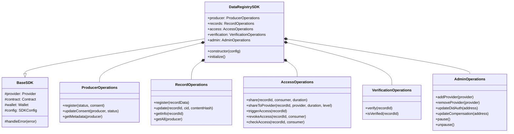

# LEDUP - DataRegistry TypeScript SDK

**Version:** 1.0.0  
**Last Updated:** March 2025  
**Status:** Production

## Table of Contents

1. [Overview](#overview)
2. [Installation](#installation)
3. [Core Components](#core-components)
4. [Usage Examples](#usage-examples)
5. [API Reference](#api-reference)
6. [Advanced Usage](#advanced-usage)
7. [Error Handling](#error-handling)
8. [TypeScript Interfaces](#typescript-interfaces)

## Overview

The DataRegistrySDK provides a TypeScript interface to interact with the DataRegistry smart contract. This SDK simplifies the process of interacting with the blockchain, handling type conversions, error handling, and providing a clean, Promise-based API.

## Installation

```bash
# Using npm
npm install @ledup/data-registry-sdk

# Using yarn
yarn add @ledup/data-registry-sdk
```

## Core Components

The SDK is organized into the following components:



## Usage Examples

### Initialization

```typescript
import { DataRegistrySDK } from '@ledup/data-registry-sdk';
import { ethers } from 'ethers';

// Connect to blockchain
const provider = new ethers.providers.JsonRpcProvider('https://eth-sepolia.g.alchemy.com/v2/YOUR_API_KEY');
const wallet = new ethers.Wallet('YOUR_PRIVATE_KEY', provider);

// Initialize SDK
const sdk = new DataRegistrySDK({
  provider,
  wallet,
  contractAddress: '0x1234...', // DataRegistry contract address
  didAuthAddress: '0xabcd...', // DidAuth contract address
});

await sdk.initialize();
```

### Producer Registration and Management

```typescript
import { RecordStatus, ConsentStatus } from '@ledup/data-registry-sdk';

// Register as a producer
const registerTx = await sdk.producer.register(RecordStatus.Active, ConsentStatus.Allowed);
await registerTx.wait();
console.log('Registered as producer');

// Update consent status
const consentTx = await sdk.producer.updateConsent(
  wallet.address, // producer address
  ConsentStatus.Allowed
);
await consentTx.wait();
console.log('Updated consent status');

// Get producer metadata
const metadata = await sdk.producer.getMetadata(wallet.address);
console.log('Producer metadata:', metadata);
```

### Record Management

```typescript
import { ResourceType } from '@ledup/data-registry-sdk';
import { utils } from 'ethers';

// Register a new health record
const recordData = {
  recordId: 'patient-123',
  cid: 'QmHash...', // IPFS content ID
  contentHash: utils.keccak256(utils.toUtf8Bytes('patient data')),
  resourceType: ResourceType.Patient,
  dataSize: 1024,
};

const registerTx = await sdk.records.register(recordData);
await registerTx.wait();
console.log('Record registered:', recordData.recordId);

// Update a record
const updateTx = await sdk.records.update(
  'patient-123',
  'QmNewHash...',
  utils.keccak256(utils.toUtf8Bytes('updated patient data'))
);
await updateTx.wait();
console.log('Record updated');

// Get record information
const recordInfo = await sdk.records.getInfo('patient-123');
console.log('Record info:', recordInfo);

// Get all records for a producer
const allRecords = await sdk.records.getAll(wallet.address);
console.log('All producer records:', allRecords);
```

### Access Control

```typescript
// Share data with a consumer
const thirtyDays = 30 * 24 * 60 * 60; // 30 days in seconds
const shareTx = await sdk.access.share('patient-123', consumerAddress, thirtyDays);
await shareTx.wait();
console.log('Shared record with consumer');

// Share with a healthcare provider
const sevenDays = 7 * 24 * 60 * 60; // 7 days in seconds
const providerTx = await sdk.access.shareToProvider('patient-123', providerAddress, sevenDays, AccessLevel.Read);
await providerTx.wait();
console.log('Shared record with provider');

// Consumer accessing data
const accessTx = await sdk.access.triggerAccess('patient-123');
await accessTx.wait();
console.log('Access triggered');

// Revoke access
const revokeTx = await sdk.access.revokeAccess('patient-123', consumerAddress);
await revokeTx.wait();
console.log('Access revoked');

// Check access
const accessInfo = await sdk.access.checkAccess('patient-123', consumerAddress);
console.log('Access info:', accessInfo);
```

### Verification

```typescript
// Verify a record (requires verifier role)
const verifyTx = await sdk.verification.verify('patient-123');
await verifyTx.wait();
console.log('Record verified');

// Check if record is verified
const isVerified = await sdk.verification.isVerified('patient-123');
console.log('Is verified:', isVerified);
```

### Administration

```typescript
// Add a provider (requires owner role)
const addTx = await sdk.admin.addProvider(providerAddress);
await addTx.wait();
console.log('Provider added');

// Pause the contract (requires owner role)
const pauseTx = await sdk.admin.pause();
await pauseTx.wait();
console.log('Contract paused');

// Unpause the contract (requires owner role)
const unpauseTx = await sdk.admin.unpause();
await unpauseTx.wait();
console.log('Contract unpaused');
```

## API Reference

### DataRegistrySDK

```typescript
class DataRegistrySDK {
  constructor(config: SDKConfig);
  async initialize(): Promise<void>;

  // Namespaced operations
  producer: ProducerOperations;
  records: RecordOperations;
  access: AccessOperations;
  verification: VerificationOperations;
  admin: AdminOperations;

  // Utility methods
  getContract(): Contract;
  getProvider(): Provider;
  getWallet(): Wallet;
  getAddress(): string;
}
```

### SDKConfig

```typescript
interface SDKConfig {
  provider: Provider;
  wallet?: Wallet | Signer;
  contractAddress: string;
  didAuthAddress?: string;
  compensationAddress?: string;
}
```

### ProducerOperations

```typescript
class ProducerOperations {
  /**
   * Register as a producer in the system
   */
  async register(status: RecordStatus, consent: ConsentStatus): Promise<TransactionResponse>;

  /**
   * Update consent status for a producer
   */
  async updateConsent(producer: string, status: ConsentStatus): Promise<TransactionResponse>;

  /**
   * Get metadata for a producer
   */
  async getMetadata(producer: string): Promise<ProducerMetadata>;
}
```

### RecordOperations

```typescript
class RecordOperations {
  /**
   * Register a new record
   */
  async register(data: RecordData): Promise<TransactionResponse>;

  /**
   * Update an existing record
   */
  async update(recordId: string, cid: string, contentHash: string): Promise<TransactionResponse>;

  /**
   * Get information about a record
   */
  async getInfo(recordId: string): Promise<RecordInfo>;

  /**
   * Get all records for a producer
   */
  async getAll(producer: string): Promise<string[]>;
}
```

### AccessOperations

```typescript
class AccessOperations {
  /**
   * Share data with a consumer
   */
  async share(recordId: string, consumer: string, duration: number): Promise<TransactionResponse>;

  /**
   * Share data with a healthcare provider
   */
  async shareToProvider(
    recordId: string,
    provider: string,
    duration: number,
    accessLevel: AccessLevel
  ): Promise<TransactionResponse>;

  /**
   * Trigger access to shared data
   */
  async triggerAccess(recordId: string): Promise<TransactionResponse>;

  /**
   * Revoke previously granted access
   */
  async revokeAccess(recordId: string, consumer: string): Promise<TransactionResponse>;

  /**
   * Check access to a record
   */
  async checkAccess(recordId: string, consumer: string): Promise<AccessInfo>;
}
```

## Advanced Usage

### Working with IPFS

The SDK integrates with IPFS for storing and retrieving the actual health data:

```typescript
import { DataRegistrySDK, ipfsUtils } from '@ledup/data-registry-sdk';

// Initialize SDK
const sdk = new DataRegistrySDK({
  /* config */
});

// Upload data to IPFS
const data = {
  /* patient record data */
};
const { cid, size } = await ipfsUtils.uploadData(data);

// Register record with IPFS information
const contentHash = ethers.utils.keccak256(ethers.utils.toUtf8Bytes(JSON.stringify(data)));

await sdk.records.register({
  recordId: 'patient-123',
  cid,
  contentHash,
  resourceType: ResourceType.Patient,
  dataSize: size,
});

// Later, retrieve data using CID
const recordInfo = await sdk.records.getInfo('patient-123');
const retrievedData = await ipfsUtils.fetchData(recordInfo.metadata.cid);
```

### Event Listeners

Set up event listeners to react to blockchain events:

```typescript
// Listen for record registration events
sdk.events.on('RecordRegistered', (event) => {
  const { recordId, did, cid, contentHash, provider } = event.args;
  console.log(`New record registered: ${recordId} by ${did}`);
  // Update UI or trigger other actions
});

// Listen for access events
sdk.events.on('AccessTriggered', (event) => {
  const { recordId, consumer, consumerDid, accessLevel } = event.args;
  console.log(`Record ${recordId} accessed by ${consumerDid}`);
  // Update UI or trigger other actions
});

// Start listening
await sdk.events.startListening();

// Later, stop listening
sdk.events.stopListening();
```

### Batch Operations

For efficiency, you can batch multiple operations:

```typescript
const batch = sdk.batch.create();

// Add operations to batch
batch.add(() => sdk.records.register(record1Data));
batch.add(() => sdk.records.register(record2Data));
batch.add(() => sdk.producer.updateConsent(wallet.address, ConsentStatus.Allowed));

// Execute batch
const results = await batch.execute();
console.log('Batch execution results:', results);
```

## Error Handling

The SDK provides standardized error handling:

```typescript
import { DataRegistryError, ErrorCode } from '@ledup/data-registry-sdk';

try {
  await sdk.records.register(recordData);
} catch (error) {
  if (error instanceof DataRegistryError) {
    switch (error.code) {
      case ErrorCode.UNAUTHORIZED:
        console.error('Not authorized to perform this action');
        break;
      case ErrorCode.RECORD_NOT_FOUND:
        console.error(`Record ${error.data.recordId} not found`);
        break;
      case ErrorCode.RECORD_ALREADY_EXISTS:
        console.error(`Record ${error.data.recordId} already exists`);
        break;
      case ErrorCode.PAYMENT_REQUIRED:
        console.error('Payment required for this operation');
        break;
      default:
        console.error('Error:', error.message);
    }
  } else {
    console.error('Unexpected error:', error);
  }
}
```

## TypeScript Interfaces

```typescript
// Enums
enum ResourceType {
  Patient,
  Observation,
  Condition,
  Procedure,
  Encounter,
  Medication,
  MedicationStatement,
  MedicationRequest,
  DiagnosticReport,
  Immunization,
  AllergyIntolerance,
  CarePlan,
  CareTeam,
  Basic,
  Other,
}

enum RecordStatus {
  Inactive,
  Active,
  Suspended,
  Deleted,
}

enum ConsentStatus {
  NotSet,
  Allowed,
  Denied,
}

enum AccessLevel {
  None,
  Read,
  Write,
}

// Main data structures
interface ProducerMetadata {
  did: string;
  consent: ConsentStatus;
  entries: number;
  isActive: boolean;
  lastUpdated: number;
  nonce: number;
  version: number;
}

interface ResourceMetadata {
  resourceType: ResourceType;
  recordId: string;
  producer: string;
  sharedCount: number;
  updatedAt: number;
  dataSize: number;
  contentHash: string;
  cid: string;
}

interface RecordInfo {
  isVerified: boolean;
  metadata: ResourceMetadata;
}

interface AccessInfo {
  hasAccess: boolean;
  expiration: number;
  accessLevel: AccessLevel;
  isRevoked: boolean;
}

// Input types
interface RecordData {
  recordId: string;
  cid: string;
  contentHash: string;
  resourceType: ResourceType;
  dataSize: number;
}

// Error types
enum ErrorCode {
  UNAUTHORIZED,
  RECORD_NOT_FOUND,
  RECORD_ALREADY_EXISTS,
  INVALID_DID,
  ACCESS_DENIED,
  EXPIRED_ACCESS,
  INVALID_CONTENT_HASH,
  PAYMENT_REQUIRED,
  DID_AUTH_NOT_INITIALIZED,
  INVALID_DID_AUTH_ADDRESS,
  ALREADY_REGISTERED,
  CONSENT_NOT_ALLOWED,
  CONTRACT_ERROR,
  NETWORK_ERROR,
  UNKNOWN_ERROR,
}

class DataRegistryError extends Error {
  code: ErrorCode;
  data?: any;
  constructor(message: string, code: ErrorCode, data?: any);
}
```

## Implementation Details

The SDK is implemented using TypeScript with ethers.js for blockchain interaction:

```typescript
// Simplified implementation snippet
import { ethers, Contract, Wallet, Signer, providers } from 'ethers';
import { DataRegistryABI } from './abis';

export class DataRegistrySDK {
  private contract: Contract;
  private provider: providers.Provider;
  private wallet: Wallet | Signer;

  constructor(config: SDKConfig) {
    this.provider = config.provider;
    this.wallet = config.wallet || this.provider.getSigner();

    // Initialize contract
    this.contract = new ethers.Contract(config.contractAddress, DataRegistryABI, this.wallet);

    // Initialize operation groups
    this.producer = new ProducerOperations(this);
    this.records = new RecordOperations(this);
    this.access = new AccessOperations(this);
    this.verification = new VerificationOperations(this);
    this.admin = new AdminOperations(this);
    this.events = new EventManager(this);
    this.batch = new BatchManager(this);
  }

  async initialize(): Promise<void> {
    // Verify connection and contract
    try {
      await this.provider.getNetwork();
      // Additional initialization logic
    } catch (error) {
      throw new DataRegistryError('Failed to initialize SDK', ErrorCode.NETWORK_ERROR, { originalError: error });
    }
  }

  // Helper methods
  getContract(): Contract {
    return this.contract;
  }

  getProvider(): providers.Provider {
    return this.provider;
  }

  getWallet(): Wallet | Signer {
    return this.wallet;
  }

  getAddress(): Promise<string> {
    return this.wallet.getAddress();
  }
}
```

---

**© 2025 LEDUP - All rights reserved.**
