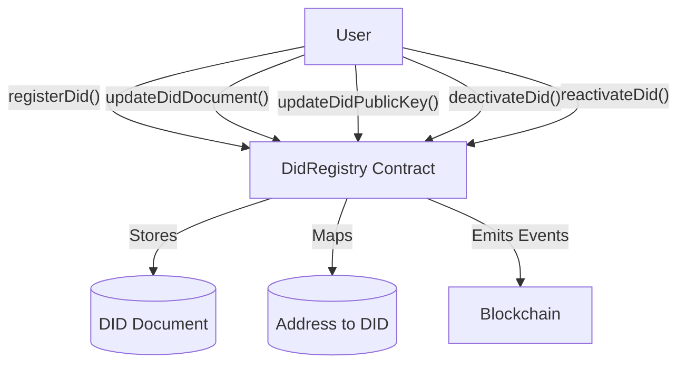
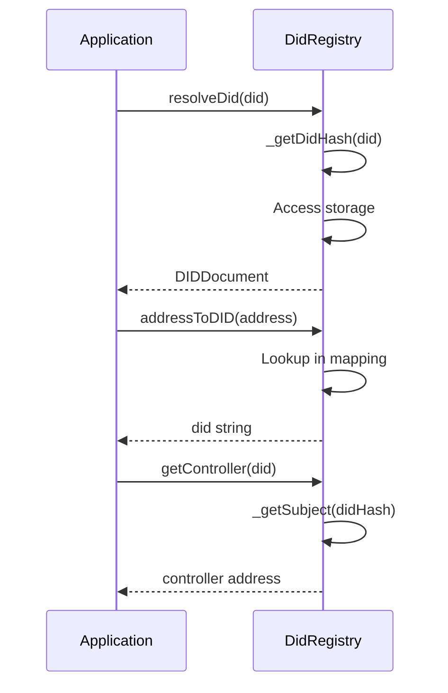
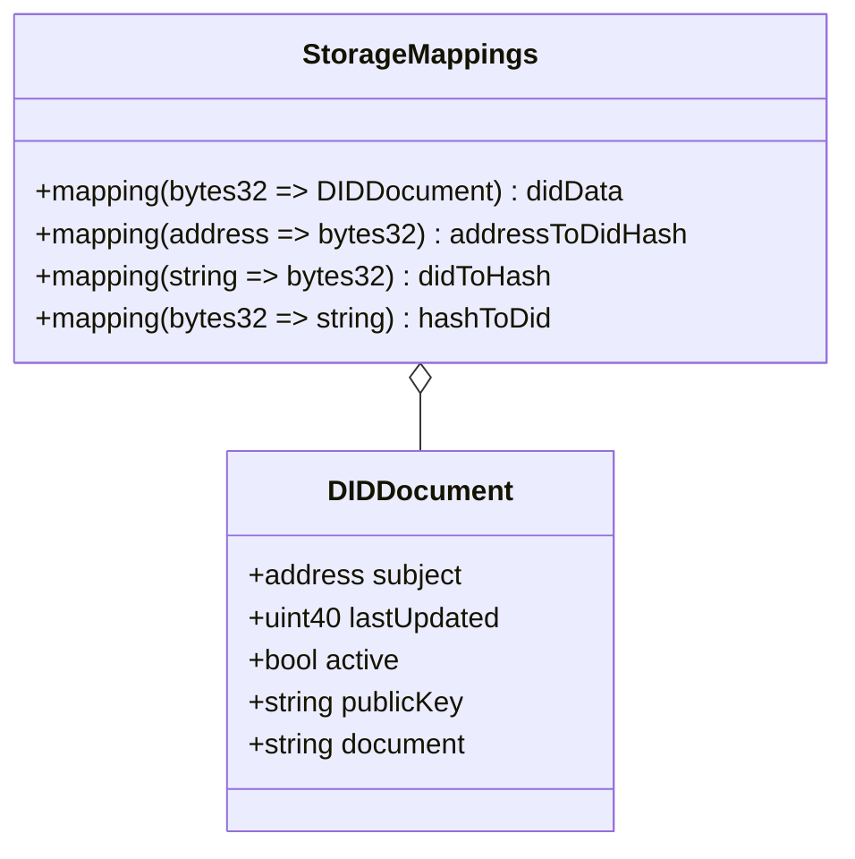
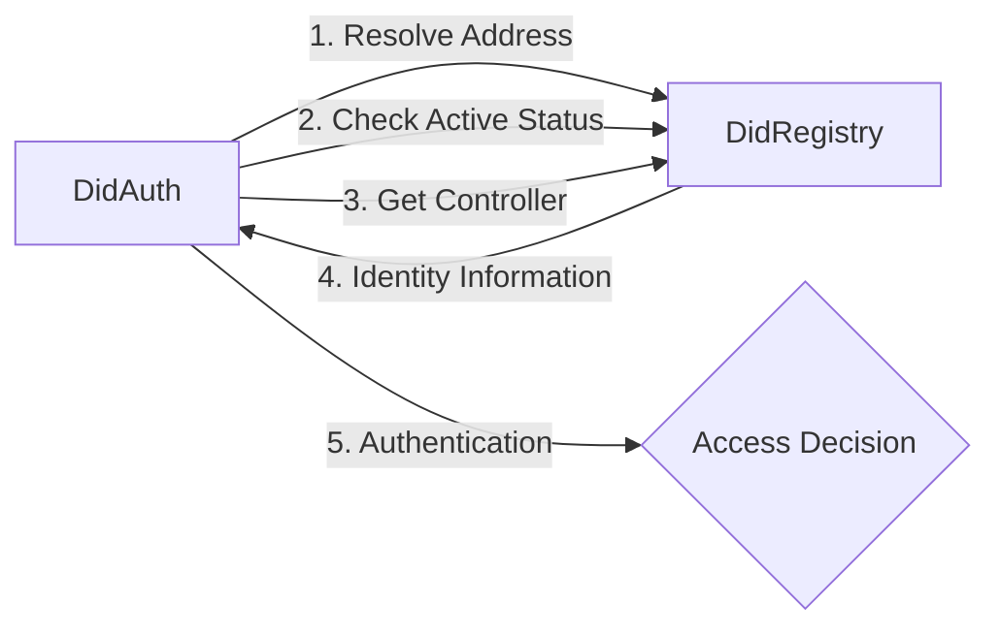
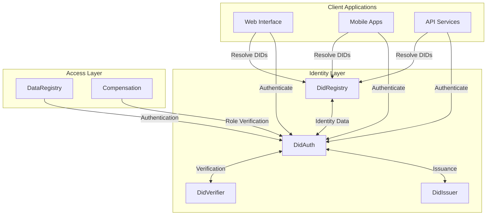
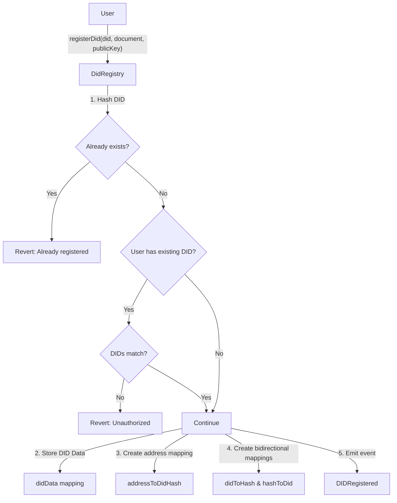
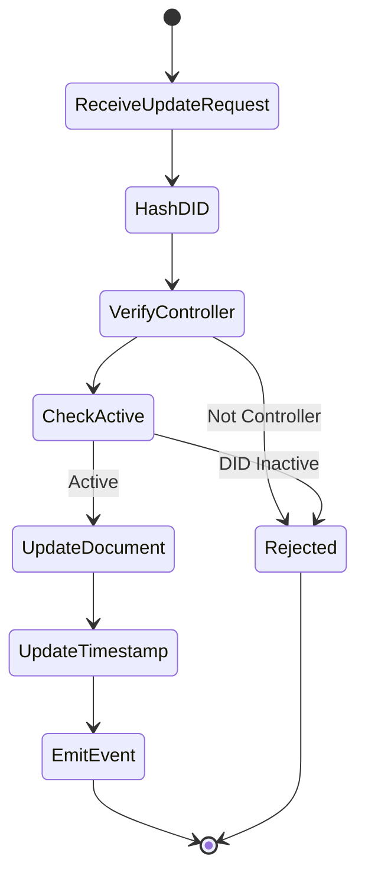

# LEDUP - DidRegistry Contract

**Version:** 1.0.0  
**Last Updated:** March 2025  
**Status:** Production

## Overview

The DidRegistry contract serves as the foundational identity layer of the LEDUP ecosystem, providing a secure and gas-optimized registry for Decentralized Identifiers (DIDs). It enables the creation, management, and resolution of DIDs, forming the backbone for all identity-based operations across the platform.

This contract stores essential DID information, maps blockchain addresses to DIDs, and provides verification services to other components in the LEDUP ecosystem, particularly the DidAuth contract which relies on this registry for authentication and authorization.

## Key Features

### DID Registration and Management

The DidRegistry contract enables complete lifecycle management of DIDs:



- **Registration**: Creates a new DID and associates it with the caller's address
- **Document Updates**: Allows controllers to update their DID documents
- **Public Key Management**: Enables rotation of public keys associated with DIDs
- **Deactivation/Reactivation**: Supports temporary or permanent deactivation of DIDs
- **Efficient Storage**: Uses optimized data structures to minimize gas costs

### DID Resolution

The DidRegistry provides comprehensive resolution services:



- **DID to Document**: Resolves a DID to its associated document and metadata
- **Address to DID**: Provides reverse lookup from blockchain addresses to DIDs
- **Controller Lookup**: Retrieves the controlling address for a specific DID
- **Active Status Checking**: Verifies if a DID is currently active

### Optimized Storage Design

The DidRegistry implements a gas-efficient storage strategy:



- **Hashed Lookups**: Uses keccak256 hashes as efficient lookup keys
- **Compact Structure**: Optimizes storage with appropriate data types
- **Bidirectional Mappings**: Enables efficient lookup in both directions
- **Single Storage Slot**: Consolidates related data in a single structure

## Interaction with Other Contracts

### Integration with DidAuth

The DidRegistry provides essential identity services to the DidAuth contract:



The DidRegistry supports DidAuth in:

- Resolving blockchain addresses to DIDs
- Verifying if DIDs are active
- Confirming the controller of a DID
- Providing document and public key information

### System Architecture

Within the broader LEDUP ecosystem, the DidRegistry functions as follows:



## Contract Events

The DidRegistry contract emits the following events:

- **DIDRegistered**: When a new DID is registered
- **DIDUpdated**: When a DID document or public key is updated
- **DIDDeactivated**: When a DID is deactivated

These events enable external systems to track DID lifecycle changes and maintain synchronized state.

## Core Operations

### DID Registration

The registration process:



### DID Document Updates

The document update process:



## Authorization Model

The DidRegistry enforces a strict authorization model:

- **Controller-Based Access**: Only the controller of a DID can modify or deactivate it
- **Address-DID Binding**: Each address can control only one DID at a time
- **Status-Based Restrictions**: Operations on inactive DIDs are restricted

## Storage Optimizations

The contract employs several gas-optimization techniques:

1. **Hashed Storage Keys**: Using bytes32 hashes as keys for efficient storage
2. **Packed Structs**: Grouping related data in single storage slots
3. **Optimized Data Types**: Using uint40 for timestamps to save gas
4. **Efficient Lookups**: Pre-computing hashes for storage access
5. **Minimal Storage Updates**: Updating only necessary fields during operations

## Security Features

The DidRegistry implements several security measures:

1. **Existence Checks**: Verifies DIDs exist before operations
2. **Controller Verification**: Ensures only authorized entities can modify DIDs
3. **Status Validation**: Prevents operations on inactive DIDs
4. **Error Handling**: Clear error messages for troubleshooting
5. **Internal Access Control**: Protected internal functions

## Integration Patterns

### For Smart Contracts

Other contracts can integrate with DidRegistry using:

```solidity
// In contract constructor
DidRegistry public didRegistry;

constructor(address _didRegistryAddress) {
    didRegistry = DidRegistry(_didRegistryAddress);
}

// To check if a DID is valid and active
function verifyDid(string memory did) internal view returns (bool) {
    return didRegistry.isActive(did);
}

// To get the controller of a DID
function getDIDController(string memory did) internal view returns (address) {
    return didRegistry.getController(did);
}
```

### For Applications

Applications can integrate with DidRegistry through contract calls:

```typescript
// Initialize contract
const didRegistryContract = new ethers.Contract(didRegistryAddress, DidRegistryABI, provider);

// Register a new DID
async function registerUserDid(did, document, publicKey) {
  try {
    const tx = await didRegistryContract.registerDid(did, document, publicKey);
    await tx.wait();
    console.log(`DID ${did} registered successfully`);
    return true;
  } catch (error) {
    console.error('DID registration failed:', error);
    return false;
  }
}

// Resolve a DID to its document
async function resolveDid(did) {
  try {
    const didDocument = await didRegistryContract.resolveDid(did);
    return {
      subject: didDocument.subject,
      publicKey: didDocument.publicKey,
      document: didDocument.document,
      active: didDocument.active,
      lastUpdated: new Date(didDocument.lastUpdated * 1000),
    };
  } catch (error) {
    console.error('DID resolution failed:', error);
    return null;
  }
}
```

## DID Format and Validation

The LEDUP platform uses the following DID format:

```
did:ledup:<network>:<identifier>
```

Where:

- `ledup` is the method name
- `<network>` indicates the blockchain network (e.g., sepolia, mainnet)
- `<identifier>` is derived from the controller's address

While basic validation happens on-chain, most validation is expected to occur off-chain before submitting transactions.

## Best Practices

When working with the DidRegistry:

1. **Validate DIDs off-chain** before submitting transactions to save gas
2. **Cache resolved DIDs** in your application to minimize blockchain calls
3. **Monitor DID events** to keep local state synchronized
4. **Check DID status** before operations that require active DIDs
5. **Verify controllers** when operations require authentication
6. **Handle inactive DIDs** gracefully in your UI

## Performance Considerations

For optimal gas usage and performance:

1. **Batch DID operations** when managing multiple DIDs
2. **Implement caching** for frequently accessed DIDs
3. **Use DID events** for state management instead of polling
4. **Minimize document size** by storing only essential data on-chain
5. **Use off-chain storage** for larger DID document content

## Summary

The DidRegistry contract provides:

1. **Secure Identity Foundation**: Establishing the core identity layer for LEDUP
2. **Efficient DID Management**: Gas-optimized operations for DID lifecycle
3. **Flexible Resolution**: Retrieving DID data through multiple paths
4. **Strict Access Control**: Ensuring only authorized updates to DIDs
5. **Integration Capabilities**: Supporting other LEDUP contracts

As the identity foundation of the LEDUP ecosystem, the DidRegistry enables secure, decentralized identity management that powers all authentication, authorization, and data ownership features across the platform.

---

**© 2025 LEDUP - All rights reserved.**
