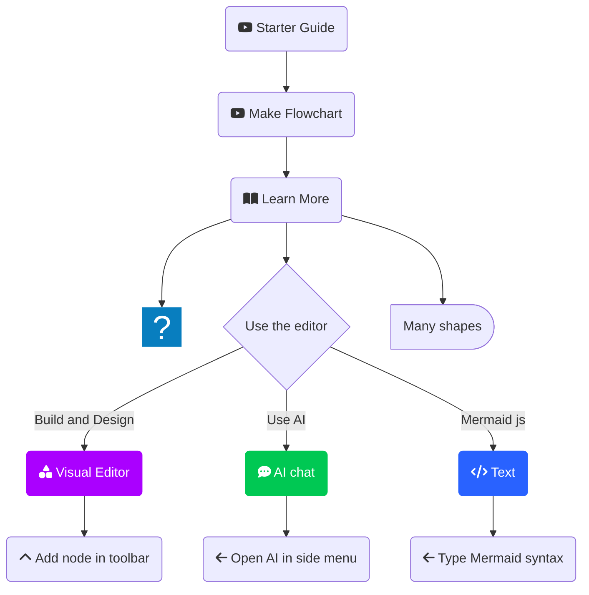

# LED-UP Smart Contract Ecosystem Improvements

## Overview

This document summarizes the comprehensive improvements made to the LED-UP smart contract ecosystem. The improvements focus on optimizing storage, enhancing cross-contract data sharing, improving security, and ensuring better maintainability and scalability of the contracts.

## Improved Contracts

The following contracts have been improved:

1. **DidRegistryImproved**: Enhanced DID registry with optimized storage
2. **DidAuthImproved**: Improved DID authentication with role-based access control
3. **DidIssuerImproved**: Enhanced credential issuance with optimized storage
4. **ConsentManagementImproved**: Improved consent management with gas-efficient storage
5. **DataRegistryImproved**: Enhanced data registry with optimized storage
6. **CompensationImproved**: Improved compensation management with gas-efficient storage

## Key Improvements Across All Contracts

### 1. Gas Efficiency

- **Optimized Storage Structures**: Implemented through the `StorageLib` library, providing standardized data structures with optimized storage layouts.
- **Packed Storage Variables**: Used smaller uint types (e.g., uint40 for timestamps) to reduce storage costs.
- **Bytes32 Hashing**: Converted strings to bytes32 hashes for efficient storage.
- **Bit Packing**: Used bit flags for role assignments and other boolean flags.
- **Reduced Cross-Contract Calls**: Implemented caching mechanisms to reduce expensive cross-contract calls.

### 2. Cross-Contract Data Sharing

- **Standardized Data Formats**: Used consistent data formats (bytes32 hashes) across contracts.
- **Direct Contract References**: Maintained direct references to related contracts for seamless integration.
- **Cached Lookups**: Implemented caching mechanisms for frequently accessed data.
- **Optimized Event Parameters**: Used optimized event parameters for efficient cross-contract communication.

### 3. Security Enhancements

- **Custom Errors**: Implemented specific custom errors for better error reporting and gas efficiency.
- **Comprehensive Validation**: Added thorough validation checks for inputs and state changes.
- **Role-Based Access Control**: Enhanced role-based access control through the DidAuthImproved contract.
- **Pausable Contracts**: Implemented emergency stop mechanisms using OpenZeppelin's Pausable contract.
- **Input Sanitization**: Added comprehensive input validation to prevent invalid data.

### 4. Maintainability and Scalability

- **Modular Design**: Separated concerns into distinct contracts and libraries.
- **Comprehensive Documentation**: Added detailed NatSpec comments for all functions and structures.
- **Consistent Error Handling**: Implemented a consistent error handling pattern across all contracts.
- **Event Logging**: Added comprehensive event logging for important state changes.
- **Upgrade Paths**: Designed contracts with potential upgrade paths in mind.

## StorageLib: The Foundation for Optimization

The `StorageLib` library serves as the foundation for the optimization efforts, providing:

- **Optimized Data Structures**: Standardized structures for DIDs, credentials, consents, and more.
- **Utility Functions**: Helper functions for bit manipulation, string-to-bytes32 conversion, and other common operations.
- **Consistent Constants**: Standardized constants for status values, roles, and other enumerations.

## Contract-Specific Improvements

### DidRegistryImproved

- **Optimized DID Storage**: Used bytes32 hashes for DID strings and optimized DID document storage.
- **Efficient Lookups**: Implemented mappings for quick lookups by DID hash and owner address.
- **Enhanced Validation**: Added comprehensive validation for DID registration and updates.

### DidAuthImproved

- **Bit-Packed Role Assignments**: Used bit flags for efficient role assignments.
- **Role Hierarchy**: Implemented a role hierarchy system for more granular access control.
- **Efficient Authentication**: Optimized the authentication process for gas efficiency.

### DidIssuerImproved

- **Optimized Credential Storage**: Used bytes32 hashes for credential types and optimized credential storage.
- **Efficient Credential Lookups**: Implemented mappings for quick lookups by credential ID and subject DID.
- **Enhanced Validation**: Added comprehensive validation for credential issuance and revocation.

### ConsentManagementImproved

- **Gas-Efficient Consent Storage**: Optimized consent storage with packed variables.
- **Efficient Consent Lookups**: Implemented mappings for quick lookups by producer and provider DIDs.
- **Enhanced Validation**: Added comprehensive validation for consent granting and revocation.

### DataRegistryImproved

- **Optimized Record Storage**: Used optimized structures for data records, health records, and metadata.
- **Efficient Record Lookups**: Implemented mappings for quick lookups by record ID and producer DID.
- **Enhanced Access Control**: Integrated with DidAuthImproved and ConsentManagementImproved for comprehensive access control.

### CompensationImproved

- **Gas-Efficient Balance Tracking**: Optimized producer balance tracking with packed variables.
- **Efficient Payment Processing**: Implemented efficient payment processing with optimized storage.
- **Enhanced Validation**: Added comprehensive validation for payments and withdrawals.

## Testing and Verification

Each improved contract comes with comprehensive test suites that verify:

- **Functional Correctness**: All functions work as expected.
- **Security Properties**: Security mechanisms function correctly.
- **Gas Efficiency**: Gas costs are optimized.
- **Edge Cases**: The contract handles edge cases correctly.

## Conclusion

The improvements to the LED-UP smart contract ecosystem represent a significant enhancement in terms of gas efficiency, security, maintainability, and scalability. By leveraging optimized storage structures, enhancing cross-contract data sharing, and implementing comprehensive security measures, the improved contracts provide a solid foundation for the LED-UP ecosystem's future growth and development.

These improvements ensure that the LED-UP ecosystem can operate efficiently on the Ethereum blockchain, providing a secure and cost-effective platform for managing DIDs, credentials, consents, health data records, and compensation in the healthcare domain.

````mermaid
flowchart TB
    %% Define styles
    classDef library fill:#f9f9ff,stroke:#9370DB,stroke-width:2px,color:#333,font-weight:bold;
    classDef contract fill:#e6f7ff,stroke:#1890ff,stroke-width:2px,color:#333,font-weight:bold;
    classDef actor fill:#f6ffed,stroke:#52c41a,stroke-width:2px,color:#333,font-weight:bold;
    classDef dataFlow stroke:#ff7875,stroke-width:2px,color:#333;
    classDef accessControl stroke:#faad14,stroke-width:2px,color:#333;

    %% Core Library
    SL["📚 StorageLib
    (Optimized Storage)"]

    %% Main Contracts - Organized in layers
    subgraph IdentityLayer["Identity Layer"]
        DR["🆔 DidRegistryImproved
        (DID Management)"]
        DA["🔐 DidAuthImproved
        (Access Control)"]
        DI["📜 DidIssuerImproved
        (Credential Management)"]
    end

    subgraph PermissionLayer["Permission Layer"]
        CM["✓ ConsentManagementImproved
        (Consent Handling)"]
    end

    subgraph DataLayer["Data Layer"]
        DR2["💾 DataRegistryImproved
        (Health Data Records)"]
    end

    subgraph FinancialLayer["Financial Layer"]
        CP["💰 CompensationImproved
        (Payment Processing)"]
    end

    %% External Actors
    subgraph Actors["System Actors"]
        Producer["👨‍⚕️ Producer
        (Data Provider)"]
        Consumer["👩‍💼 Consumer
        (Data Consumer)"]
        Verifier["🔍 Verifier
        (Data Validator)"]
        Admin["👨‍💻 Admin
        (System Manager)"]
        Issuer["🏛️ Issuer
        (Credential Provider)"]
    end

    %% Library connections
    SL -.-> IdentityLayer
    SL -.-> PermissionLayer
    SL -.-> DataLayer
    SL -.-> FinancialLayer

    %% Contract interactions - Hierarchical flow
    DR --> DA
    DR --> DI

    IdentityLayer --> PermissionLayer
    IdentityLayer --> DataLayer
    IdentityLayer --> FinancialLayer

    PermissionLayer --> DataLayer

    DataLayer --> FinancialLayer

    %% Specific contract interactions
    DR --> CM
    DR --> DR2
    DR --> CP

    DA ==> DI
    DA ==> CM
    DA ==> DR2
    DA ==> CP

    CM ==> DR2

    DI -.-> DR2

    %% Actor interactions
    Producer -->|"Register DID"| DR
    Producer -->|"Register health data"| DR2
    Producer -->|"Grant consent"| CM
    Producer -->|"Receive payment"| CP

    Consumer -->|"Access health data"| DR2
    Consumer -->|"Request consent"| CM

    Verifier -->|"Verify health data"| DR2

    Admin -->|"Manage roles"| DA
    Admin -->|"Manage system"| DR
    Admin -->|"Manage system"| DR2
    Admin -->|"Manage system"| CP

    Issuer -->|"Issue credentials"| DI

    %% Apply styles
    class SL library;
    class DR,DI,DA,CM,DR2,CP contract;
    class Producer,Consumer,Verifier,Admin,Issuer actor;
    ```
````


