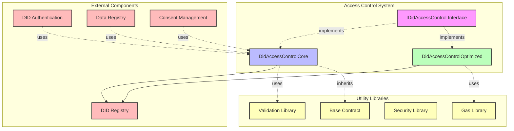
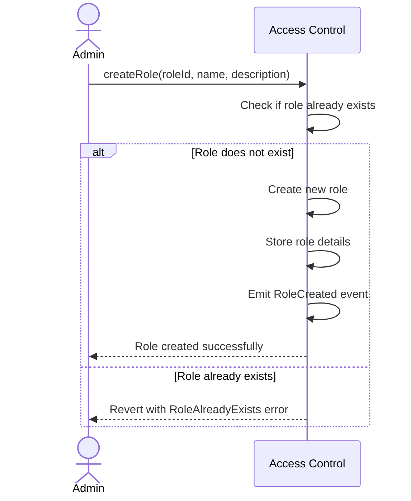
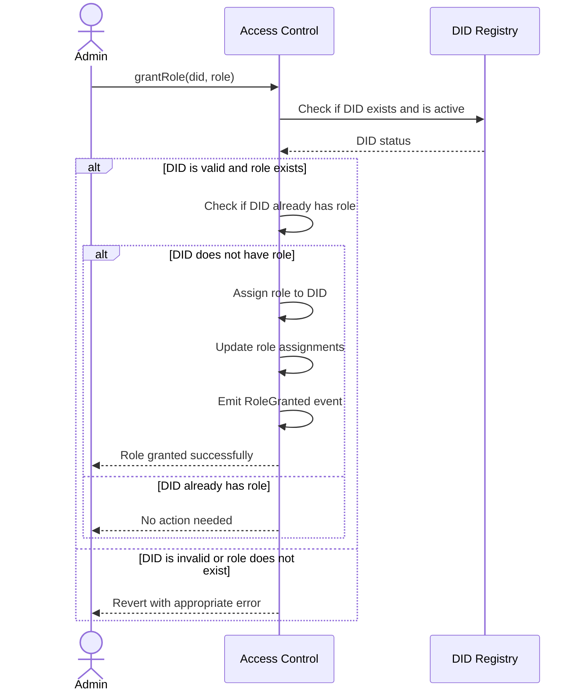
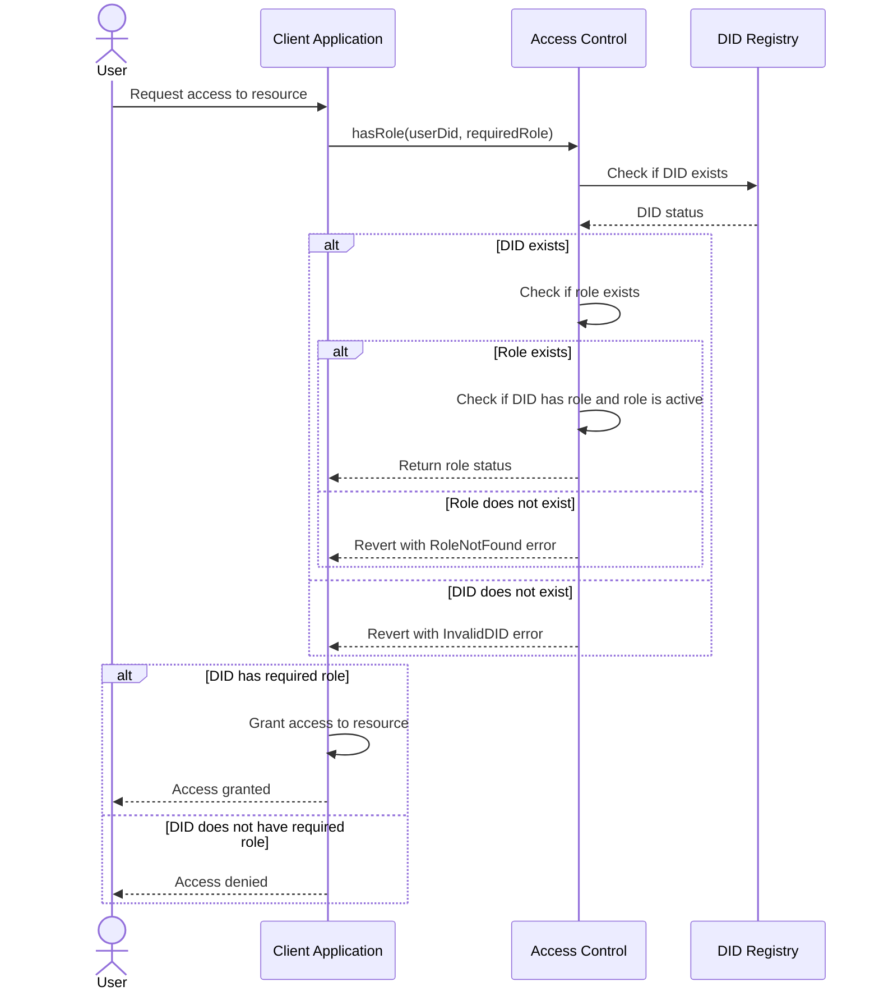
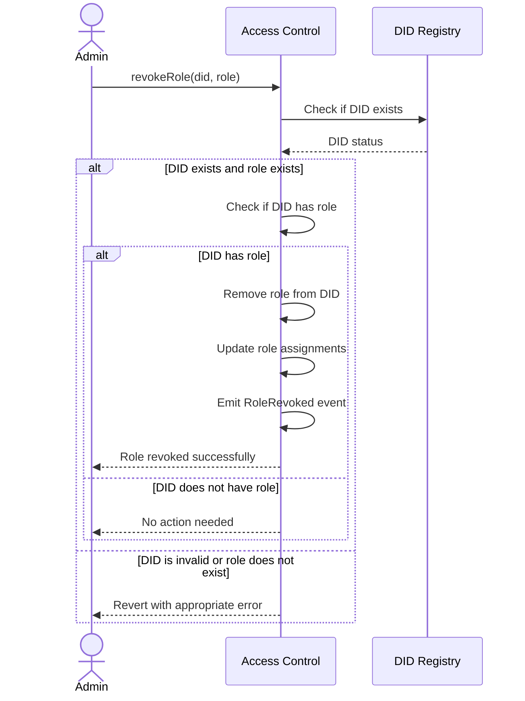
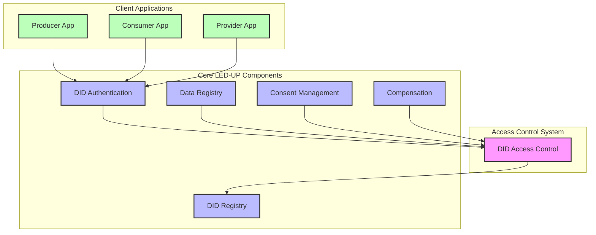
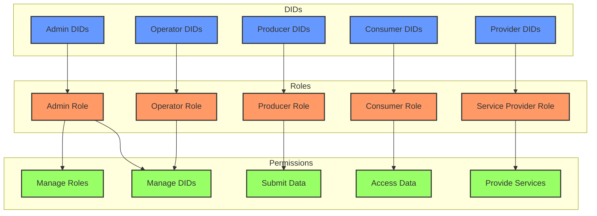
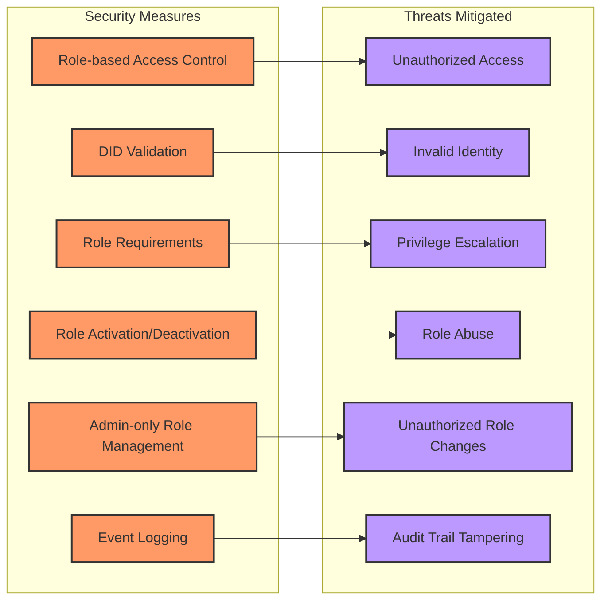
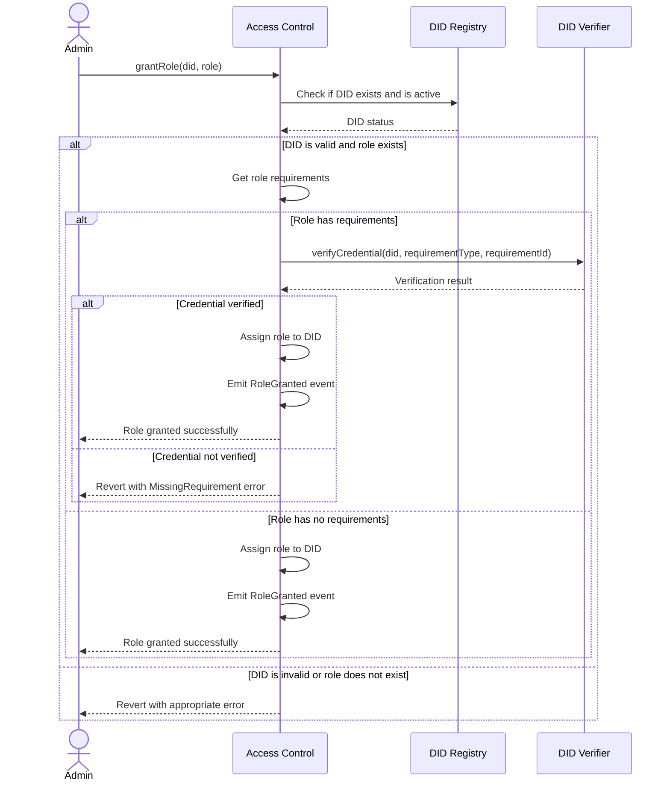

# LED-UP DID Access Control System Architecture

## Overview

This document provides a comprehensive architectural overview of the LED-UP DID Access Control system, which is designed to provide decentralized, role-based access control for the LED-UP platform. The system leverages blockchain technology to enable secure, verifiable, and flexible access management based on Decentralized Identifiers (DIDs).

The access control system is built on several core components:

1. **IDidAccessControl Interface** - Defines the standard contract interface for DID-based access control
2. **DidAccessControlCore** - Implements the core access control functionality
3. **DidAccessControlOptimized** - Provides a gas-optimized implementation for production use

## System Architecture



## Component Details

### 1. IDidAccessControl Interface

The `IDidAccessControl` interface defines the standard contract interface for DID-based access control in the LED-UP ecosystem. It establishes a consistent API for access control operations across different implementations.

#### Key Features:

- **Role Management**: Create, activate, and deactivate roles
- **Role Assignment**: Grant and revoke roles to DIDs
- **Role Verification**: Check if a DID has a specific role
- **Role Querying**: Get information about roles and role assignments

#### Interface Definition:

```solidity
interface IDidAccessControl {
    function createRole(bytes32 role, string calldata name, string calldata description) external;
    function grantRole(string calldata did, bytes32 role) external;
    function revokeRole(string calldata did, bytes32 role) external;
    function hasRole(string calldata did, bytes32 role) external view returns (bool);
    function getDidRegistryAddress() external view returns (address);
}
```

### 2. DidAccessControlCore

The `DidAccessControlCore` contract implements the core functionality defined in the `IDidAccessControl` interface. It provides the fundamental access control mechanisms for the LED-UP platform.

#### Key Features:

- **Role Definitions**: Define roles with names, descriptions, and active status
- **Role Requirements**: Set requirements for roles (e.g., required credentials)
- **Role Assignment**: Assign roles to DIDs and track assignments
- **Role Verification**: Verify if a DID has a specific role
- **Role Querying**: Query roles and role assignments

#### Data Structures:

```solidity
// Role structure
struct Role {
    bytes32 id;
    string name;
    string description;
    uint256 createdAt;
    bool active;
}

// Role storage
mapping(bytes32 => Role) private roles;
bytes32[] private roleIds;

// Role assignments
mapping(string => mapping(bytes32 => bool)) private didRoles;

// Role assignments by DID
mapping(string => bytes32[]) private didRolesList;

// Role assignments by role
mapping(bytes32 => string[]) private roleDids;
```

### 3. DidAccessControlOptimized

The `DidAccessControlOptimized` contract provides a gas-optimized implementation of the access control functionality. It uses bit manipulation and other gas optimization techniques to reduce transaction costs.

#### Key Features:

- **Bit-Packed Role Flags**: Store multiple role assignments in a single storage slot
- **Hashed DIDs**: Use hashed DIDs as keys to reduce storage costs
- **Predefined Roles**: Use predefined role constants to reduce gas costs
- **Optimized Role Checks**: Efficient role checking using bit operations

#### Gas Optimization Techniques:

```solidity
// Role flags
uint8 private constant ROLE_ADMIN = 0;
uint8 private constant ROLE_OPERATOR = 1;
uint8 private constant ROLE_PRODUCER = 2;
uint8 private constant ROLE_CONSUMER = 3;
uint8 private constant ROLE_SERVICE_PROVIDER = 4;

// Role requirements - optimized using bytes32 for requirement hashes
mapping(bytes32 => bytes32) private roleRequirements;

// DID-based role assignments - optimized using bytes32 for DID hashes and uint256 for role flags
mapping(bytes32 => uint256) private didRoleFlags;
```

## Access Control Flows

### 1. Role Creation



### 2. Role Assignment



### 3. Role Verification



### 4. Role Revocation



## Integration with LED-UP Ecosystem

The access control system integrates with the broader LED-UP ecosystem through interactions with other core components:



## Role-Based Access Control Model

The LED-UP access control system implements a role-based access control (RBAC) model with DID-based identities:



## Security Considerations

The access control system implements several security measures to ensure the integrity and confidentiality of the access control process:



### Key Security Features:

1. **Role-based Access Control**: Restricts access to functions based on assigned roles
2. **DID Validation**: Ensures DIDs are valid and active before role assignment
3. **Role Requirements**: Allows setting requirements for roles (e.g., required credentials)
4. **Role Activation/Deactivation**: Enables disabling roles without removing assignments
5. **Admin-only Role Management**: Restricts role management to admin users
6. **Event Logging**: Logs all role-related actions for audit purposes

## Architectural Assessment

### Strengths

1. **Flexible Role Management**: The system allows for dynamic creation and management of roles.
2. **DID Integration**: Seamless integration with the DID system for identity verification.
3. **Optimized Implementation**: Gas-optimized implementation for production use.
4. **Comprehensive Role Tracking**: Tracks role assignments by both DID and role.
5. **Role Requirements**: Supports setting requirements for roles.

### Areas for Improvement

1. **Role Hierarchy**: The current implementation does not support role hierarchies or inheritance.
2. **Credential Verification**: The role requirement verification is currently a placeholder.
3. **Delegation**: No support for delegating role-based permissions.
4. **Temporal Constraints**: No support for time-limited role assignments.
5. **Fine-grained Permissions**: Roles are binary (granted or not) without support for fine-grained permissions.

## Recommendations for Enhancement

### 1. Implement Role Hierarchy

Enhance the system with role hierarchy support to allow roles to inherit permissions from parent roles.

```solidity
// Role hierarchy
mapping(bytes32 => bytes32) private roleParents;

// Check if a DID has a role or any parent role
function hasRoleOrParent(string calldata did, bytes32 role) external view returns (bool) {
    if (hasRole(did, role)) {
        return true;
    }

    bytes32 parentRole = roleParents[role];
    while (parentRole != bytes32(0)) {
        if (hasRole(did, parentRole)) {
            return true;
        }
        parentRole = roleParents[parentRole];
    }

    return false;
}
```

### 2. Implement Credential Verification

Enhance the role requirement verification to check for specific credentials.



### 3. Implement Role Delegation

Allow DIDs to delegate their roles to other DIDs for specific purposes.

```solidity
// Delegation structure
struct Delegation {
    string delegator;
    string delegate;
    bytes32 role;
    uint256 expiresAt;
    bool active;
}

// Delegation storage
mapping(bytes32 => Delegation) private delegations;

// Delegate a role
function delegateRole(string calldata delegator, string calldata delegate, bytes32 role, uint256 duration)
    external
    didExists(delegator)
    didExists(delegate)
    roleExists(role)
{
    // Check if the delegator has the role
    if (!hasRole(delegator, role)) {
        revert DidAccessControl__Unauthorized();
    }

    // Create delegation
    bytes32 delegationId = keccak256(abi.encodePacked(delegator, delegate, role));
    delegations[delegationId] = Delegation({
        delegator: delegator,
        delegate: delegate,
        role: role,
        expiresAt: block.timestamp + duration,
        active: true
    });

    emit RoleDelegated(delegator, delegate, role, block.timestamp + duration);
}

// Check if a delegation is valid
function hasDelegatedRole(string calldata delegate, bytes32 role) external view returns (bool) {
    for (uint256 i = 0; i < delegations.length; i++) {
        Delegation memory delegation = delegations[i];
        if (
            keccak256(bytes(delegation.delegate)) == keccak256(bytes(delegate)) &&
            delegation.role == role &&
            delegation.active &&
            delegation.expiresAt > block.timestamp
        ) {
            return true;
        }
    }

    return false;
}
```

### 4. Implement Temporal Constraints

Add support for time-limited role assignments.

```solidity
// Time-limited role assignment structure
struct TimedRole {
    bytes32 role;
    uint256 expiresAt;
    bool active;
}

// Time-limited role assignments
mapping(string => mapping(bytes32 => TimedRole)) private timedRoles;

// Grant a time-limited role
function grantTimedRole(string calldata did, bytes32 role, uint256 duration)
    external
    didExists(did)
    roleExists(role)
    onlyOwner
{
    timedRoles[did][role] = TimedRole({
        role: role,
        expiresAt: block.timestamp + duration,
        active: true
    });

    emit TimedRoleGranted(did, role, block.timestamp + duration);
}

// Check if a DID has a valid timed role
function hasValidTimedRole(string calldata did, bytes32 role) external view returns (bool) {
    TimedRole memory timedRole = timedRoles[did][role];
    return timedRole.active && timedRole.expiresAt > block.timestamp;
}
```

### 5. Implement Fine-grained Permissions

Enhance the system with fine-grained permissions within roles.

```solidity
// Permission structure
struct Permission {
    bytes32 id;
    string name;
    string description;
    bool active;
}

// Role-permission assignments
mapping(bytes32 => mapping(bytes32 => bool)) private rolePermissions;

// Grant a permission to a role
function grantPermissionToRole(bytes32 role, bytes32 permission)
    external
    roleExists(role)
    permissionExists(permission)
    onlyOwner
{
    rolePermissions[role][permission] = true;

    emit PermissionGranted(role, permission);
}

// Check if a role has a permission
function roleHasPermission(bytes32 role, bytes32 permission) external view returns (bool) {
    return rolePermissions[role][permission];
}

// Check if a DID has a permission
function didHasPermission(string calldata did, bytes32 permission) external view returns (bool) {
    for (uint256 i = 0; i < roleIds.length; i++) {
        bytes32 role = roleIds[i];
        if (hasRole(did, role) && roleHasPermission(role, permission)) {
            return true;
        }
    }

    return false;
}
```

## Conclusion

The LED-UP DID Access Control system provides a robust foundation for role-based access control in the LED-UP ecosystem. The modular architecture, with both standard and optimized implementations, allows for flexibility and efficiency while maintaining a consistent interface.

The system implements several security measures to ensure the integrity and confidentiality of the access control process, including role-based access control, DID validation, role requirements, role activation/deactivation, admin-only role management, and event logging.

While the current implementation provides a solid foundation, there are several areas for enhancement, including role hierarchy, credential verification, delegation, temporal constraints, and fine-grained permissions. By implementing these enhancements, the LED-UP DID Access Control system can provide even stronger security guarantees while maintaining flexibility and usability for the LED-UP ecosystem.
