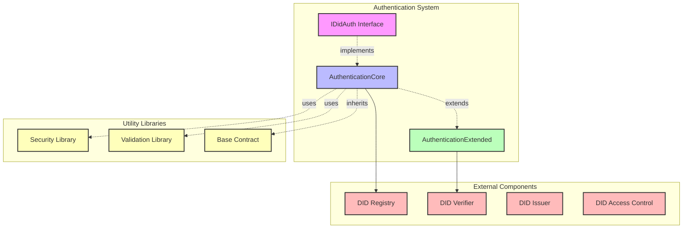
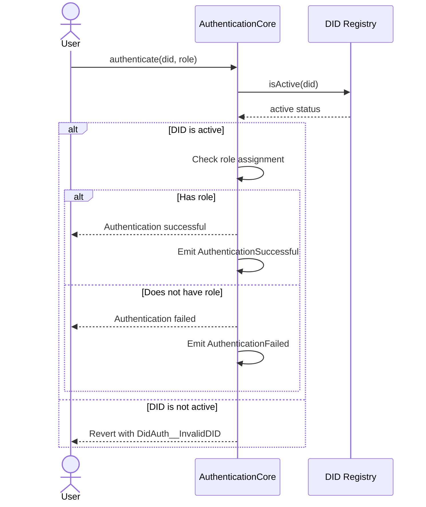
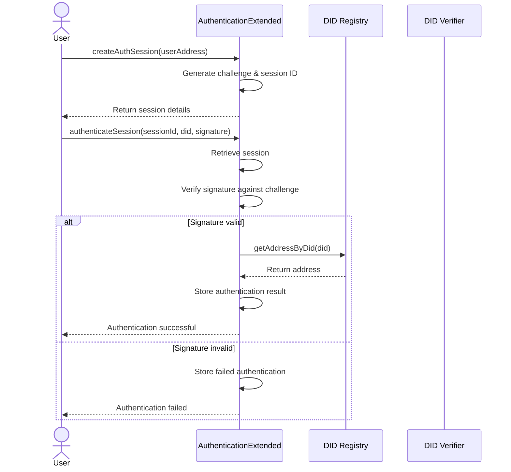
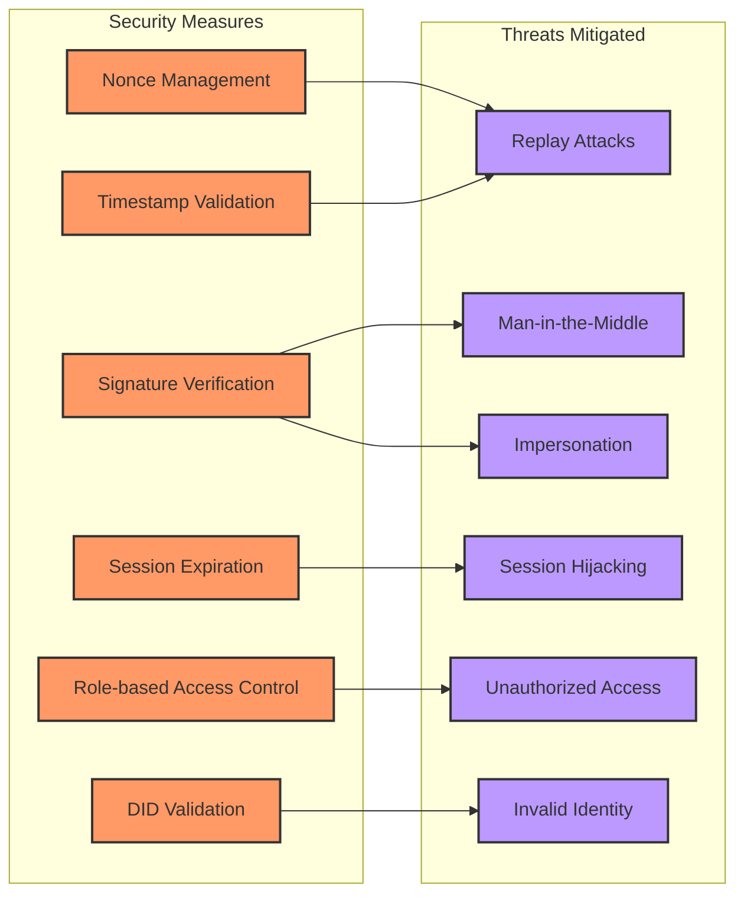
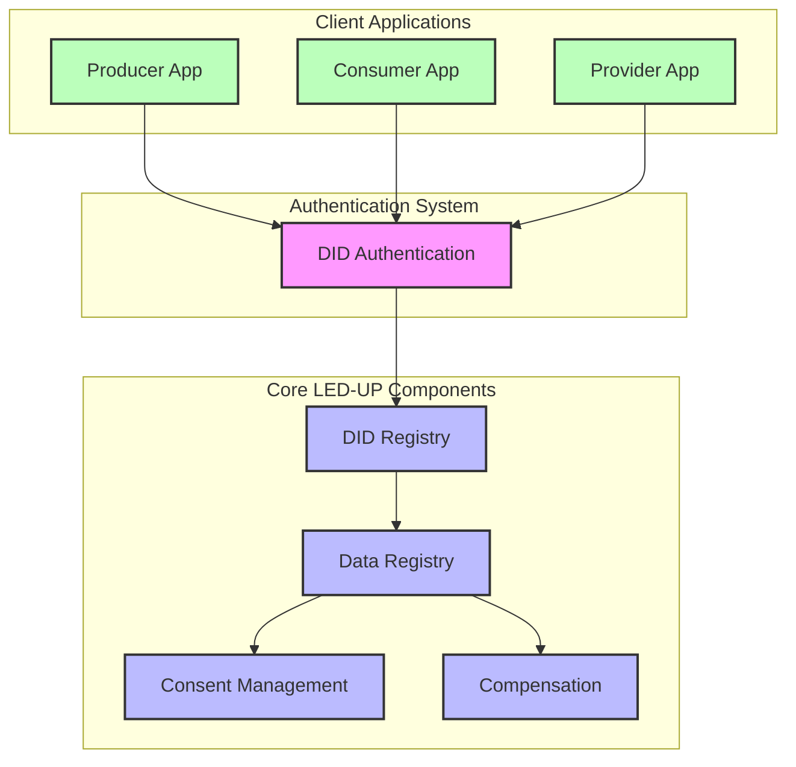
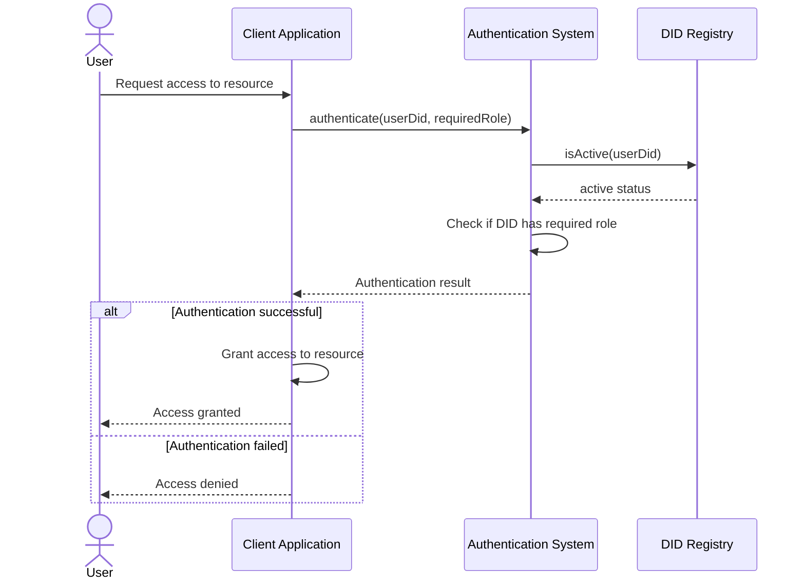
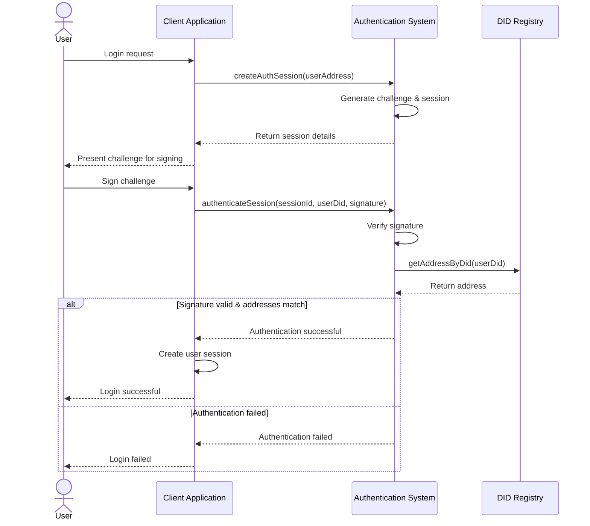
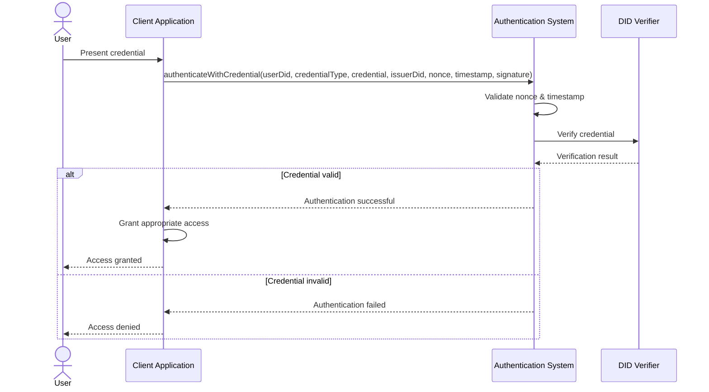
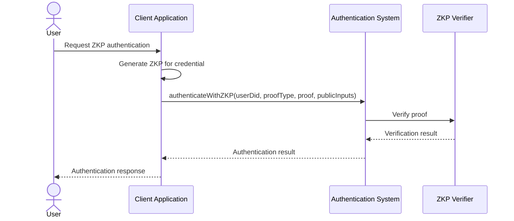

# LED-UP DID Authentication System Architecture

## Overview

This document provides a comprehensive architectural overview of the LED-UP DID Authentication system, which is designed to provide secure, decentralized identity authentication for the LED-UP platform. The system leverages blockchain technology to enable secure, verifiable, and privacy-preserving authentication mechanisms.

The authentication system is built on three core components:

1. **IDidAuth Interface** - Defines the standard contract interface for DID authentication
2. **AuthenticationCore** - Implements the core authentication functionality
3. **AuthenticationExtended** - Extends the core with advanced authentication features

## System Architecture



## Component Details

### 1. IDidAuth Interface

The `IDidAuth` interface defines the standard contract interface for DID authentication in the LED-UP ecosystem. It establishes a consistent API for authentication operations across different implementations.

#### Key Features:

- **Role-based Authentication**: Authenticate DIDs for specific roles
- **Credential Verification**: Verify credentials associated with DIDs
- **Role Management**: Grant and revoke roles for DIDs
- **Component Integration**: Access related DID system components

#### Interface Definition:

```solidity
interface IDidAuth {
    function authenticate(string calldata did, bytes32 role) external returns (bool);
    function verifyCredential(string calldata did, string calldata credentialType, bytes32 credentialId) external returns (bool);
    function hasRole(string calldata did, bytes32 role) external view returns (bool);
    function grantRole(string calldata did, bytes32 role) external;
    function revokeRole(string calldata did, bytes32 role) external;
    // Component access functions
    function getDidRegistryAddress() external view returns (address);
    function getDidAccessControlAddress() external view returns (address);
    function getDidVerifierAddress() external view returns (address);
    function getDidIssuerAddress() external view returns (address);
}
```

### 2. AuthenticationCore

The `AuthenticationCore` contract implements the core functionality defined in the `IDidAuth` interface. It provides the fundamental authentication mechanisms for the LED-UP platform.

#### Key Features:

- **DID Validation**: Ensures DIDs are valid and active
- **Role Management**: Manages role assignments for DIDs
- **Credential Verification**: Basic verification of credentials
- **Access Control**: Ensures only authorized users can perform certain operations

#### Authentication Flow:



### 3. AuthenticationExtended

The `AuthenticationExtended` contract extends the core authentication functionality with advanced features such as session-based authentication, signature verification, and credential-based authentication.

#### Key Features:

- **Session Management**: Create and manage authentication sessions
- **Signature-based Authentication**: Authenticate using cryptographic signatures
- **Credential-based Authentication**: Authenticate using verifiable credentials
- **Nonce Management**: Prevent replay attacks with nonce validation
- **Timestamp Validation**: Ensure authentication requests are recent

#### Extended Authentication Flow:



## Data Structures

### AuthenticationCore

```solidity
// Role assignments
mapping(string => mapping(bytes32 => bool)) private didRoles;

// Role requirements
mapping(bytes32 => string) private roleRequirements;

// Verified credentials
mapping(string => mapping(string => mapping(bytes32 => bool))) private verifiedCredentials;
```

### AuthenticationExtended

```solidity
// Authentication session structure
struct AuthSession {
    address user;
    bytes32 challenge;
    uint256 createdAt;
    uint256 expiresAt;
    bool active;
}

// Authentication result structure
struct AuthResult {
    address user;
    string did;
    uint256 timestamp;
    bool success;
    string authMethod;
}

// Session storage
mapping(bytes32 => AuthSession) private authSessions;

// Authentication results
mapping(address => AuthResult[]) private authResults;

// Used nonces for replay protection
mapping(bytes32 => bool) private usedNonces;
```

## Security Considerations

The authentication system implements several security measures to ensure the integrity and confidentiality of the authentication process:



### Key Security Features:

1. **Signature Verification**: Uses `ecrecover` to verify that signatures are created by the claimed identity
2. **Nonce Management**: Prevents replay attacks by ensuring each authentication request uses a unique nonce
3. **Timestamp Validation**: Ensures authentication requests are recent, preventing delayed replay attacks
4. **Session Expiration**: Limits the validity period of authentication sessions
5. **Role-based Access Control**: Restricts access to functions based on assigned roles
6. **DID Validation**: Ensures DIDs are valid and active before authentication

## Integration with LED-UP Ecosystem

The authentication system integrates with the broader LED-UP ecosystem through interactions with other core components:



## Authentication Flows

### 1. Basic Role-based Authentication



### 2. Session-based Authentication



### 3. Credential-based Authentication



## Architectural Assessment

### Strengths

1. **Modular Design**: The system follows a modular design with clear separation of concerns between core and extended functionality.
2. **Comprehensive Security**: Implements multiple security measures to protect against common attack vectors.
3. **Flexible Authentication Methods**: Supports multiple authentication methods (role-based, signature-based, credential-based).
4. **Standards Compliance**: Follows DID standards for decentralized identity management.
5. **Extensibility**: The architecture allows for easy extension with additional authentication methods.

### Areas for Improvement

1. **Gas Optimization**: The current implementation could be optimized for gas usage, particularly in the extended authentication flows.
2. **Credential Verification**: The credential verification in `AuthenticationCore` is currently a placeholder and needs a robust implementation.
3. **Role Requirements**: The role requirements mechanism is defined but not fully utilized in the authentication process.
4. **Session Management**: The session management could be enhanced with more sophisticated features like session renewal and revocation.
5. **Event Logging**: While events are emitted for key actions, more comprehensive event logging would improve auditability.

## Recommendations for Enhancement

### 1. Implement Zero-Knowledge Proof Authentication

Enhance privacy by implementing zero-knowledge proof-based authentication that allows users to prove they possess certain credentials without revealing the actual credential data.



### 2. Add Multi-factor Authentication

Implement multi-factor authentication to enhance security by requiring multiple forms of verification.

```solidity
// Multi-factor authentication structure
struct MFAConfig {
    bool enabled;
    uint8 requiredFactors;
    mapping(string => bool) enabledFactors; // e.g., "signature", "credential", "otp"
}

// MFA status tracking
struct MFAStatus {
    uint8 completedFactors;
    mapping(string => bool) completedFactorTypes;
    uint256 expiresAt;
}

// MFA storage
mapping(address => MFAConfig) private mfaConfigs;
mapping(bytes32 => MFAStatus) private mfaSessions;
```

### 3. Enhance Role Management

Implement hierarchical roles and more sophisticated role management features.

```solidity
// Role hierarchy
mapping(bytes32 => bytes32) private roleParents;

// Role inheritance check
function hasRoleOrParent(string calldata did, bytes32 role) external view returns (bool) {
    if (didRoles[did][role]) {
        return true;
    }

    bytes32 parentRole = roleParents[role];
    while (parentRole != bytes32(0)) {
        if (didRoles[did][parentRole]) {
            return true;
        }
        parentRole = roleParents[parentRole];
    }

    return false;
}
```

### 4. Implement Delegation

Allow DIDs to delegate authentication authority to other DIDs for specific purposes.

```solidity
// Delegation structure
struct Delegation {
    string delegator;
    string delegate;
    bytes32[] roles;
    uint256 expiresAt;
    bool active;
}

// Delegation storage
mapping(bytes32 => Delegation) private delegations;

// Check delegation
function checkDelegation(string calldata delegator, string calldata delegate, bytes32 role)
    external view returns (bool) {
    bytes32 delegationId = keccak256(abi.encodePacked(delegator, delegate));
    Delegation storage delegation = delegations[delegationId];

    if (!delegation.active || delegation.expiresAt < block.timestamp) {
        return false;
    }

    for (uint256 i = 0; i < delegation.roles.length; i++) {
        if (delegation.roles[i] == role) {
            return true;
        }
    }

    return false;
}
```

### 5. Implement Rate Limiting

Add rate limiting to prevent brute force attacks and denial of service.

```solidity
// Rate limiting structure
struct RateLimit {
    uint256 windowStart;
    uint256 count;
    uint256 limit;
    uint256 windowSize;
}

// Rate limit tracking
mapping(address => RateLimit) private rateLimits;

// Rate limit check
modifier rateLimit(uint256 limit, uint256 windowSize) {
    RateLimit storage rateLimit = rateLimits[msg.sender];

    if (block.timestamp > rateLimit.windowStart + windowSize) {
        rateLimit.windowStart = block.timestamp;
        rateLimit.count = 1;
    } else {
        rateLimit.count += 1;
    }

    require(rateLimit.count <= limit, "Rate limit exceeded");
    _;
}
```

## Conclusion

The LED-UP DID Authentication system provides a robust foundation for secure, decentralized identity authentication in the LED-UP ecosystem. The modular architecture, with clear separation between core and extended functionality, allows for flexibility and extensibility while maintaining a consistent interface.

The system implements multiple security measures to protect against common attack vectors, including signature verification, nonce management, timestamp validation, and session expiration. It also supports multiple authentication methods, including role-based, signature-based, and credential-based authentication.

While the current implementation provides a solid foundation, there are several areas for enhancement, including gas optimization, more robust credential verification, enhanced role management, and additional authentication methods like zero-knowledge proofs and multi-factor authentication.
