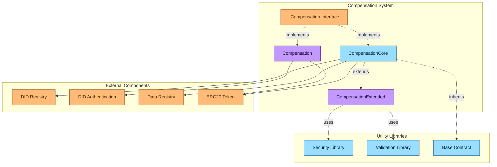
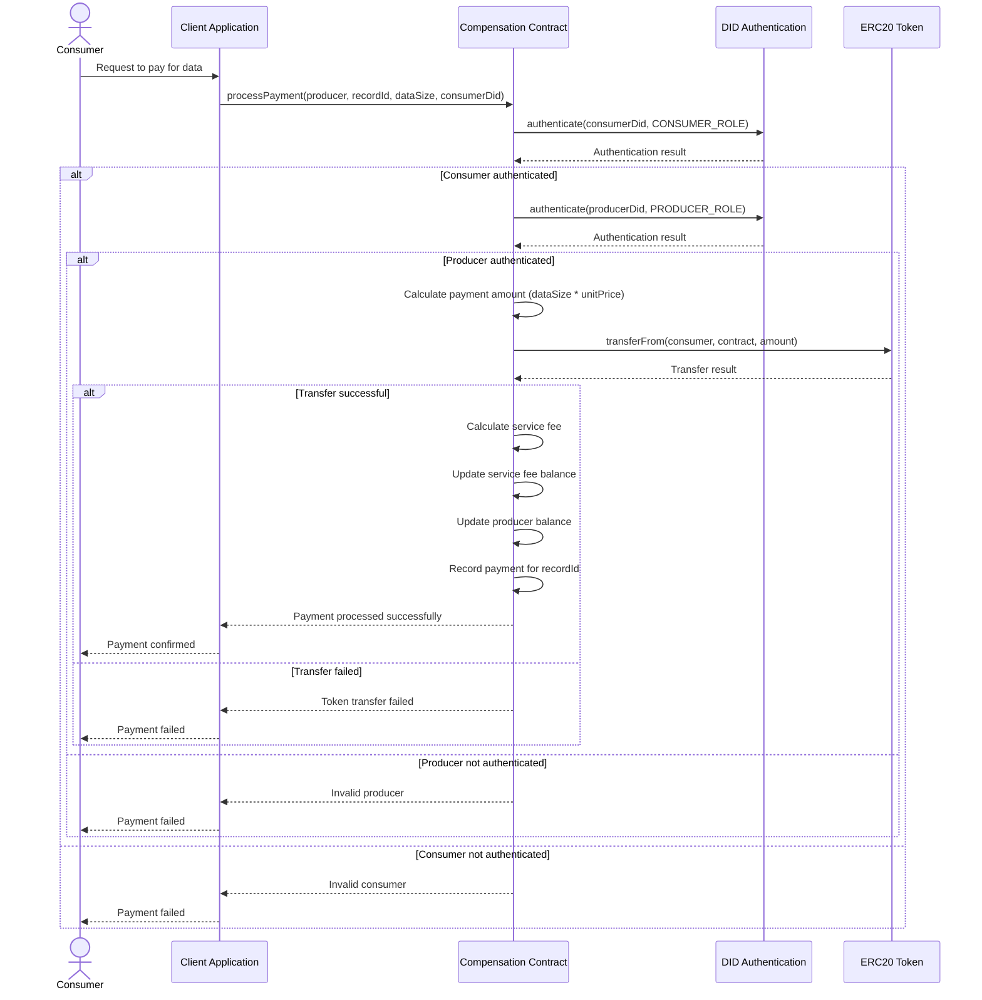
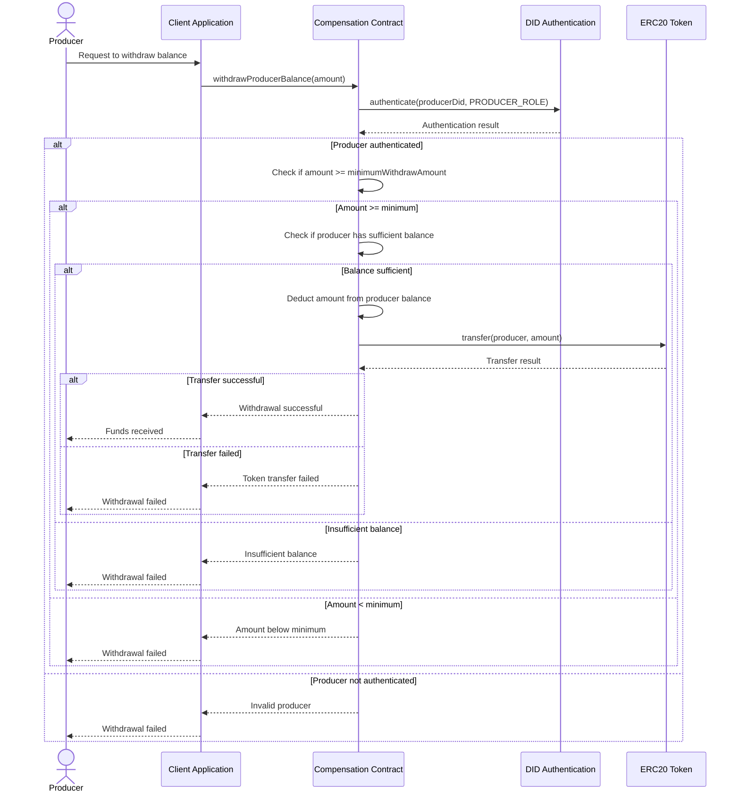
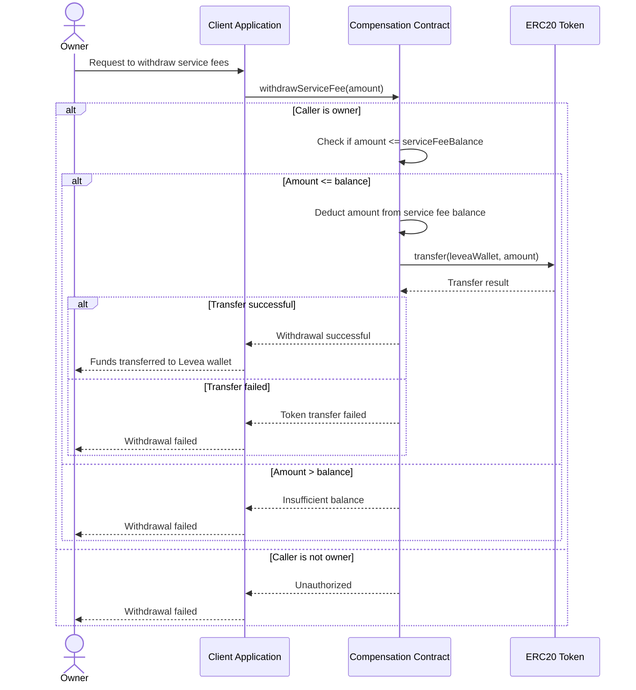
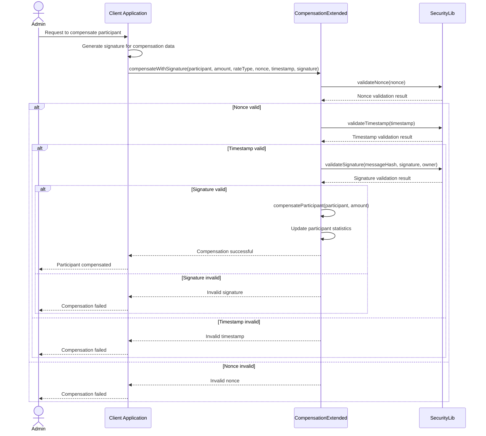
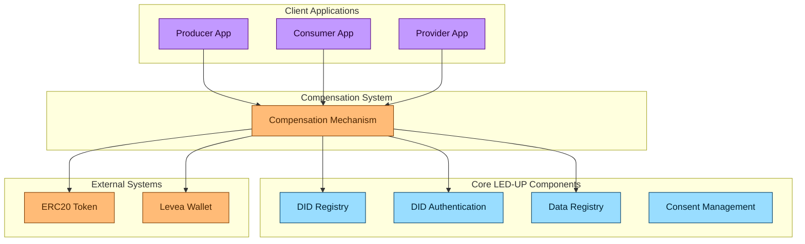
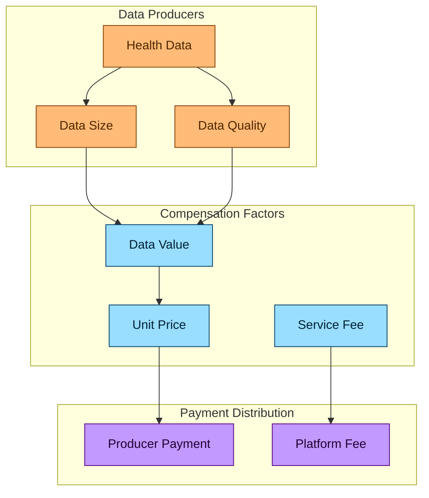
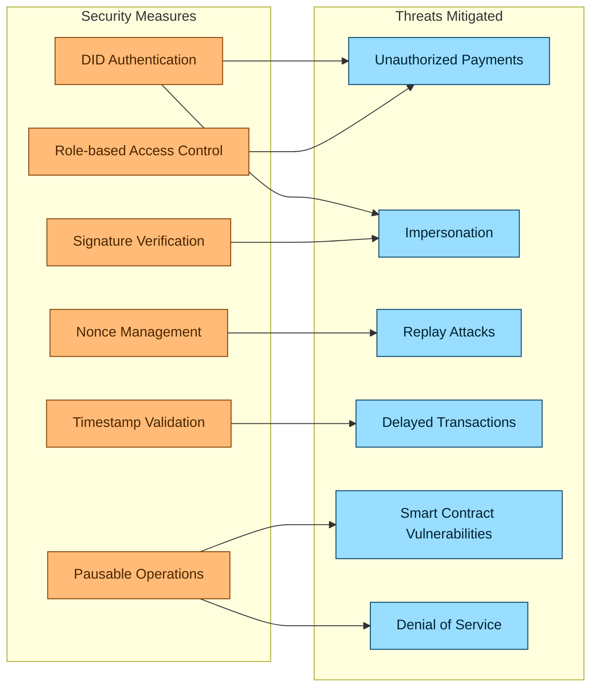
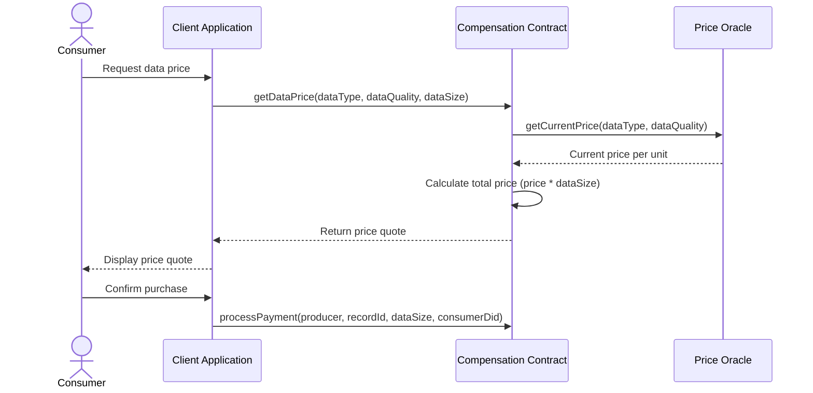

# LED-UP Compensation Mechanism Architecture

## Overview

This document provides a comprehensive architectural overview of the LED-UP Compensation Mechanism, which is designed to facilitate fair and transparent compensation for data producers in the LED-UP ecosystem. The system leverages blockchain technology to enable secure, verifiable, and automated payment processing for health data sharing.

The compensation mechanism is built on several core components:

1. **ICompensation Interface** - Defines the standard contract interface for compensation operations
2. **CompensationCore** - Implements the core compensation functionality
3. **CompensationExtended** - Extends the core with advanced compensation features
4. **Compensation** - The main implementation used in production

## System Architecture



## Component Details

### 1. ICompensation Interface

The `ICompensation` interface defines the standard contract interface for compensation operations in the LED-UP ecosystem. It establishes a consistent API for payment processing, balance management, and administrative functions.

#### Key Features:

- **Payment Processing**: Process payments for data access
- **Payment Verification**: Verify payment status for records
- **Balance Management**: Manage producer balances and withdrawals
- **Service Fee Management**: Manage service fees and withdrawals
- **Administrative Functions**: Configure system parameters

#### Interface Definition:

```solidity
interface ICompensation {
    struct Payment {
        uint256 amount;
        bool isPayed;
    }

    function processPayment(address _producer, string memory _recordId, uint256 dataSize, string memory consumerDid) external;
    function verifyPayment(string memory _recordId) external view returns (bool);
    function withdrawProducerBalance(uint256 _amount) external;
    function withdrawServiceFee(uint256 _amount) external;
    function removeProducer(address _producer) external;
    function changeServiceFee(uint256 _newServiceFee) external;
    function changeUnitPrice(uint256 _newUnitPrice) external;
    function setMinimumWithdrawAmount(uint256 _amount) external;
    function changeTokenAddress(address _tokenAddress) external;
    function pauseService() external;
    function unpauseService() external;

    // View functions
    function getServiceFee() external view returns (uint256);
    function getLeveaWallet() external view returns (address);
    function getLeveaWalletBalance() external view returns (uint256);
    function getProducerBalance() external view returns (uint256);
    function getProducerBalance(address _producer) external view returns (uint256);
    function getMinimumWithdrawAmount() external view returns (uint256);
    function getUnitPrice() external view returns (uint256);
    function getPaymentTokenAddress() external view returns (address);
}
```

### 2. CompensationCore

The `CompensationCore` contract implements the core functionality defined in the `ICompensation` interface. It provides the fundamental compensation mechanisms for the LED-UP platform.

#### Key Features:

- **Token Integration**: Integration with ERC20 token for payments
- **Registry Integration**: Integration with DID and Data registries
- **Compensation Records**: Track compensation history
- **Service Fee Management**: Manage service fees
- **Producer Balance Management**: Manage producer balances

#### Data Structures:

```solidity
// Token contract
IERC20 private token;

// DID registry contract address
address private didRegistry;

// Data registry contract address
address private dataRegistry;

// Compensation records
mapping(address => uint256) private compensationRecords;
mapping(address => uint256) private lastCompensationTime;

// Service fee percentage (in basis points, e.g., 250 = 2.5%)
uint256 private serviceFeePercent;

// Unit price
uint256 private unitPrice;

// Minimum withdraw amount
uint256 private minimumWithdrawAmount;

// Producer balances
mapping(address => uint256) private producerBalances;

// Service fee balance
uint256 private serviceFeeBalance;

// Levea wallet address
address private leveaWallet;

// Payments
mapping(string => Payment) private payments;
```

### 3. CompensationExtended

The `CompensationExtended` contract extends the core compensation functionality with advanced features such as compensation rates, periods, and signature-based compensation.

#### Key Features:

- **Compensation Rates**: Define different rates for different types of compensation
- **Compensation Periods**: Define time periods for compensation processing
- **Signature-based Compensation**: Process compensation with cryptographic signatures
- **Participant Statistics**: Track detailed statistics for participants

#### Data Structures:

```solidity
// Compensation rate structure
struct CompensationRate {
    string rateType;
    uint256 baseRate;
    uint256 bonusRate;
    uint256 timestamp;
    bool active;
}

// Compensation period structure
struct CompensationPeriod {
    uint256 startTime;
    uint256 endTime;
    bool processed;
    uint256 totalAmount;
}

// Participant statistics structure
struct ParticipantStats {
    uint256 totalCompensation;
    uint256 lastCompensationTime;
    uint256 compensationCount;
    uint256 averageCompensation;
}

// Compensation rates
mapping(string => CompensationRate) private compensationRates;
string[] private rateTypes;

// Compensation periods
mapping(uint256 => CompensationPeriod) private compensationPeriods;
uint256[] private periodIds;

// Participant statistics
mapping(address => ParticipantStats) private participantStats;

// Used nonces for replay protection
mapping(bytes32 => bool) private usedNonces;
```

### 4. Compensation

The `Compensation` contract is the main implementation used in production. It implements the `ICompensation` interface directly and integrates with the DID Authentication system for role-based access control.

#### Key Features:

- **DID Authentication**: Integrate with DID Authentication for role-based access control
- **Producer and Consumer DIDs**: Map addresses to DIDs for authentication
- **Payment Processing**: Process payments with DID verification
- **Balance Management**: Manage producer balances and withdrawals
- **Service Fee Management**: Manage service fees and withdrawals

#### Data Structures:

```solidity
// Token contract
IERC20 public token;

// Levea wallet address
address payable private leveaWallet;

// Service fee percentage
uint256 private serviceFeePercent;

// Minimum withdraw amount
uint256 private minimumWithdrawAmount;

// Unit price
uint256 private unitPrice;

// Service fee balance
uint256 public serviceFeeBalance;

// Producer balances
mapping(address => uint256) private producerBalances;

// Payments
mapping(string => Payment) public payments;

// DID Authentication
DidAuth public didAuth;

// DID mappings
mapping(address => string) private producerDids;
mapping(address => string) private consumerDids;
```

## Compensation Flows

### 1. Payment Processing



### 2. Producer Balance Withdrawal



### 3. Service Fee Withdrawal



### 4. Extended Compensation with Signature



## Integration with LED-UP Ecosystem

The compensation mechanism integrates with the broader LED-UP ecosystem through interactions with other core components:



## Compensation Model

The LED-UP compensation system implements a data-driven compensation model:



## Security Considerations

The compensation system implements several security measures to ensure the integrity and confidentiality of the payment process:



### Key Security Features:

1. **DID Authentication**: Verifies the identity of producers and consumers using DIDs
2. **Role-based Access Control**: Ensures only authorized roles can perform specific actions
3. **Signature Verification**: Validates cryptographic signatures for secure operations
4. **Nonce Management**: Prevents replay attacks by ensuring each transaction is unique
5. **Timestamp Validation**: Ensures transactions are recent and not delayed
6. **Pausable Operations**: Allows pausing the contract in case of emergencies

## Architectural Assessment

### Strengths

1. **DID Integration**: Seamless integration with the DID system for identity verification.
2. **Flexible Payment Model**: Configurable unit price and service fee for different data types.
3. **Extended Features**: Advanced features like compensation rates, periods, and signature-based compensation.
4. **Comprehensive Security**: Multiple security measures to protect against common attack vectors.
5. **Transparent Fee Structure**: Clear separation between producer payments and platform fees.

### Areas for Improvement

1. **Gas Optimization**: The current implementation could be optimized for gas usage, particularly in the payment processing flow.
2. **Bulk Operations**: No support for processing multiple payments in a single transaction.
3. **Token Flexibility**: Limited support for multiple token types or payment methods.
4. **Dynamic Pricing**: No support for dynamic pricing based on data quality or market demand.
5. **Escrow Mechanism**: No escrow mechanism for dispute resolution.

## Recommendations for Enhancement

### 1. Implement Gas-Optimized Payment Processing

Optimize the payment processing flow to reduce gas costs, particularly for frequent operations.

```solidity
// Gas-optimized payment processing
function processPaymentOptimized(
    address[] calldata producers,
    string[] calldata recordIds,
    uint256[] calldata dataSizes,
    string[] calldata consumerDids
) external {
    require(
        producers.length == recordIds.length &&
        recordIds.length == dataSizes.length &&
        dataSizes.length == consumerDids.length,
        "Array lengths must match"
    );

    uint256 totalAmount = 0;

    // Calculate total amount first
    for (uint256 i = 0; i < producers.length; i++) {
        totalAmount += dataSizes[i] * unitPrice;
    }

    // Transfer tokens once
    if (!token.transferFrom(msg.sender, address(this), totalAmount)) {
        revert Compensation__TokenTransferFailed();
    }

    // Process individual payments
    for (uint256 i = 0; i < producers.length; i++) {
        _processPayment(producers[i], recordIds[i], dataSizes[i], consumerDids[i]);
    }
}
```

### 2. Implement Dynamic Pricing

Enhance the system with dynamic pricing based on data quality, market demand, or other factors.



### 3. Implement Multi-Token Support

Add support for multiple token types or payment methods.

```solidity
// Multi-token support
struct TokenInfo {
    IERC20 token;
    uint256 unitPrice;
    uint256 minimumWithdrawAmount;
    bool active;
}

// Token storage
mapping(address => TokenInfo) private supportedTokens;
address[] private tokenAddresses;

// Process payment with specified token
function processPaymentWithToken(
    address _producer,
    string memory _recordId,
    uint256 dataSize,
    string memory consumerDid,
    address tokenAddress
) external {
    TokenInfo storage tokenInfo = supportedTokens[tokenAddress];
    require(tokenInfo.active, "Token not supported");

    // Calculate amount based on token-specific unit price
    uint256 amount = dataSize * tokenInfo.unitPrice;

    // Process payment with the specified token
    // ...
}
```

### 4. Implement Escrow Mechanism

Add an escrow mechanism for dispute resolution.

```solidity
// Escrow structure
struct Escrow {
    address consumer;
    address producer;
    uint256 amount;
    uint256 createdAt;
    uint256 expiresAt;
    EscrowStatus status;
}

enum EscrowStatus {
    Created,
    Released,
    Refunded,
    Disputed,
    Resolved
}

// Escrow storage
mapping(bytes32 => Escrow) private escrows;

// Create escrow
function createEscrow(
    address producer,
    string memory recordId,
    uint256 dataSize,
    string memory consumerDid,
    uint256 escrowPeriod
) external returns (bytes32 escrowId) {
    // Calculate amount
    uint256 amount = dataSize * unitPrice;

    // Transfer tokens to contract
    if (!token.transferFrom(msg.sender, address(this), amount)) {
        revert Compensation__TokenTransferFailed();
    }

    // Create escrow
    escrowId = keccak256(abi.encodePacked(producer, recordId, block.timestamp));
    escrows[escrowId] = Escrow({
        consumer: msg.sender,
        producer: producer,
        amount: amount,
        createdAt: block.timestamp,
        expiresAt: block.timestamp + escrowPeriod,
        status: EscrowStatus.Created
    });

    return escrowId;
}
```

### 5. Implement Reputation-Based Incentives

Enhance the system with reputation-based incentives to encourage high-quality data.

```solidity
// Producer reputation structure
struct ProducerReputation {
    uint256 totalTransactions;
    uint256 totalRatings;
    uint256 averageRating;
    uint256 reputationScore;
    uint256 lastUpdated;
}

// Reputation storage
mapping(address => ProducerReputation) private producerReputations;

// Rate producer
function rateProducer(address producer, uint256 rating, string memory recordId) external {
    // Verify the consumer has paid for the record
    require(payments[recordId].isPayed, "No payment for this record");

    // Update producer reputation
    ProducerReputation storage reputation = producerReputations[producer];
    reputation.totalTransactions++;
    reputation.totalRatings += rating;
    reputation.averageRating = reputation.totalRatings / reputation.totalTransactions;

    // Calculate reputation score (example algorithm)
    reputation.reputationScore = (reputation.averageRating * 80 + reputation.totalTransactions * 20) / 100;
    reputation.lastUpdated = block.timestamp;

    // Apply reputation bonus for future payments
    // ...
}
```

## Conclusion

The LED-UP Compensation Mechanism provides a robust foundation for fair and transparent compensation in the LED-UP ecosystem. The modular architecture, with clear separation between core and extended functionality, allows for flexibility and extensibility while maintaining a consistent interface.

The system implements multiple security measures to ensure the integrity and confidentiality of the payment process, including DID authentication, role-based access control, signature verification, nonce management, timestamp validation, and pausable operations.

While the current implementation provides a solid foundation, there are several areas for enhancement, including gas optimization, bulk operations, token flexibility, dynamic pricing, and escrow mechanisms. By implementing these enhancements, the LED-UP Compensation Mechanism can provide even stronger security guarantees while maintaining flexibility and usability for the LED-UP ecosystem.
