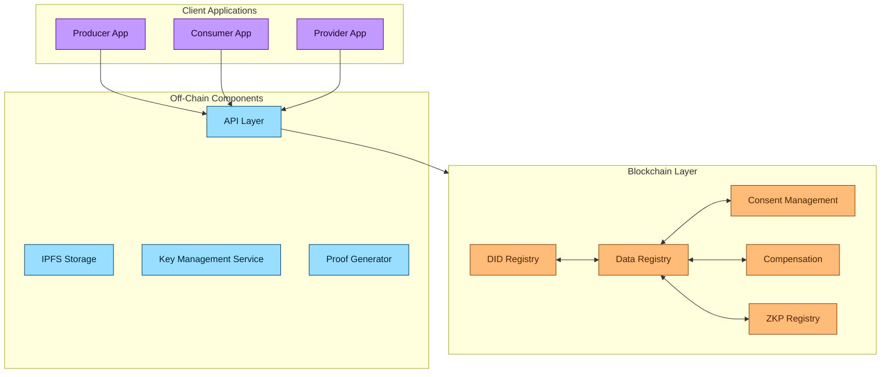
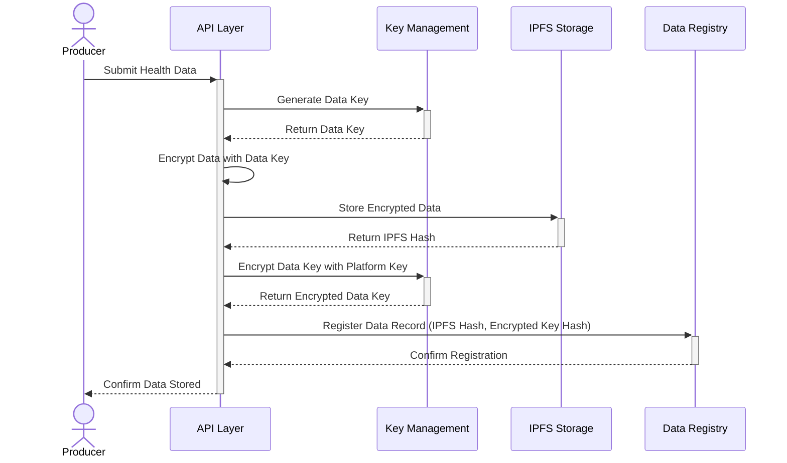
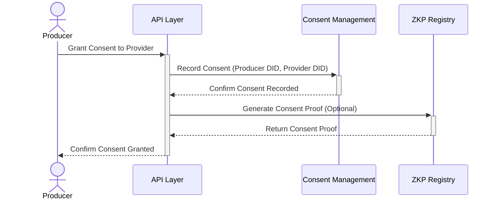
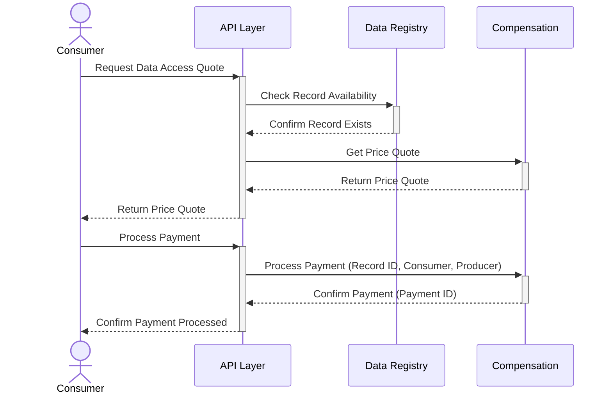
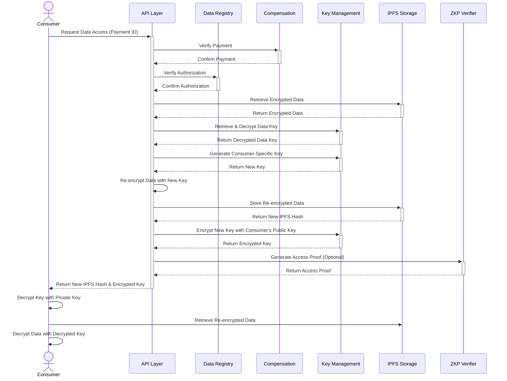
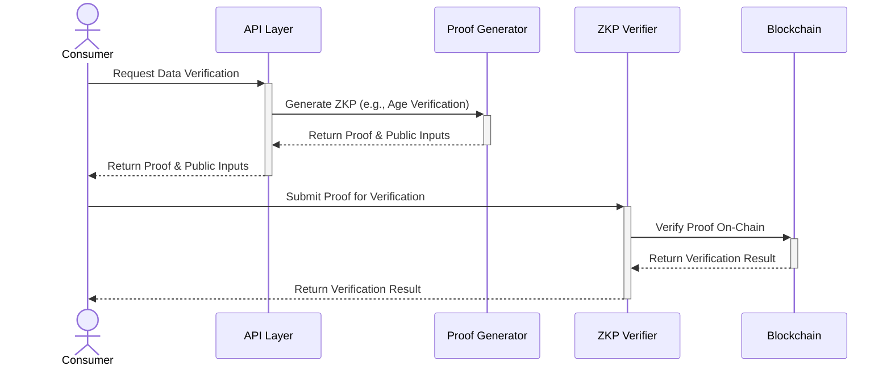

# Enhanced Secure Data Sharing Strategy for LED-UP

## Overview

This document outlines an enhanced secure data sharing strategy for the LED-UP platform, integrating blockchain-based access control, zero-knowledge proofs, and secure off-chain data storage. The strategy improves upon the existing approach by adding multiple layers of security, privacy-preserving verification, and efficient key management.

## Architecture Components



## Enhanced Data Sharing Flow

### 1. Data Registration and Encryption



1. **Producer Submits Data**: The producer submits health data through the API.
2. **Key Generation**: The system generates a unique symmetric data key for this specific record.
3. **Data Encryption**: The data is encrypted with the data key.
4. **IPFS Storage**: The encrypted data is stored on IPFS, returning a content hash.
5. **Key Encryption**: The data key is encrypted with a platform master key and stored securely.
6. **Blockchain Registration**: A record containing the IPFS hash and a reference to the encrypted key is registered on-chain.

### 2. Consent Management



1. **Consent Granting**: The producer grants consent for a specific provider to access their data.
2. **On-Chain Recording**: The consent is recorded on the blockchain with appropriate metadata.
3. **ZKP Generation (Optional)**: For enhanced privacy, a zero-knowledge proof can be generated to prove consent exists without revealing details.

### 3. Payment Processing



1. **Quote Request**: The consumer requests a quote for accessing specific data.
2. **Price Determination**: The system determines the price based on the data type and configured unit price.
3. **Payment Processing**: The consumer processes the payment through the Compensation contract.
4. **Payment Confirmation**: The system confirms the payment and records it on-chain.

### 4. Secure Data Access with Re-encryption



1. **Access Request**: The consumer requests access to data they've paid for.
2. **Payment Verification**: The system verifies the payment has been processed.
3. **Authorization Check**: The system checks that the consumer is authorized to access the data.
4. **Data Retrieval**: The system retrieves the encrypted data from IPFS.
5. **Key Retrieval**: The system retrieves and decrypts the data key.
6. **Re-encryption**: The system generates a new key specific to this consumer and re-encrypts the data.
7. **Consumer Key Encryption**: The new key is encrypted with the consumer's public key.
8. **Access Proof**: Optionally, a ZKP is generated to prove legitimate access.
9. **Data Delivery**: The consumer receives the new IPFS hash and encrypted key.
10. **Client-side Decryption**: The consumer decrypts the key with their private key and uses it to decrypt the data.

### 5. Verification with Zero-Knowledge Proofs



1. **Verification Request**: The consumer requests verification of specific data properties.
2. **Proof Generation**: The system generates a zero-knowledge proof for the requested verification.
3. **On-Chain Verification**: The proof is verified on-chain without revealing the underlying data.
4. **Verification Result**: The verification result is returned to the consumer.

## Key Security Enhancements

### 1. Multi-Layer Encryption

The strategy employs multiple layers of encryption:

1. **Data Encryption**: Each health record is encrypted with a unique symmetric key.
2. **Key Encryption**: The data key is encrypted with a platform master key.
3. **Consumer-Specific Re-encryption**: Data is re-encrypted with a consumer-specific key for access.
4. **Public Key Encryption**: The consumer-specific key is encrypted with the consumer's public key.

### 2. Zero-Knowledge Proofs for Privacy

Zero-knowledge proofs enable verification without revealing sensitive data:

1. **Age Verification**: Verify a person's age without revealing the actual age.
2. **FHIR Resource Verification**: Verify properties of FHIR resources without exposing the resource data.
3. **Hash Verification**: Verify data integrity without revealing the data.
4. **Consent Verification**: Verify consent without revealing detailed consent information.

### 3. Secure Key Management

The key management system provides:

1. **Key Generation**: Secure generation of cryptographic keys.
2. **Key Storage**: Secure storage of keys in Azure Key Vault or similar service.
3. **Key Rotation**: Regular rotation of platform master keys.
4. **Key Recovery**: Secure key recovery procedures.
5. **Access Control**: Strict access control for key operations.

### 4. Blockchain-Based Access Control

The blockchain provides:

1. **Immutable Access Records**: All access grants and revocations are recorded on-chain.
2. **Payment Verification**: Payments are verified on-chain before access is granted.
3. **Consent Tracking**: Consent is tracked on-chain with timestamps and expiry information.
4. **Authorization Checks**: All data access requires on-chain authorization.

## Implementation Details

### 1. Smart Contract Enhancements

```solidity
// Enhanced DataRegistry with encryption metadata
struct EnhancedHealthRecord {
    address producer;
    bytes32 metadataHash;
    uint40 timestamp;
    bool active;
    string dataURI;
    bytes32 encryptedKeyReference; // Reference to the encrypted data key
    string encryptionAlgorithm;    // Algorithm used for encryption
}

// Enhanced Compensation with access tracking
struct EnhancedPayment {
    address consumer;
    address producer;
    uint256 amount;
    uint256 serviceFee;
    uint256 timestamp;
    bool processed;
    uint256 accessExpiryTime;     // When access expires
    bytes32 accessKeyReference;   // Reference to the access key
}

// Enhanced Consent with verification proof
struct EnhancedConsent {
    string producerDid;
    string providerDid;
    ConsentStatus status;
    uint256 timestamp;
    uint256 expiryTime;
    string purpose;
    bytes32 verificationProof;    // ZKP verification reference
}
```

### 2. API Layer Implementation

The API layer should implement:

1. **Encryption Service**: Handles data encryption and decryption.
2. **Key Management Service**: Manages cryptographic keys.
3. **IPFS Integration**: Handles storage and retrieval from IPFS.
4. **ZKP Generation**: Generates zero-knowledge proofs.
5. **Blockchain Interaction**: Interacts with smart contracts.
6. **Authentication**: Authenticates users and verifies DIDs.
7. **Authorization**: Checks access permissions.
8. **Notification Service**: Notifies users of events.

### 3. Client-Side Implementation

The client applications should implement:

1. **Local Key Management**: Securely stores private keys.
2. **Decryption Logic**: Decrypts data with the provided keys.
3. **ZKP Verification**: Verifies zero-knowledge proofs.
4. **Blockchain Interaction**: Interacts with smart contracts.
5. **IPFS Retrieval**: Retrieves data from IPFS.
6. **User Authentication**: Authenticates users with DIDs.
7. **Payment Processing**: Processes payments for data access.

## Security Best Practices

1. **End-to-End Encryption**: All sensitive data is encrypted end-to-end.
2. **Zero-Knowledge Proofs**: Use ZKPs for privacy-preserving verification.
3. **Secure Key Management**: Implement robust key management practices.
4. **Blockchain Verification**: Use the blockchain for verification and access control.
5. **Minimal On-Chain Data**: Store only hashes and metadata on-chain.
6. **Access Control**: Implement strict access control for all operations.
7. **Audit Logging**: Log all access and operations for audit purposes.
8. **Regular Security Audits**: Conduct regular security audits of the system.
9. **Secure Communication**: Use secure communication channels (TLS/HTTPS).
10. **Data Minimization**: Collect and process only necessary data.

## Implementation Roadmap

1. **Phase 1: Core Infrastructure**

   - Implement enhanced data registry with encryption metadata
   - Set up secure key management system
   - Integrate IPFS storage

2. **Phase 2: Security Enhancements**

   - Implement multi-layer encryption
   - Develop ZKP integration
   - Enhance access control mechanisms

3. **Phase 3: User Experience**

   - Develop client-side encryption/decryption
   - Implement notification system
   - Create user-friendly interfaces

4. **Phase 4: Scaling and Optimization**
   - Optimize gas usage
   - Implement batched operations
   - Enhance performance and scalability

## Conclusion

This enhanced secure data sharing strategy provides a robust framework for privacy-preserving data sharing in the LED-UP platform. By combining blockchain-based access control, zero-knowledge proofs, and secure off-chain storage, the strategy achieves a balance between security, privacy, and usability.

The multi-layered approach ensures that sensitive health data remains protected throughout its lifecycle, from creation to sharing and verification. The use of zero-knowledge proofs enables verification without exposing sensitive data, while the blockchain provides immutable records of consent and access.

By implementing this strategy, the LED-UP platform can provide secure, privacy-preserving data sharing that meets the highest standards of security and compliance while delivering a seamless user experience.
