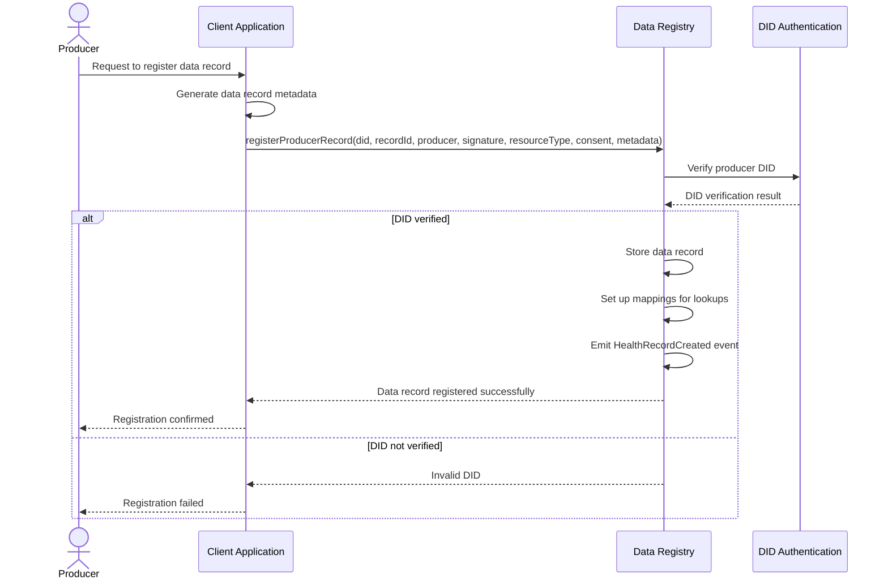
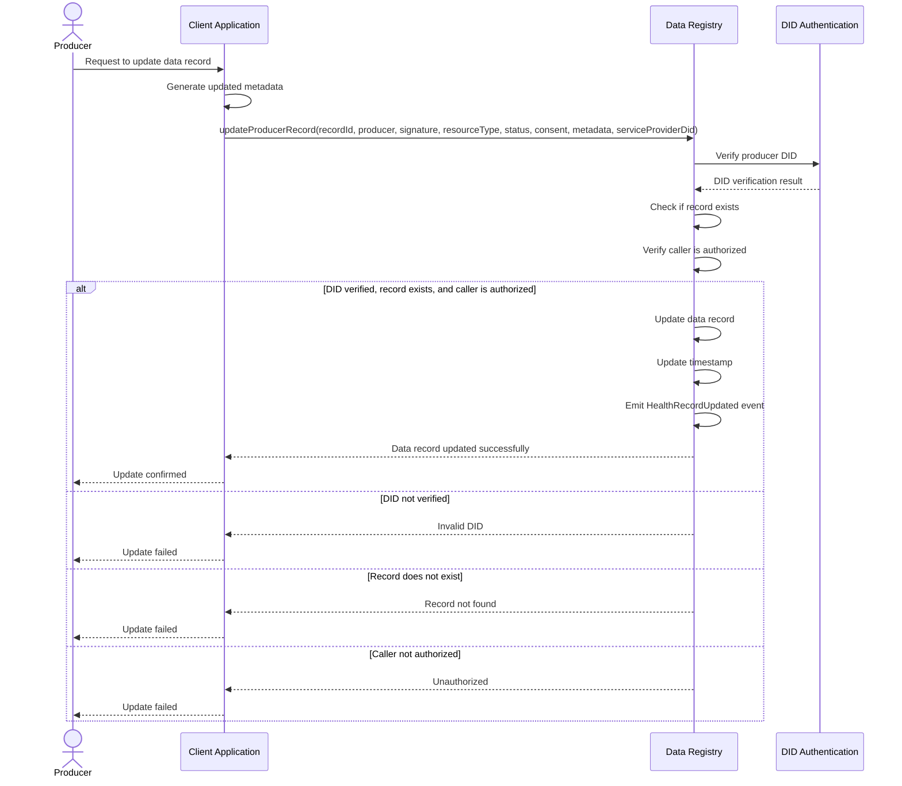
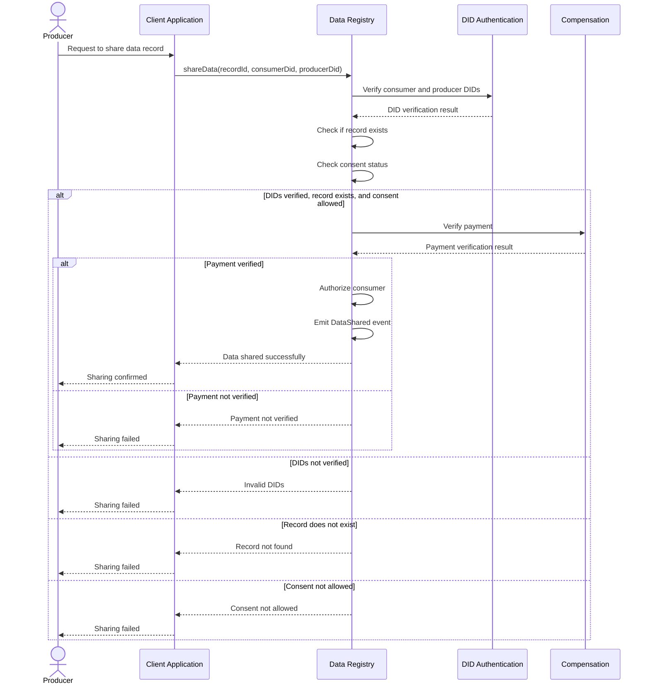
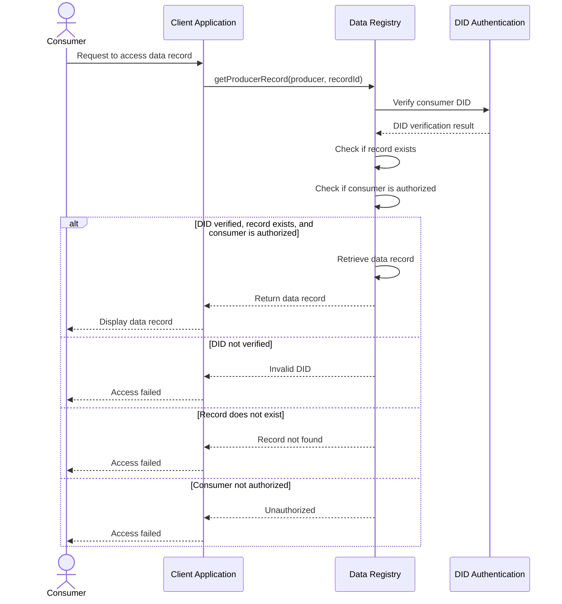
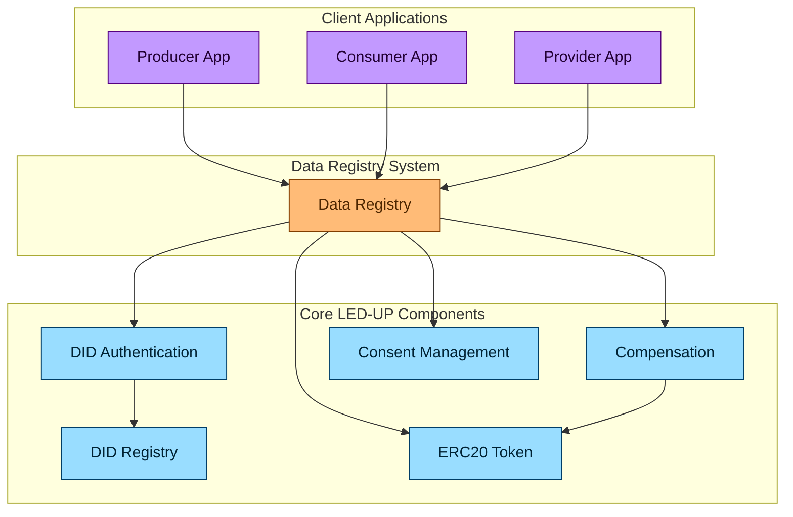
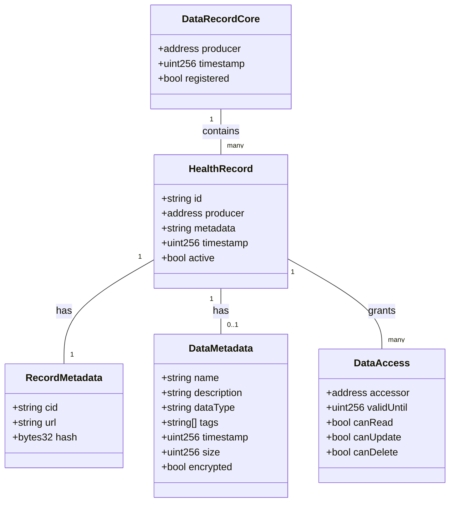
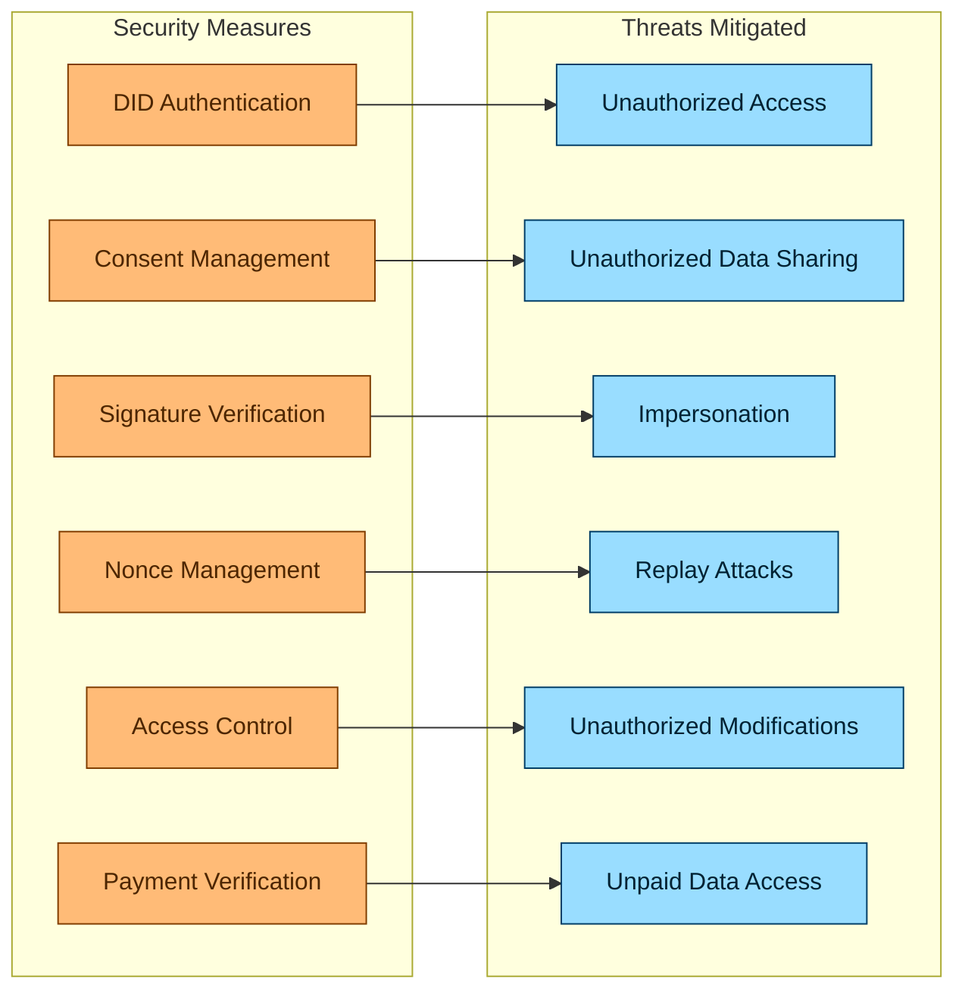
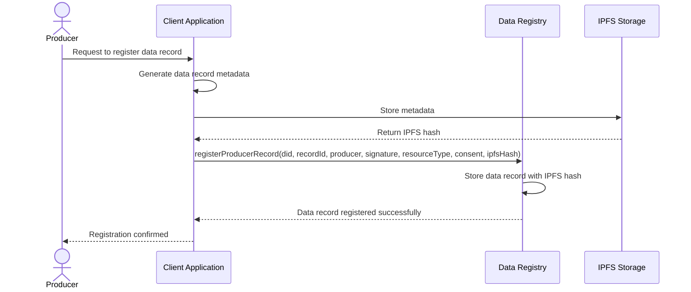
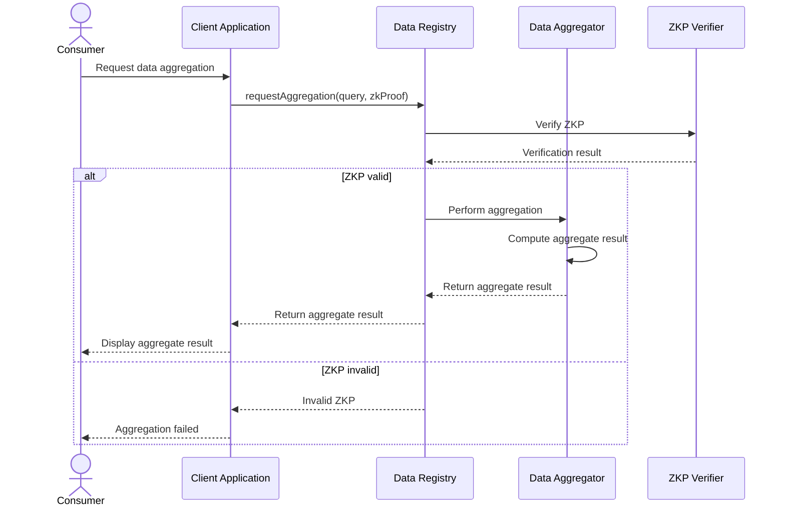

# LED-UP Data Registry Architecture

## Overview

This document provides a comprehensive architectural overview of the LED-UP Data Registry system, which is designed to provide secure, verifiable, and decentralized management of health and personal data records on the LED-UP platform. The system leverages blockchain technology to enable the creation, management, sharing, and monetization of data in a transparent and privacy-preserving manner.

The Data Registry system is built on several core components:

1. **IDataRegistry Interface** - Defines the standard contract interface for data record management
2. **DataRegistryCore** - Implements the core data registry functionality
3. **DataRegistryOptimized** - Provides a gas-optimized implementation for production use
4. **DataRegistryExtended** - Extends the core functionality with additional features
5. **DataRegistry** - The main implementation used in production

## System Architecture

```mermaid
flowchart TB
    subgraph "Data Registry System"
        direction TB
        IDataRegistry["IDataRegistry Interface"]
        DataRegistryCore["DataRegistryCore"]
        DataRegistryOptimized["DataRegistryOptimized"]
        DataRegistryExtended["DataRegistryExtended"]
        DataRegistry["DataRegistry"]

        IDataRegistry -.implements.-> DataRegistryCore
        IDataRegistry -.implements.-> DataRegistryOptimized
        IDataRegistry -.implements.-> DataRegistryExtended
        IDataRegistry -.implements.-> DataRegistry

        DataRegistryCore -.extends.-> DataRegistryExtended
    end

    subgraph "External Components"
        direction TB
        DidRegistry["DID Registry"]
        DidAuth["DID Authentication"]
        Compensation["Compensation"]
        Token["ERC20 Token"]
    end

    subgraph "Utility Libraries"
        direction TB
        StorageLib["Storage Library"]
        ValidationLib["Validation Library"]
        SecurityLib["Security Library"]
        StringLib["String Library"]
        GasLib["Gas Library"]
        BaseContract["Base Contract"]
    end

    DataRegistry --> DidAuth
    DataRegistry --> Compensation
    DataRegistry --> Token
    DidAuth --> DidRegistry

    DataRegistryCore -.uses.-> StorageLib
    DataRegistryCore -.uses.-> ValidationLib
    DataRegistryCore -.uses.-> SecurityLib
    DataRegistryOptimized -.uses.-> StorageLib
    DataRegistryOptimized -.uses.-> GasLib
    DataRegistryOptimized -.uses.-> StringLib
    DataRegistryCore -.inherits.-> BaseContract
    DataRegistryOptimized -.inherits.-> BaseContract

    classDef interface fill:#ffbb77,stroke:#803d00,color:#4d2600;
    classDef core fill:#99ddff,stroke:#003d66,color:#002233;
    classDef optimized fill:#c299ff,stroke:#550080,color:#220033;
    classDef external fill:#ffbb77,stroke:#803d00,color:#4d2600;
    classDef utility fill:#99ddff,stroke:#003d66,color:#002233;

    class IDataRegistry interface;
    class DataRegistryCore core;
    class DataRegistryOptimized,DataRegistryExtended,DataRegistry optimized;
    class DidRegistry,DidAuth,Compensation,Token external;
    class StorageLib,ValidationLib,SecurityLib,StringLib,GasLib,BaseContract utility;
```



## Component Details

### 1. IDataRegistry Interface

The `IDataRegistry` interface defines the standard contract interface for data record management in the LED-UP ecosystem. It establishes a consistent API for data operations across different implementations.

#### Key Features:

- **Data Record Registration**: Register new data records with associated metadata
- **Data Record Updates**: Update existing data records and metadata
- **Data Sharing**: Share data records with authorized consumers
- **Data Access Control**: Control access to data records based on consent and payment
- **Producer Management**: Register and manage data producers

#### Interface Definition:

```solidity
interface IDataRegistry {
    // Error definitions
    error DataRegistry__ProducerNotFound(address producer);
    error DataRegistry__Unauthorized();
    error DataRegistry__RecordNotFound(string recordId);
    // ... additional errors ...

    // Event definitions
    event ProducerRegistered(address indexed producer, uint256 timestamp);
    event HealthRecordCreated(string indexed recordId, address indexed producer, uint256 timestamp);
    event HealthRecordUpdated(string indexed recordId, address indexed producer, uint256 timestamp);
    // ... additional events ...

    // Core functions
    function registerProducerRecord(
        string calldata did,
        string calldata recordId,
        address producer,
        string calldata signature,
        string calldata resourceType,
        ConsentStatus consent,
        RecordMetadata calldata metadata
    ) external;

    function updateProducerRecord(
        string calldata recordId,
        address producer,
        string calldata signature,
        string calldata resourceType,
        RecordStatus status,
        ConsentStatus consent,
        RecordMetadata calldata metadata,
        string calldata serviceProviderDid
    ) external;

    function shareData(
        string calldata recordId,
        string calldata consumerDid,
        string calldata producerDid
    ) external;

    // ... additional functions ...
}
```

### 2. DataRegistryCore

The `DataRegistryCore` contract implements the core functionality defined in the `IDataRegistry` interface. It provides the fundamental data record management mechanisms for the LED-UP platform.

#### Key Features:

- **DID Integration**: Integrates with the DID Registry for identity verification
- **Data Record Storage**: Stores data records and associated metadata
- **Access Control**: Ensures only authorized users can modify data records
- **Data Lifecycle Management**: Manages the lifecycle of data records from creation to sharing
- **Data Resolution**: Resolves data records to their associated metadata

#### Data Structures:

```solidity
// Primary storage
mapping(address => StorageLib.DataRecordCore) private records;
mapping(address => string[]) private ids;
mapping(address => mapping(string => StorageLib.HealthRecord)) private healthRecords;
mapping(string => mapping(string => bool)) private authorizedConsumers;

// DID to address mappings for reverse lookups
mapping(string => address) private didToAddress;

// Health Record structure
struct HealthRecord {
    string id; // Record ID
    address producer; // Producer address
    string metadata; // Metadata
    uint256 timestamp; // Timestamp of creation
    bool active; // Active status flag
}

// Data Record Core structure
struct DataRecordCore {
    address producer; // Producer address
    uint256 timestamp; // Timestamp of creation
    bool registered; // Registration status
}
```

### 3. DataRegistryOptimized

The `DataRegistryOptimized` contract provides a gas-optimized implementation of the data registry functionality. It uses various gas optimization techniques to reduce transaction costs.

#### Key Features:

- **Optimized Storage**: Uses hashes instead of strings to reduce storage costs
- **Efficient Lookups**: Optimized mappings for efficient data record lookups
- **Reduced Storage Size**: Uses smaller data types where possible to reduce storage costs
- **Minimal String Operations**: Minimizes string operations to reduce gas costs
- **Efficient Validation**: Streamlined validation to reduce gas costs

#### Gas Optimization Techniques:

```solidity
// Optimized storage using bytes32 hashes and packed data
mapping(address => StorageLib.DataRecordCore) private records;
mapping(address => bytes32[]) private recordIdHashes;
mapping(address => mapping(bytes32 => StorageLib.HealthRecordOptimized)) private healthRecords;
mapping(bytes32 => mapping(bytes32 => bool)) private authorizedConsumers;

// DID to address mappings for reverse lookups
mapping(bytes32 => address) private didHashToAddress;
mapping(address => bytes32) private addressToDidHash;

// Producer flags for gas-efficient status tracking
mapping(address => uint256) private producerFlags;

// Optimized Health Record structure
struct HealthRecordOptimized {
    bytes32 idHash; // Hash of record ID
    address producer; // Producer address
    bytes32 metadataHash; // Hash of metadata
    uint40 timestamp; // Timestamp of creation (reduced size)
    bool active; // Active status flag
}
```

### 4. DataRegistryExtended

The `DataRegistryExtended` contract extends the core data registry functionality with additional features for enhanced data management.

#### Key Features:

- **Enhanced Metadata**: Provides more detailed metadata for data records
- **Access Control**: Implements fine-grained access control for data records
- **Signature Verification**: Verifies signatures for data operations
- **Nonce Management**: Prevents replay attacks with nonce management
- **Data Access Tracking**: Tracks data access for auditing purposes

#### Extended Data Structures:

```solidity
// Metadata structure for data entries
struct DataMetadata {
    string name;
    string description;
    string dataType;
    string[] tags;
    uint256 timestamp;
    uint256 size;
    bool encrypted;
}

// Data access structure
struct DataAccess {
    address accessor;
    uint256 validUntil;
    bool canRead;
    bool canUpdate;
    bool canDelete;
}

// Metadata storage
mapping(bytes32 => DataMetadata) private dataMetadata;

// Access control storage
mapping(bytes32 => mapping(address => DataAccess)) private dataAccess;
mapping(bytes32 => address[]) private dataAccessList;

// Used nonces for replay protection
mapping(bytes32 => bool) private usedNonces;
```

### 5. DataRegistry

The `DataRegistry` contract is the main implementation used in production. It integrates with the DID Authentication and Compensation systems to provide a complete data management solution.

#### Key Features:

- **DID Authentication**: Integrates with the DID Authentication system for identity verification
- **Compensation Integration**: Integrates with the Compensation system for data monetization
- **Token Integration**: Integrates with the ERC20 token for payments
- **Access Control**: Implements role-based access control for data operations
- **Data Sharing**: Enables secure data sharing with consent and payment verification

#### Implementation Details:

```solidity
// External contract references
DidAuth public didAuth;
Compensation private compensation;
IERC20 private token;

// Primary storage
mapping(address => DataRecordCore) private records;
mapping(address => string[]) private ids;
mapping(address => mapping(string => HealthRecord)) private healthRecords;
mapping(string => mapping(string => bool)) private authorizedConsumers;

// DID to address mappings for reverse lookups
mapping(string => address) private didToAddress;
```

## Data Management Flows

### 1. Data Record Registration



### 2. Data Record Update



### 3. Data Sharing



### 4. Data Access



## Integration with LED-UP Ecosystem

The Data Registry system integrates with the broader LED-UP ecosystem through interactions with other core components:



## Data Model

The LED-UP Data Registry system uses a structured data model for managing health and personal data records:



## Security Considerations

The Data Registry system implements several security measures to ensure the integrity and confidentiality of data records:



### Key Security Features:

1. **DID Authentication**: Verifies the identity of producers, consumers, and service providers
2. **Consent Management**: Ensures data is shared only with explicit consent
3. **Signature Verification**: Validates signatures for data operations to prevent impersonation
4. **Nonce Management**: Prevents replay attacks by ensuring each operation uses a unique nonce
5. **Access Control**: Restricts access to data operations based on roles and ownership
6. **Payment Verification**: Ensures data access is properly compensated

## Architectural Assessment

### Strengths

1. **Decentralized Data Management**: Provides a decentralized approach to data management.
2. **Flexible Implementation**: Multiple implementations allow for different trade-offs between functionality and gas efficiency.
3. **Comprehensive API**: Provides a comprehensive API for data record management.
4. **Gas Optimization**: The optimized implementation reduces gas costs for production use.
5. **Integration with DID and Compensation**: Seamlessly integrates with the DID and Compensation systems.

### Areas for Improvement

1. **Off-chain Storage**: The current implementation stores metadata on-chain, which can be expensive for large metadata.
2. **Data Encryption**: Limited support for data encryption and decryption.
3. **Batch Operations**: Limited support for batch operations for data records.
4. **Data Versioning**: No built-in support for data versioning.
5. **Data Aggregation**: Limited support for data aggregation and analytics.

## Recommendations for Enhancement

### 1. Implement Off-chain Storage

Store data record metadata off-chain and only keep hashes on-chain to reduce gas costs.



### 2. Implement Data Encryption

Add support for end-to-end encryption of data records.

```solidity
// Enhanced data record structure with encryption
struct EncryptedHealthRecord {
    string id;
    address producer;
    bytes encryptedMetadata;
    bytes encryptionKey;
    uint256 timestamp;
    bool active;
}

// Register encrypted data record
function registerEncryptedRecord(
    string calldata did,
    string calldata recordId,
    address producer,
    bytes calldata encryptedMetadata,
    bytes calldata encryptionKey,
    ConsentStatus consent
) external {
    // Verify DID
    // ...

    // Store encrypted record
    encryptedHealthRecords[producer][recordId] = EncryptedHealthRecord({
        id: recordId,
        producer: producer,
        encryptedMetadata: encryptedMetadata,
        encryptionKey: encryptionKey,
        timestamp: block.timestamp,
        active: true
    });

    // Emit event
    emit EncryptedHealthRecordCreated(recordId, producer, block.timestamp);
}
```

### 3. Implement Batch Operations

Add support for batch operations to reduce gas costs for multiple operations.

```solidity
// Batch register data records
function batchRegisterRecords(
    string calldata did,
    string[] calldata recordIds,
    address producer,
    string[] calldata signatures,
    string[] calldata resourceTypes,
    ConsentStatus[] calldata consents,
    RecordMetadata[] calldata metadatas
) external {
    // Verify DID
    // ...

    // Verify array lengths
    if (
        recordIds.length != signatures.length ||
        recordIds.length != resourceTypes.length ||
        recordIds.length != consents.length ||
        recordIds.length != metadatas.length
    ) {
        revert DataRegistry__InvalidInputParam();
    }

    // Register each record
    for (uint256 i = 0; i < recordIds.length; i++) {
        // Register record
        // ...

        // Emit event
        emit HealthRecordCreated(recordIds[i], producer, block.timestamp);
    }
}
```

### 4. Implement Data Versioning

Add support for data record versioning to track changes over time.

```solidity
// Versioned health record structure
struct VersionedHealthRecord {
    string id;
    address producer;
    uint256 version;
    string metadata;
    uint256 timestamp;
    bool active;
}

// Version history mapping
mapping(address => mapping(string => VersionedHealthRecord[])) private versionHistory;

// Update record with versioning
function updateRecordWithVersioning(
    string calldata recordId,
    address producer,
    string calldata metadata
) external {
    // Verify caller is authorized
    // ...

    // Get current record
    HealthRecord memory currentRecord = healthRecords[producer][recordId];

    // Create new version
    uint256 newVersion = versionHistory[producer][recordId].length + 1;

    // Store current version in history
    versionHistory[producer][recordId].push(VersionedHealthRecord({
        id: recordId,
        producer: producer,
        version: newVersion - 1,
        metadata: currentRecord.metadata,
        timestamp: currentRecord.timestamp,
        active: currentRecord.active
    }));

    // Update current record
    healthRecords[producer][recordId].metadata = metadata;
    healthRecords[producer][recordId].timestamp = block.timestamp;

    // Emit event
    emit HealthRecordVersioned(recordId, producer, newVersion, block.timestamp);
}
```

### 5. Implement Data Aggregation

Add support for data aggregation and analytics while preserving privacy.



## Conclusion

The LED-UP Data Registry system provides a robust foundation for decentralized data management in the LED-UP ecosystem. The modular architecture, with multiple implementations for different use cases, allows for flexibility and extensibility while maintaining a consistent interface.

The system implements multiple security measures to ensure the integrity and confidentiality of data records, including DID authentication, consent management, signature verification, nonce management, access control, and payment verification.

While the current implementation provides a solid foundation, there are several areas for enhancement, including off-chain storage, data encryption, batch operations, data versioning, and data aggregation. By implementing these enhancements, the LED-UP Data Registry system can provide even stronger security guarantees while maintaining flexibility and usability for the LED-UP ecosystem.
