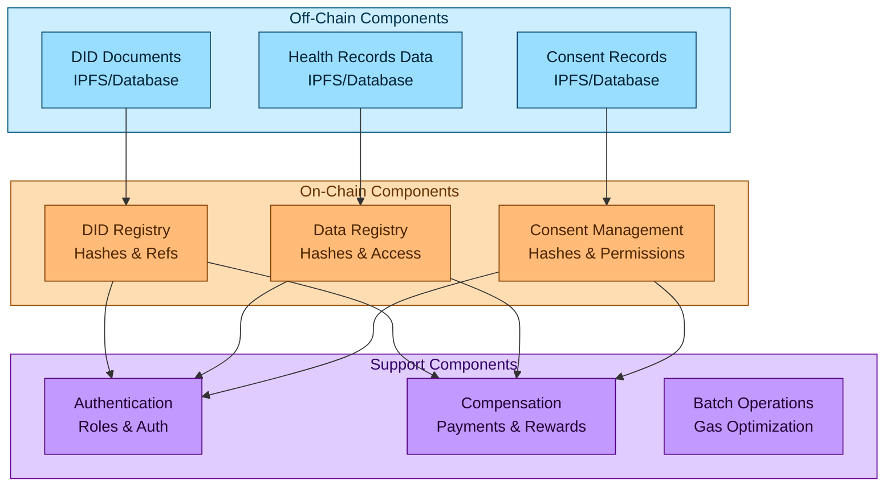
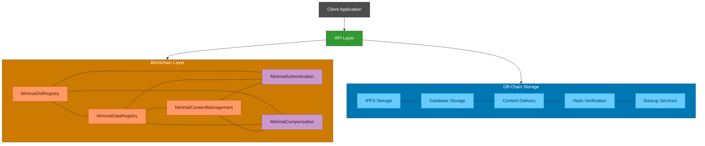

# LED-UP Minimal Architecture

This document outlines a minimal implementation architecture for the LED-UP platform that keeps most data off-chain while using the blockchain for verification and data integrity.

## Table of Contents

- [High-Level Architecture](#high-level-architecture)
- [Minimal Implementation Details](#minimal-implementation-details)
  - [DID Registry](#1-did-registry-minimalDidRegistry)
  - [Data Registry](#2-data-registry-minimaldataregistry)
  - [Consent Management](#3-consent-management-minimalconsentmanagement)
  - [Authentication](#4-authentication-minimalauthentication)
  - [Compensation](#5-compensation-minimalcompensation)
- [Implementation Strategy](#implementation-strategy)
- [Security Considerations](#security-considerations)
- [Gas Optimization](#gas-optimization)
- [Conclusion](#conclusion)

## High-Level Architecture

The architecture separates concerns between on-chain and off-chain components to optimize for cost, scalability, and security.



## Minimal Implementation Details

### 1. DID Registry (MinimalDidRegistry)

**On-Chain Storage:**

- DID to hash mapping
- Address to DID mapping
- DID document hash
- DID status (active/inactive)
- DID controller address

**Off-Chain Storage:**

- Complete DID documents
- Public keys
- Extended metadata

**Data Structure:**

```solidity
struct MinimalDIDDocument {
    address controller;      // The controller address
    bytes32 documentHash;    // Hash of the off-chain document
    uint40 lastUpdated;      // Timestamp of last update
    bool active;             // Active status flag
    string documentURI;      // URI to the off-chain document (IPFS/URL)
}

mapping(string => MinimalDIDDocument) private didDocuments;
mapping(address => string) private addressToDid;
```

**Flow Diagram:**



```mermaid
sequenceDiagram
    %% Participants
    actor User as User/Client
    participant DIDReg as MinimalDidRegistry
    participant Storage as Off-Chain Storage

    %% DID Registration Flow
    rect  rgb(56,23,35)
    Note over User, Storage: DID Registration Flow
    User->>+DIDReg: Register DID
    DIDReg->>+Storage: Store DID Document
    Storage-->>-DIDReg: Return Document URI
    Note over DIDReg: Store Hash & URI on-chain
    DIDReg-->>-User: Return Success
    end

    %% DID Verification Flow
    rect  rgb(23, 56, 45)
    Note over User, Storage: DID Verification Flow
    User->>+DIDReg: Verify DID
    DIDReg->>+Storage: Retrieve Document
    Storage-->>-DIDReg: Return Document
    Note over DIDReg: Verify Hash
    DIDReg-->>-User: Return Verification
    end
```

### 2. Data Registry (MinimalDataRegistry)

**On-Chain Storage:**

- Record ID to hash mapping
- Producer to record IDs mapping
- Record access permissions
- Record status (active/inactive)
- Record hash for integrity verification

**Off-Chain Storage:**

- Complete health records
- Metadata
- Record schemas

**Data Structure:**

```solidity
struct MinimalHealthRecord {
    address producer;        // Producer address
    bytes32 metadataHash;    // Hash of the off-chain metadata
    uint40 timestamp;        // Timestamp of creation
    bool active;             // Active status flag
    string dataURI;          // URI to the off-chain data (IPFS/URL)
}

mapping(address => mapping(string => MinimalHealthRecord)) private healthRecords;
mapping(address => string[]) private producerRecordIds;
mapping(string => mapping(string => bool)) private authorizedConsumers; // recordId => consumerDid => authorized
```

**Flow Diagram:**



```mermaid
sequenceDiagram
    %% Participants
    actor Producer
    participant DataReg as MinimalDataRegistry
    participant Storage as Off-Chain Storage

    %% Record Creation Flow
    rect rgb(56,23,35)
    Note over Producer, Storage: Record Creation Flow
    Producer->>+DataReg: Create Record
    DataReg->>+Storage: Store Record Data
    Storage-->>-DataReg: Return Data URI
    Note over DataReg: Store Hash & URI on-chain
    DataReg-->>-Producer: Return Success
    end

    %% Record Access Flow
    rect  rgb(23, 56, 45)
    Note over Producer, Storage: Record Access Flow
    actor Consumer
    Consumer->>+DataReg: Request Access
    Note over DataReg: Check Authorization
    DataReg-->>-Consumer: Grant Access
    Consumer->>+DataReg: Access Record
    Note over DataReg: Verify Authorization
    DataReg->>+Storage: Retrieve Record
    Storage-->>-DataReg: Return Record
    DataReg-->>-Consumer: Return Record Data
    end
```

### 3. Consent Management (MinimalConsentManagement)

**On-Chain Storage:**

- Consent status (granted/revoked)
- Consent timestamps
- Consent hashes for verification

**Off-Chain Storage:**

- Detailed consent records
- Consent purposes
- Consent history

**Data Structure:**

```solidity
struct MinimalConsent {
    bytes32 consentHash;     // Hash of the off-chain consent record
    uint8 status;            // Status (0=NotSet, 1=Granted, 2=Revoked)
    uint40 timestamp;        // Timestamp of last update
    uint40 expiryTime;       // Optional expiry time
    string consentURI;       // URI to the off-chain consent record
}

mapping(string => mapping(string => MinimalConsent)) private consents; // producerDid => providerDid => consent
```

**Flow Diagram:**



```mermaid
sequenceDiagram
    %% Participants
    actor Producer
    participant ConsentMgmt as MinimalConsentManagement
    participant Storage as Off-Chain Storage

    %% Consent Granting Flow
    rect rgb(56,23,35)
    Note over Producer, Storage: Consent Granting Flow
    Producer->>+ConsentMgmt: Grant Consent
    ConsentMgmt->>+Storage: Store Consent Record
    Storage-->>-ConsentMgmt: Return Consent URI
    Note over ConsentMgmt: Store Status & URI on-chain
    ConsentMgmt-->>-Producer: Return Success
    end

    %% Consent Verification Flow
    rect rgb(23, 56, 45)
    Note over Producer, Storage: Consent Verification Flow
    actor Provider
    Provider->>+ConsentMgmt: Check Consent
    Note over ConsentMgmt: Verify Consent Status
    ConsentMgmt->>+Storage: Retrieve Consent Record
    Storage-->>-ConsentMgmt: Return Consent Record
    Note over ConsentMgmt: Verify Consent Hash
    ConsentMgmt-->>-Provider: Return Consent Status
    end
```

### 4. Authentication (MinimalAuthentication)

**On-Chain Storage:**

- Role assignments
- Authentication status
- Credential verification hashes

**Off-Chain Storage:**

- Detailed credentials
- Authentication history
- Extended role information

**Data Structure:**

```solidity
struct MinimalRole {
    bool assigned;           // Whether the role is assigned
    uint40 timestamp;        // Timestamp of assignment
    bytes32 credentialHash;  // Hash of the off-chain credential
}

mapping(string => mapping(bytes32 => MinimalRole)) private roles; // did => role => roleInfo
```

**Flow Diagram:**



```mermaid
sequenceDiagram
    %% Participants
    actor User
    participant Auth as MinimalAuthentication
    participant Storage as Off-Chain Storage

    %% Role Assignment Flow
    rect  rgb(56,23,35)
    Note over User, Storage: Role Assignment Flow
    User->>+Auth: Request Role
    Auth->>+Storage: Store Credential
    Storage-->>-Auth: Return Credential URI
    Note over Auth: Store Role & Hash on-chain
    Auth-->>-User: Return Success
    end

    %% Authentication Flow
    rect rgb(23, 56, 45)
    Note over User, Storage: Authentication Flow
    User->>+Auth: Authenticate
    Note over Auth: Verify Role
    Auth->>+Storage: Retrieve Credential
    Storage-->>-Auth: Return Credential
    Note over Auth: Verify Credential Hash
    Auth-->>-User: Return Authentication
    end
```

### 5. Compensation (MinimalCompensation)

**On-Chain Storage:**

- Payment records (minimal)
- Balances
- Service fee information

**Off-Chain Storage:**

- Detailed payment records
- Payment history
- Extended compensation information

**Data Structure:**

```solidity
struct MinimalPayment {
    address consumer;        // Consumer address
    address producer;        // Producer address
    uint128 amount;          // Payment amount
    uint40 timestamp;        // Timestamp of payment
    bool processed;          // Whether payment has been processed
    bytes32 detailsHash;     // Hash of the off-chain payment details
    string detailsURI;       // URI to the off-chain payment details
}

mapping(string => MinimalPayment) private payments; // recordId => payment
mapping(address => uint256) private producerBalances;
uint256 private serviceFeeBalance;
```

**Flow Diagram:**



```mermaid
sequenceDiagram
    %% Participants
    actor Consumer
    participant Comp as MinimalCompensation
    participant Storage as Off-Chain Storage

    %% Payment Processing Flow
    rect  rgb(56,23,35)
    Note over Consumer, Storage: Payment Processing Flow
    Consumer->>+Comp: Process Payment
    Comp->>+Storage: Store Payment Details
    Storage-->>-Comp: Return Details URI
    Note over Comp: Update Balances<br>Store Payment Record
    Comp-->>-Consumer: Return Success
    end

    %% Withdrawal Flow
    rect rgb(23, 56, 45)
    Note over Consumer, Storage: Withdrawal Flow
    actor Producer
    Producer->>+Comp: Withdraw Balance
    Note over Comp: Process Withdrawal
    Comp->>+Storage: Record Transaction
    Storage-->>-Comp: Confirm Transaction
    Comp-->>-Producer: Return Funds
    end
```

## Implementation Strategy

### 1. Smart Contract Implementation

**MinimalDidRegistry.sol**

```solidity
// SPDX-License-Identifier: MIT
pragma solidity ^0.8.19;

import {BaseContract} from "../base/BaseContract.sol";
import {IDidRegistry} from "../interfaces/IDidRegistry.sol";

/**
 * @title MinimalDidRegistry
 * @dev Minimal implementation of the DID registry with off-chain storage
 */
contract MinimalDidRegistry is BaseContract, IDidRegistry {
    struct MinimalDIDDocument {
        address controller;      // The controller address
        bytes32 documentHash;    // Hash of the off-chain document
        uint40 lastUpdated;      // Timestamp of last update
        bool active;             // Active status flag
        string documentURI;      // URI to the off-chain document (IPFS/URL)
    }

    string private didMethod;

    // Primary storage
    mapping(string => MinimalDIDDocument) private didDocuments;
    mapping(address => string) private addressToDid;

    constructor(string memory _didMethod) {
        didMethod = _didMethod;
    }

    function registerDid(
        string calldata did,
        string calldata document,
        string calldata publicKey
    ) external override whenNotPausedWithCustomError {
        // Validate DID format

        // Hash the document for on-chain storage
        bytes32 documentHash = keccak256(abi.encodePacked(document, publicKey));

        // Store minimal DID information on-chain
        didDocuments[did] = MinimalDIDDocument({
            controller: msg.sender,
            documentHash: documentHash,
            lastUpdated: uint40(block.timestamp),
            active: true,
            documentURI: "" // Set by separate call to updateDocumentURI
        });

        // Store mappings for lookups
        addressToDid[msg.sender] = did;

        emit DIDRegistered(did, msg.sender);
    }

    function updateDocumentURI(string calldata did, string calldata uri) external {
        // Ensure caller is the controller
        if (didDocuments[did].controller != msg.sender) {
            revert DidRegistry__Unauthorized();
        }

        didDocuments[did].documentURI = uri;
    }

    // Other functions from IDidRegistry interface...
}
```

**MinimalDataRegistry.sol**

```solidity
// SPDX-License-Identifier: MIT
pragma solidity ^0.8.19;

import {BaseContract} from "../base/BaseContract.sol";
import {IDataRegistry} from "../interfaces/IDataRegistry.sol";
import {IDidRegistry} from "../interfaces/IDidRegistry.sol";

/**
 * @title MinimalDataRegistry
 * @dev Minimal implementation of the data registry with off-chain storage
 */
contract MinimalDataRegistry is BaseContract, IDataRegistry {
    struct MinimalHealthRecord {
        address producer;        // Producer address
        bytes32 metadataHash;    // Hash of the off-chain metadata
        uint40 timestamp;        // Timestamp of creation
        bool active;             // Active status flag
        string dataURI;          // URI to the off-chain data (IPFS/URL)
    }

    IDidRegistry public didRegistry;

    // Primary storage
    mapping(address => mapping(string => MinimalHealthRecord)) private healthRecords;
    mapping(address => string[]) private producerRecordIds;
    mapping(string => mapping(string => bool)) private authorizedConsumers; // recordId => consumerDid => authorized

    constructor(address _didRegistryAddress) {
        didRegistry = IDidRegistry(_didRegistryAddress);
    }

    function createHealthRecord(
        string calldata _recordId,
        string calldata _metadata
    ) external override whenNotPausedWithCustomError {
        // Validate record ID

        // Hash the metadata for on-chain storage
        bytes32 metadataHash = keccak256(bytes(_metadata));

        // Store minimal record information on-chain
        healthRecords[msg.sender][_recordId] = MinimalHealthRecord({
            producer: msg.sender,
            metadataHash: metadataHash,
            timestamp: uint40(block.timestamp),
            active: true,
            dataURI: "" // Set by separate call to updateDataURI
        });

        // Add record ID to producer's records
        producerRecordIds[msg.sender].push(_recordId);

        emit HealthRecordCreated(_recordId, msg.sender, block.timestamp);
    }

    function updateDataURI(string calldata _recordId, string calldata _uri) external {
        // Ensure caller is the producer
        if (healthRecords[msg.sender][_recordId].producer != msg.sender) {
            revert DataRegistry__Unauthorized();
        }

        healthRecords[msg.sender][_recordId].dataURI = _uri;
    }

    // Other functions from IDataRegistry interface...
}
```

### 2. Off-Chain Storage Implementation

The off-chain storage can be implemented using:

1. **IPFS** for decentralized storage of:

   - Complete DID documents
   - Health record data
   - Consent records
   - Credentials

2. **Database** for indexed access to:
   - DID document history
   - Health record metadata
   - Consent history
   - Payment records

### 3. API Layer

An API layer should be implemented to:

1. **Handle Off-Chain Storage**:

   - Store and retrieve data from IPFS
   - Manage database records
   - Generate and verify hashes

2. **Interact with Smart Contracts**:
   - Register DIDs and update documents
   - Create and manage health records
   - Manage consent and authentication
   - Process payments

## Mindmap: Minimal Implementation Architecture

```mermaid
flowchart LR
    %% Main node
    A((("LED-UP<br>Minimal<br>Architecture")))

    %% Main branches
    A --- B["MinimalDidRegistry"]
    A --- C["MinimalDataRegistry"]
    A --- D["MinimalConsentManagement"]
    A --- E["MinimalAuthentication"]
    A --- F["MinimalCompensation"]

    %% DID Registry branch
    subgraph DID["DID Registry"]
        direction TB
        B --- B1["On-Chain Storage"]
        B --- B2["Off-Chain Storage"]

        B1 --- B1a["DID to Controller Mapping"]
        B1 --- B1b["Document Hashes"]
        B1 --- B1c["Status Flags"]
        B1 --- B1d["URIs to Off-Chain Data"]

        B2 --- B2a["Complete DID Documents"]
        B2 --- B2b["Public Keys"]
        B2 --- B2c["Extended Metadata"]
    end

    %% Data Registry branch
    subgraph DATA["Data Registry"]
        direction TB
        C --- C1["On-Chain Storage"]
        C --- C2["Off-Chain Storage"]

        C1 --- C1a["Record Hashes"]
        C1 --- C1b["Producer Mappings"]
        C1 --- C1c["Access Control Lists"]
        C1 --- C1d["URIs to Off-Chain Data"]

        C2 --- C2a["Complete Health Records"]
        C2 --- C2b["Detailed Metadata"]
        C2 --- C2c["Record History"]
    end

    %% Consent Management branch
    subgraph CONSENT["Consent Management"]
        direction TB
        D --- D1["On-Chain Storage"]
        D --- D2["Off-Chain Storage"]

        D1 --- D1a["Consent Status"]
        D1 --- D1b["Timestamps"]
        D1 --- D1c["Expiry Information"]
        D1 --- D1d["URIs to Off-Chain Data"]

        D2 --- D2a["Detailed Consent Records"]
        D2 --- D2b["Consent History"]
        D2 --- D2c["Extended Purpose Information"]
    end

    %% Authentication branch
    subgraph AUTH["Authentication"]
        direction TB
        E --- E1["On-Chain Storage"]
        E --- E2["Off-Chain Storage"]

        E1 --- E1a["Role Assignments"]
        E1 --- E1b["Credential Hashes"]
        E1 --- E1c["URIs to Off-Chain Data"]

        E2 --- E2a["Complete Credentials"]
        E2 --- E2b["Authentication History"]
        E2 --- E2c["Extended Role Information"]
    end

    %% Compensation branch
    subgraph COMP["Compensation"]
        direction TB
        F --- F1["On-Chain Storage"]
        F --- F2["Off-Chain Storage"]

        F1 --- F1a["Payment Records"]
        F1 --- F1b["Balances"]
        F1 --- F1c["URIs to Off-Chain Data"]

        F2 --- F2a["Detailed Payment Records"]
        F2 --- F2b["Payment History"]
        F2 --- F2c["Extended Compensation Information"]
    end

    %% Styling
    classDef root fill:#333333,stroke:#ffffff,color:#ffffff;
    classDef didRegistry fill:#ff996677,stroke:#cc5200,color:#4d1f00;
    classDef dataRegistry fill:#66cc9977,stroke:#2d8659,color:#0d261a;
    classDef consentMgmt fill:#6699cc77,stroke:#336699,color:#0d1f33;
    classDef authentication fill:#cc99cc77,stroke:#996699,color:#331a33;
    classDef compensation fill:#ffcc6677,stroke:#cc9933,color:#4d3913;
    classDef onChain fill:#ffffcc77,stroke:#cccc99,color:#4d4d33;
    classDef offChain fill:#ccffff77,stroke:#99cccc,color:#334d4d;
    classDef subgraphStyle fill:#f5f5f577,stroke:#cccccc,color:#333333;

    class A root;
    class B didRegistry;
    class C dataRegistry;
    class D consentMgmt;
    class E authentication;
    class F compensation;
    class B1,C1,D1,E1,F1 onChain;
    class B2,C2,D2,E2,F2 offChain;
    class B1a,B1b,B1c,B1d,C1a,C1b,C1c,C1d,D1a,D1b,D1c,D1d,E1a,E1b,E1c,F1a,F1b,F1c onChain;
    class B2a,B2b,B2c,C2a,C2b,C2c,D2a,D2b,D2c,E2a,E2b,E2c,F2a,F2b,F2c offChain;
    class DID,DATA,CONSENT,AUTH,COMP subgraphStyle;
```



## Flow Diagram: Overall System



## Security Considerations

1. **Hash Verification**: Implement robust hash verification to ensure data integrity between on-chain and off-chain storage.

2. **Access Control**: Maintain strict access control for off-chain data, using the on-chain permissions as the source of truth.

3. **Data Availability**: Ensure high availability of off-chain data through redundant storage solutions.

4. **Encryption**: Implement end-to-end encryption for sensitive off-chain data.

5. **Signature Verification**: Use cryptographic signatures to verify the authenticity of off-chain data.

6. **Timestamp Validation**: Implement timestamp validation to prevent replay attacks.

7. **URI Security**: Ensure URIs to off-chain data are properly secured and validated.

## Gas Optimization

1. **Minimal On-Chain Storage**: Store only hashes and minimal metadata on-chain.

2. **Batch Operations**: Implement batch operations for multiple transactions.

3. **Optimized Data Structures**: Use packed structs and smaller data types where possible.

4. **Event-Based Storage**: Use events for data that doesn't need on-chain verification.

5. **Lazy Loading**: Implement lazy loading patterns for off-chain data retrieval.

## Conclusion

This minimal implementation architecture provides a balance between on-chain security and off-chain scalability. By storing only verification data, hashes, and access control information on-chain, while keeping the bulk of the data off-chain, we can achieve:

1. **Reduced Gas Costs**: Minimal on-chain storage means lower transaction costs.

2. **Improved Scalability**: Off-chain storage allows for unlimited data growth without blockchain bloat.

3. **Enhanced Privacy**: Sensitive data can be stored off-chain with appropriate access controls.

4. **Data Integrity**: On-chain hashes ensure the integrity of off-chain data.

5. **Flexible Access Control**: On-chain permissions control access to off-chain data.

The implementation leverages the strengths of both blockchain technology (for verification and access control) and traditional storage solutions (for scalability and flexibility), creating a robust and efficient system for managing DIDs, health records, consent, authentication, and compensation.
