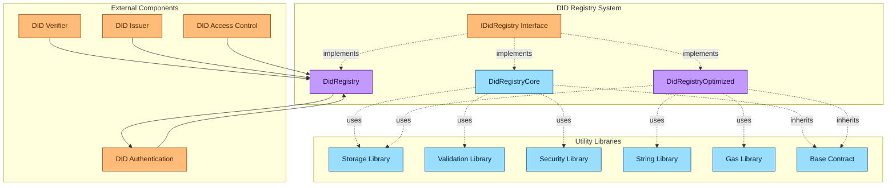
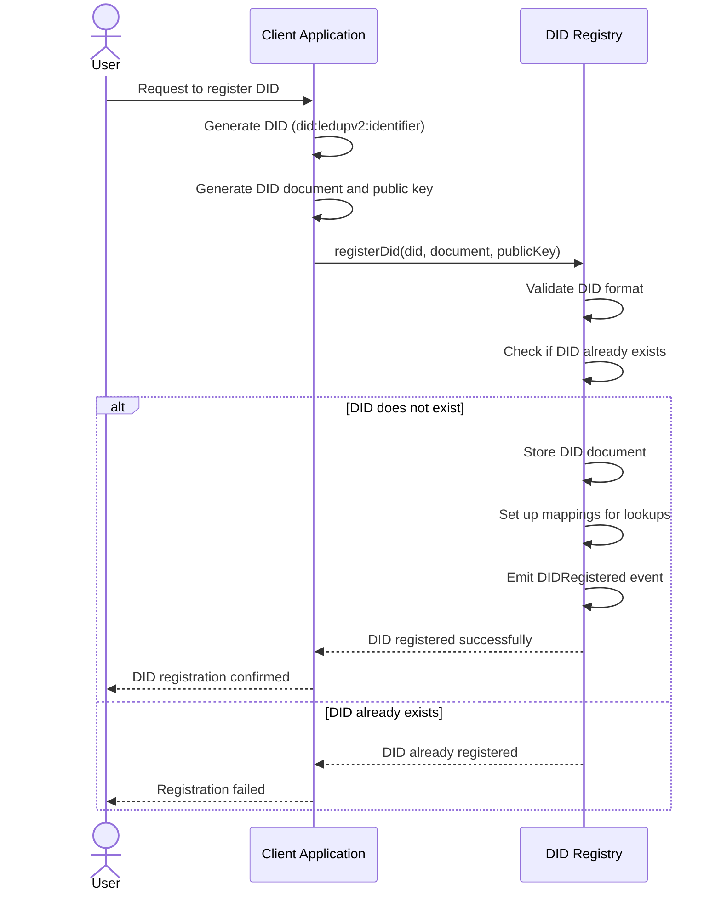
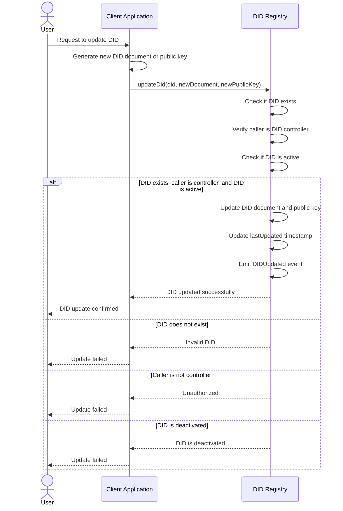
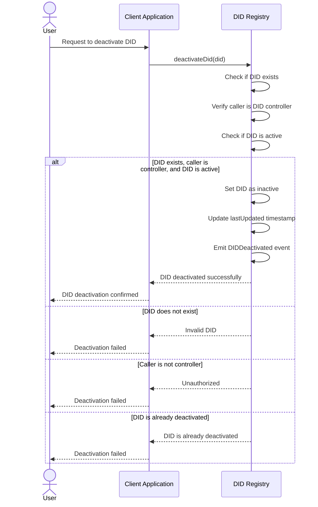
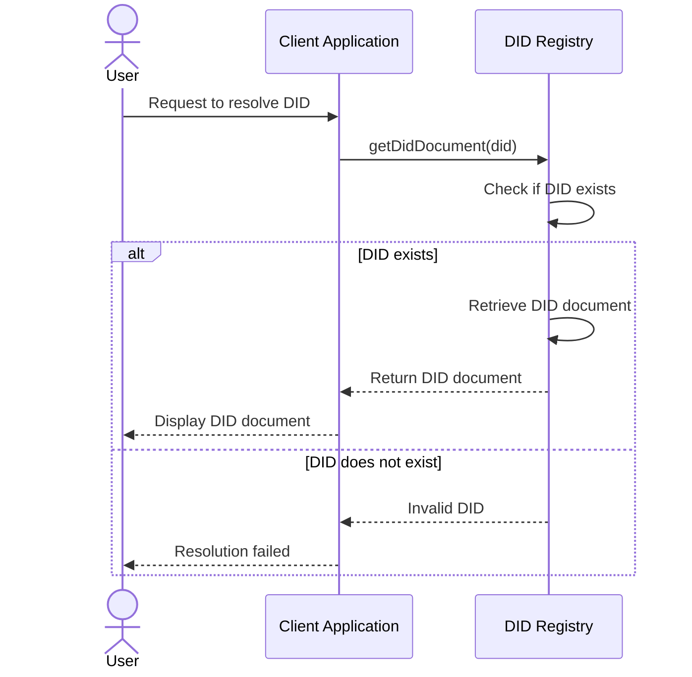
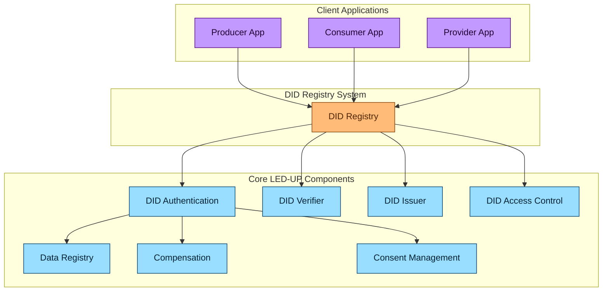
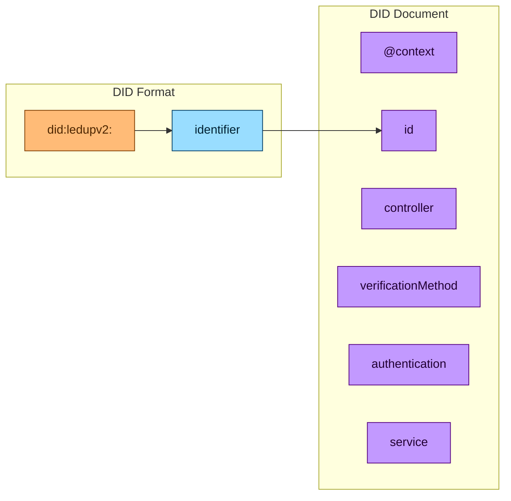
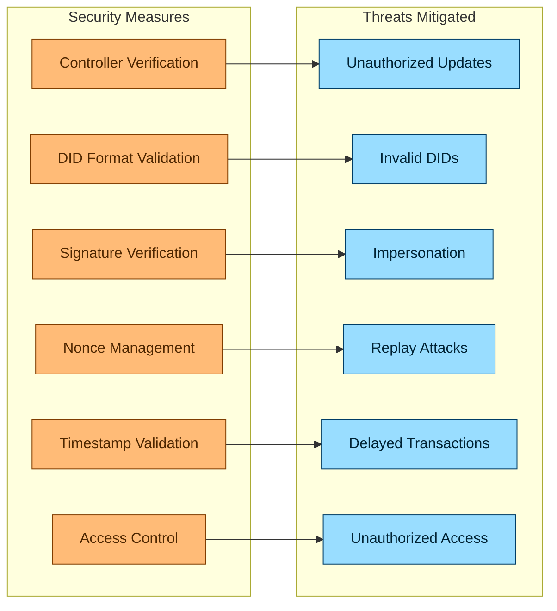
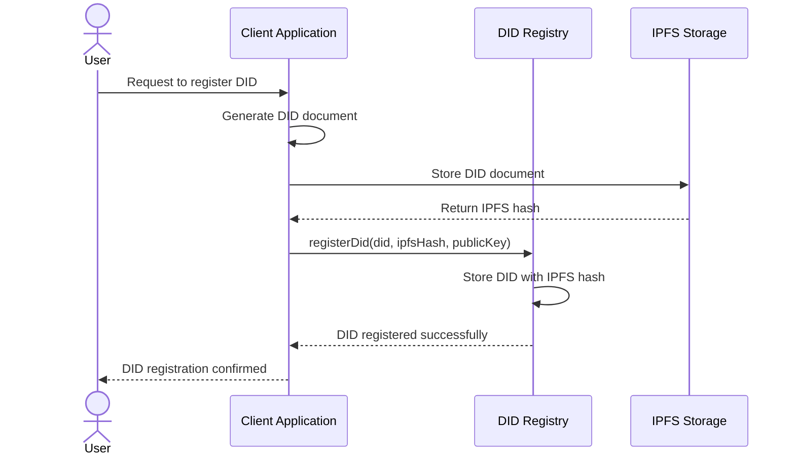
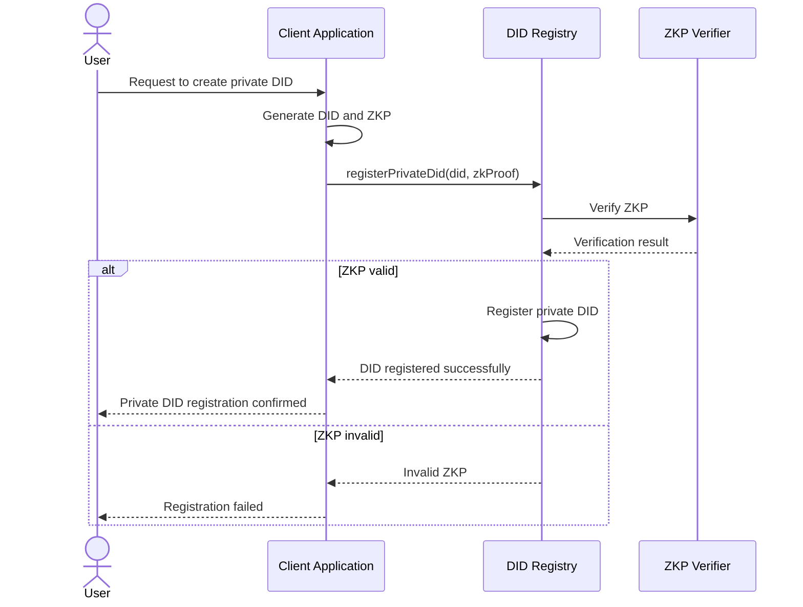

# LED-UP DID Registry Architecture

## Overview

This document provides a comprehensive architectural overview of the LED-UP DID (Decentralized Identifier) Registry system, which is designed to provide secure, verifiable, and decentralized identity management for the LED-UP platform. The system leverages blockchain technology to enable the creation, management, and verification of DIDs in a transparent and tamper-resistant manner.

The DID Registry system is built on several core components:

1. **IDidRegistry Interface** - Defines the standard contract interface for DID management
2. **DidRegistryCore** - Implements the core DID registry functionality
3. **DidRegistryOptimized** - Provides a gas-optimized implementation for production use
4. **DidRegistry** - The main implementation used in production

## System Architecture



## Component Details

### 1. IDidRegistry Interface

The `IDidRegistry` interface defines the standard contract interface for DID management in the LED-UP ecosystem. It establishes a consistent API for DID operations across different implementations.

#### Key Features:

- **DID Registration**: Register new DIDs with associated documents and public keys
- **DID Updates**: Update existing DID documents and public keys
- **DID Deactivation**: Deactivate DIDs when they are no longer needed
- **DID Resolution**: Resolve DIDs to their associated documents and metadata
- **DID Verification**: Verify DID ownership and status

#### Interface Definition:

```solidity
interface IDidRegistry {
    function registerDid(string calldata did, string calldata document, string calldata publicKey) external;
    function updateDid(string calldata did, string calldata document, string calldata publicKey) external;
    function deactivateDid(string calldata did) external;
    function isActive(string calldata did) external view returns (bool);
    function getDidDocument(string calldata did) external view returns (
        address subject,
        uint256 lastUpdated,
        bool active,
        string memory publicKey,
        string memory document
    );
    function getDidByAddress(address subject) external view returns (string memory);
    function getAddressByDid(string calldata did) external view returns (address);
}
```

### 2. DidRegistryCore

The `DidRegistryCore` contract implements the core functionality defined in the `IDidRegistry` interface. It provides the fundamental DID management mechanisms for the LED-UP platform.

#### Key Features:

- **DID Format Validation**: Ensures DIDs follow the correct format (did:method:identifier)
- **DID Document Storage**: Stores DID documents and associated metadata
- **Access Control**: Ensures only authorized users can modify DIDs
- **DID Lifecycle Management**: Manages the lifecycle of DIDs from creation to deactivation
- **DID Resolution**: Resolves DIDs to their associated documents and metadata

#### Data Structures:

```solidity
// Primary storage
mapping(bytes32 => StorageLib.DIDDocument) internal didData;
mapping(address => bytes32) internal addressToDidHash;
mapping(string => bytes32) internal didToHash;
mapping(bytes32 => string) internal hashToDid;

// DID Document structure
struct DIDDocument {
    address subject; // The controller/subject address
    uint40 lastUpdated; // Timestamp of last update
    bool active; // Active status flag
    string publicKey; // Public key string
    string document; // Document string
}
```

### 3. DidRegistryOptimized

The `DidRegistryOptimized` contract provides a gas-optimized implementation of the DID registry functionality. It uses various gas optimization techniques to reduce transaction costs.

#### Key Features:

- **Optimized Storage**: Uses hashes instead of strings to reduce storage costs
- **Efficient Lookups**: Optimized mappings for efficient DID lookups
- **Reduced Storage Size**: Uses smaller data types where possible to reduce storage costs
- **Minimal String Operations**: Minimizes string operations to reduce gas costs
- **Efficient Validation**: Streamlined validation to reduce gas costs

#### Gas Optimization Techniques:

```solidity
// Optimized storage
mapping(bytes32 => StorageLib.DIDDocumentOptimized) internal didData;
mapping(address => bytes32) internal addressToDidHash;
mapping(bytes32 => address) internal didHashToAddress;

// Optimized DID Document structure
struct DIDDocumentOptimized {
    address subject; // The controller/subject address
    uint40 lastUpdated; // Timestamp of last update (reduced from uint256)
    bool active; // Active status flag
    bytes32 publicKeyHash; // Hash of public key
    bytes32 documentHash; // Hash of document
}
```

### 4. DidRegistry

The `DidRegistry` contract is the main implementation used in production. It provides a balance between functionality and gas efficiency.

#### Key Features:

- **Simplified API**: Provides a simplified API for DID management
- **Optimized Storage**: Uses optimized storage structures for efficient DID management
- **Comprehensive Events**: Emits detailed events for off-chain tracking
- **Robust Validation**: Implements robust validation to ensure DID integrity
- **Efficient Lookups**: Provides efficient lookups for DID resolution

#### Implementation Details:

```solidity
// Primary storage - single mapping for all DID data
mapping(bytes32 => DIDDocument) internal didData;
mapping(address => bytes32) internal addressToDidHash;
mapping(string => bytes32) internal didToHash;
mapping(bytes32 => string) internal hashToDid;

// DID Document structure
struct DIDDocument {
    address subject; // The controller/subject address
    uint40 lastUpdated; // Timestamp of last update
    bool active; // Active status flag
    string publicKey; // Public key string
    string document; // Document string
}
```

## DID Management Flows

### 1. DID Registration



### 2. DID Update



### 3. DID Deactivation



### 4. DID Resolution



## Integration with LED-UP Ecosystem

The DID Registry system integrates with the broader LED-UP ecosystem through interactions with other core components:



## DID Format and Structure

The LED-UP DID system uses a specific format for DIDs that follows the W3C DID specification:



### DID Format

The LED-UP DID format follows the pattern:

```
did:ledupv2:<identifier>
```

Where:

- `did` is the scheme identifier
- `ledupv2` is the method identifier
- `<identifier>` is a unique identifier, typically derived from the controller's address

### DID Document Structure

The DID document follows the W3C DID Document specification and includes:

```json
{
  "@context": ["https://www.w3.org/ns/did/v1"],
  "id": "did:ledupv2:identifier",
  "controller": ["did:ledupv2:identifier"],
  "verificationMethod": [
    {
      "id": "did:ledupv2:identifier#keys-1",
      "type": "EcdsaSecp256k1VerificationKey2019",
      "controller": "did:ledupv2:identifier",
      "publicKeyHex": "publicKey"
    }
  ],
  "authentication": ["did:ledupv2:identifier#keys-1"],
  "service": [
    {
      "id": "did:ledupv2:identifier#service-1",
      "type": "DataService",
      "serviceEndpoint": "https://example.com/data"
    }
  ]
}
```

## Security Considerations

The DID Registry system implements several security measures to ensure the integrity and confidentiality of DIDs:



### Key Security Features:

1. **Controller Verification**: Ensures only the controller of a DID can update or deactivate it
2. **DID Format Validation**: Validates the format of DIDs to ensure they follow the correct pattern
3. **Signature Verification**: Validates signatures for DID operations to prevent impersonation
4. **Nonce Management**: Prevents replay attacks by ensuring each operation uses a unique nonce
5. **Timestamp Validation**: Ensures operations are recent and not delayed
6. **Access Control**: Restricts access to DID operations based on ownership and roles

## Architectural Assessment

### Strengths

1. **Decentralized Identity**: Provides a decentralized approach to identity management.
2. **Flexible Implementation**: Multiple implementations allow for different trade-offs between functionality and gas efficiency.
3. **Comprehensive API**: Provides a comprehensive API for DID management.
4. **Gas Optimization**: The optimized implementation reduces gas costs for production use.
5. **Standards Compliance**: Follows W3C DID standards for interoperability.

### Areas for Improvement

1. **Off-chain Storage**: The current implementation stores DID documents on-chain, which can be expensive for large documents.
2. **DID Resolution**: The optimized implementation does not fully support DID resolution for public keys and documents.
3. **Delegation**: No support for delegating DID control to other entities.
4. **Revocation**: Limited support for credential revocation.
5. **Privacy**: Limited privacy features for DID documents.

## Recommendations for Enhancement

### 1. Implement Off-chain Storage

Store DID documents off-chain and only keep hashes on-chain to reduce gas costs.



### 2. Implement DID Resolution with IPFS

Enhance DID resolution to support retrieving documents from IPFS.

```solidity
// Enhanced DID document structure
struct EnhancedDIDDocument {
    address subject;
    uint40 lastUpdated;
    bool active;
    string publicKey;
    string ipfsHash; // IPFS hash of the DID document
}

// Resolve DID with IPFS
function resolveDidWithIpfs(string calldata did) external view returns (
    address subject,
    uint256 lastUpdated,
    bool active,
    string memory publicKey,
    string memory ipfsHash
) {
    bytes32 didHash = keccak256(bytes(did));
    EnhancedDIDDocument memory doc = didData[didHash];

    return (doc.subject, doc.lastUpdated, doc.active, doc.publicKey, doc.ipfsHash);
}
```

### 3. Implement DID Delegation

Add support for delegating DID control to other entities.

```solidity
// Delegation structure
struct Delegation {
    string delegator;
    string delegate;
    uint256 expiresAt;
    bool active;
}

// Delegation storage
mapping(bytes32 => Delegation) private delegations;

// Delegate DID control
function delegateDidControl(
    string calldata delegator,
    string calldata delegate,
    uint256 duration
) external {
    bytes32 didHash = keccak256(bytes(delegator));

    // Check if caller is the controller of the delegator DID
    if (didData[didHash].subject != msg.sender) {
        revert DidRegistry__Unauthorized();
    }

    // Create delegation
    bytes32 delegationId = keccak256(abi.encodePacked(delegator, delegate));
    delegations[delegationId] = Delegation({
        delegator: delegator,
        delegate: delegate,
        expiresAt: block.timestamp + duration,
        active: true
    });

    emit DIDDelegated(delegator, delegate, block.timestamp + duration);
}
```

### 4. Implement Enhanced Credential Revocation

Add support for more sophisticated credential revocation mechanisms.

```solidity
// Revocation registry
mapping(bytes32 => bool) private revokedCredentials;
mapping(bytes32 => uint256) private revocationTimestamps;

// Revoke credential
function revokeCredential(bytes32 credentialId) external {
    // Check if caller is authorized to revoke the credential
    // ...

    revokedCredentials[credentialId] = true;
    revocationTimestamps[credentialId] = block.timestamp;

    emit CredentialRevoked(credentialId, block.timestamp);
}

// Check if credential is revoked
function isCredentialRevoked(bytes32 credentialId) external view returns (bool, uint256) {
    return (revokedCredentials[credentialId], revocationTimestamps[credentialId]);
}
```

### 5. Implement Privacy-Preserving DIDs

Add support for privacy-preserving DIDs using zero-knowledge proofs.



## Conclusion

The LED-UP DID Registry system provides a robust foundation for decentralized identity management in the LED-UP ecosystem. The modular architecture, with multiple implementations for different use cases, allows for flexibility and extensibility while maintaining a consistent interface.

The system implements multiple security measures to ensure the integrity and confidentiality of DIDs, including controller verification, DID format validation, signature verification, nonce management, timestamp validation, and access control.

While the current implementation provides a solid foundation, there are several areas for enhancement, including off-chain storage, improved DID resolution, delegation, enhanced credential revocation, and privacy-preserving DIDs. By implementing these enhancements, the LED-UP DID Registry system can provide even stronger security guarantees while maintaining flexibility and usability for the LED-UP ecosystem.
