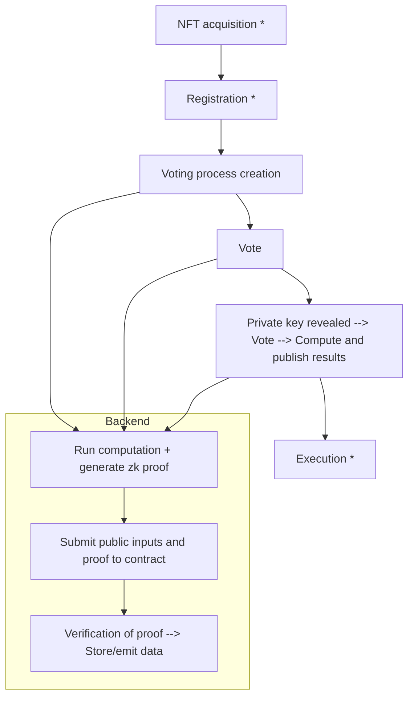
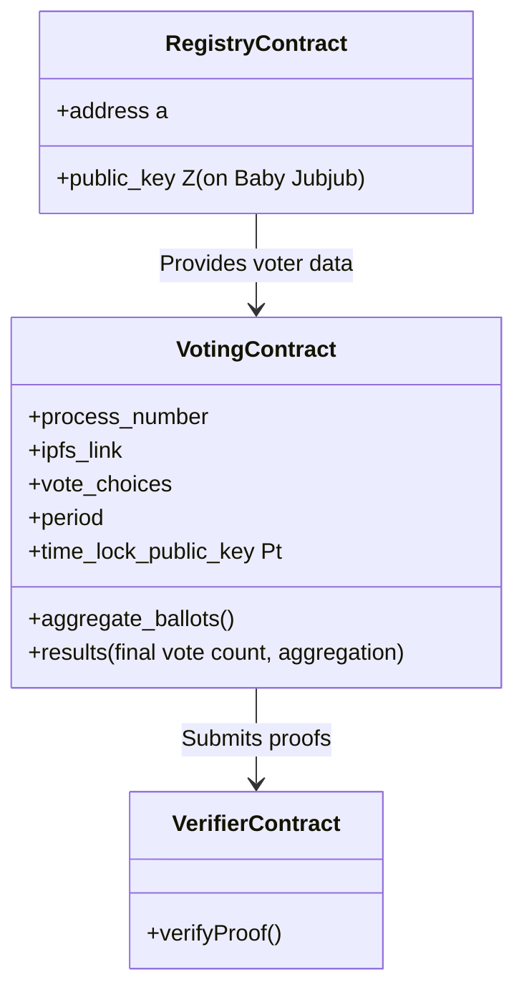

### Technical Survey Note: Zero-Knowledge Proof-Based Onchain Private Voting System for DAOs

This document provides a comprehensive analysis of a zero-knowledge proof (ZKP)-based onchain private voting system designed for Decentralized Autonomous Organizations (DAOs), as presented in a detailed transcript and accompanying slides dated September 20, 2023. The system leverages Ethereum, zkSNARKs, and time-lock services to ensure voter anonymity and vote privacy during the voting period, with results revealed at the end. This note expands on the previous survey by incorporating additional details from the new slides, addressing technical aspects, providing sample code snippets, and including Mermaid diagrams to replicate the visual aids.

---

#### Introduction

Decentralized Autonomous Organizations (DAOs) require secure and private voting mechanisms to ensure fair governance. Traditional onchain voting systems, while transparent, often expose voter identities and choices, compromising privacy. The system described here, developed in collaboration with Aztec as part of Nouns DAO's private voting research sprint, uses zero-knowledge proofs (zkSNARKs) to enable anonymous voting on Ethereum. It assigns voting power based on NFT ownership (one NFT, one vote), encrypts votes during the voting period, and reveals results only at the end via a time-lock service, ensuring privacy and verifiability.

This note aims to provide a detailed technical overview, including system design, implementation, voting processes, challenges, and future improvements, supplemented by sample code and diagrams.

---

#### System Design and High-Level Overview

The system operates on Ethereum, utilizing smart contracts and zkSNARKs for privacy and verifiability. The high-level design, as shown in the "High Level" slide, is divided into frontend and backend processes:

- **Frontend Workflow**:

  - NFT acquisition (establishing voting power).
  - Voter registration (enrollment in the system).
  - Voting process creation (defining the voting parameters).
  - Vote submission (encrypted votes).
  - Execution (result computation and publication).

- **Backend Workflow** (for non-starred steps, i.e., voting process creation, voting, and tallying):
  - Run computation and generate a zk proof.
  - Submit public inputs and the proof to the smart contract.
  - Verify the proof and store/emit data.

The following Mermaid flowchart replicates the high-level design:



**Explanation**:

- Starred (\*) steps (NFT acquisition, registration, execution) are user-driven and do not involve zk proofs.
- Non-starred steps (voting process creation, vote, result computation) involve zk proof generation and submission for onchain verification, ensuring privacy and correctness.

---

#### System Architecture and Components

The system comprises several components, as outlined in the "Setup" and "Contracts" slides:

- **Ethereum Blockchain**: The underlying platform, using ERC-721 contracts for NFTs.
- **zkSNARK Proving System**: Utilizes UltraPlonk via Noir, with Baby Jubjub as the embedded curve for cryptographic operations.
- **zkSNARK-Friendly Hash Function**: Poseidon is used, though noted as a permutation-based function rather than a traditional hash (fixed input length, apply permutation, project).
- **Additional Hash Function**: Poseidon is also used for ballot aggregation.
- **Time-Lock Service**: Provides verifiably random key generation for vote encryption and decryption.
- **Smart Contracts**:
  - **Registry Contract**: Stores pairs \((a, Z)\), where \(a\) is an address and \(Z\) is a public key on Baby Jubjub.
  - **Voting Contract**: Manages voting processes, including IPFS links, vote choices, periods, time-lock public key \(P_t\), and aggregates ballots (logged, not stored).
  - **Verifier Contract**: Verifies zkSNARK proofs.

The "Contracts" slide provides a structured view of these components, which can be represented with a Mermaid class diagram:



---

#### Voter Registration

The "Voter registration" slide outlines the registration process:

- Connect wallet.
- Generate private key \(z\) on Baby Jubjub by signing a message.
- Compute public key \(Z\).
- Submit \(Z\) to the registry contract from the NFT-owning address.

**Sample Code (Solidity)**:

```solidity
// Registry Contract (simplified)
pragma solidity ^0.8.0;

contract Registry {
    mapping(address => bytes) public publicKeys; // Address to public key Z (Baby Jubjub)

    event Registered(address indexed voter, bytes publicKey);

    function register(bytes calldata publicKey) external {
        require(publicKeys[msg.sender].length == 0, "Already registered");
        publicKeys[msg.sender] = publicKey;
        emit Registered(msg.sender, publicKey);
    }
}
```

**Explanation**:

- The voter signs a message offchain to generate \(z\), computes \(Z\), and submits \(Z\) to the registry.
- The contract ensures the address hasn't registered before, preventing double registration.

---

#### Voting Process Creation

The "Voting process creation" slide details the steps for creating a voting process:

- Submit to the voting contract:
  - Public key \(P_i\) (private key revealed later via time-lock service).
  - Voting parameters (IPFS link, choices, period).
  - Current block number \(N\), state root \(H\_{\text{state}}\), storage roots \(H_1, H_2\) of registry and NFT contracts.
  - Succinct proof \(\pi*0\) verifying consistency with block hash \(H*{\text{block}}\).

The "Refresher: Blocks" slide illustrates the Ethereum block structure, showing state root traversal to storage roots. This can be represented with a Mermaid diagram:

```mermaid
graph TD
    A[Block] -->|contains| B[... <-- ... <-- [state_root] <-- ... --> ...]
    B -->|branch| C[+ ... + ... + ... + ... +]
    C -->|leaf| D[[...][state_root][...]]
```

The "Refresher: State proofs" slide shows state root traversal to storage slots, as depicted below:

```mermaid
graph TD
    A[branch] -->|state_root| B[+ ... + ... + ... + ... +]
    B -->|extension| C[[3f...41] (resolve 0x23f..., 41) e.g., registry or NFT contract]
    C -->|branch| D[+ ... + ... + ... + ... +]
    D -->|leaf| E[[0][...][storage_root][...]] --> F[(account 0x23f..., 41)]
```

The "Refresher: Storage proofs" slide details storage root traversal to values:

```mermaid
graph TD
    A[branch] -->|storage_root| B[+ ... + ... + ... + ... +]
    B -->|leaf| C[[a0...2][value]] --> D[(storage slot 0x7a0..., 2)]

    subgraph Examples
        E[Registry] --> F[+ Storage slot --> address + Value --> public key]
        G[NFT] --> H[+ Storage slot --> NFT ID + Value --> address]
    end
```

**Sample Code (Solidity)**:

```solidity
// Voting Contract (simplified)
pragma solidity ^0.8.0;

contract Voting {
    struct VotingProcess {
        uint256 processId;
        string ipfsLink;
        bytes32[] choices;
        uint256 period;
        bytes publicKey; // P_i
        bytes32 stateRoot;
        bytes32 blockHash;
        bool active;
    }

    mapping(uint256 => VotingProcess) public processes;
    uint256 public processCounter;

    event ProcessCreated(uint256 processId, string ipfsLink, bytes publicKey);

    function createProcess(
        string calldata ipfsLink,
        bytes32[] calldata choices,
        uint256 period,
        bytes calldata publicKey,
        bytes32 stateRoot,
        bytes32 blockHash,
        bytes calldata proof // Simplified: proof verification omitted
    ) external {
        processCounter++;
        processes[processCounter] = VotingProcess(
            processCounter,
            ipfsLink,
            choices,
            period,
            publicKey,
            stateRoot,
            blockHash,
            true
        );
        emit ProcessCreated(processCounter, ipfsLink, publicKey);
    }
}
```

**Explanation**:

- The contract stores voting process details, including the state root and block hash for later verification.
- In practice, proof verification would involve calling the Verifier contract to validate \(\pi_0\).

---

#### Voting Process

The "Voting" slide describes the voting steps for a voter with address \(a\), process ID, and NFT ID:

- Compute signatures: \(\sigma = \text{sign}(Z, [id_{\text{nft}}, id])\), \(\tau = \text{sign}(Z, v)\).
- Compute nullifier: \(\underline{n} = h(\sigma)\).
- Generate random key \(r\), compute \(A = g^r\), \(K = P_t^r\), encrypt vote \(B = h(K, v, id)\).
- Fetch storage proofs \(p_1, p_2\) at block \(N\):
  - \(p_1\): Address \(a\) to public key \(Z\) in registry.
  - \(p_2\): NFT ID to address \(a\) in NFT contract.
- Generate ZK proof \(\pi\) verifying eligibility.
- Submit \(\pi\) and public inputs to the voting contract.
- Log ballot \((id, A, B)\).

**Sample Code (Solidity)**:

```solidity
// Voting Contract (vote submission, simplified)
function vote(
    uint256 processId,
    bytes calldata signatureSigma,
    bytes calldata signatureTau,
    bytes calldata nullifier,
    bytes calldata A,
    bytes calldata B,
    bytes calldata proof // Simplified: proof verification omitted
) external {
    VotingProcess storage process = processes[processId];
    require(process.active, "Voting process not active");

    // In practice, verify proof and nullifier to prevent double-voting
    emit BallotLogged(processId, A, B);
}

event BallotLogged(uint256 processId, bytes A, bytes B);
```

---

#### Tallying

The "Tallying" slide outlines the tallying process:

- Given private key \(P_t\) and logged ballots \((id, A_i, B_i)\):
  - Compute \(K_i = A_i^{P_t}\), decrypt \(B_i\) to obtain \(v_i\).
  - Compute results \(res\) of the voting process.
  - Compute aggregation \(\text{agg} = \text{fold}(h_1, 0, [B_1, \ldots, B_N])\).
- Generate ZK proof \(\pi\_{\text{res}}\) verifying correctness.
- Submit \(res\) and public inputs to the voting contract.

**Sample Code (Solidity)**:

```solidity
// Voting Contract (tallying, simplified)
function tally(
    uint256 processId,
    bytes calldata privateKey,
    bytes calldata results,
    bytes calldata aggregation,
    bytes calldata proof // Simplified: proof verification omitted
) external {
    VotingProcess storage process = processes[processId];
    require(process.active, "Voting process not active");
    process.active = false;

    emit ResultsPublished(processId, results, aggregation);
}

event ResultsPublished(uint256 processId, bytes results, bytes aggregation);
```

---

#### Challenges and Drawbacks

The "Challenges and drawbacks" slide highlights key issues:

- **Archive Node Dependency**: Storage proofs require historical data, necessitating archive nodes.
- **Trie Proofs**: Expensive in zkSNARKs due to Merkle tree traversal and Keccak hashing.
- **Gas Costs**: High, several hundred thousand gas units per proof verification.
- **Whale Sightings**: Large NFT holders may be identifiable, compromising privacy.

---

#### Future Outlook

The "Outlook" slide proposes future improvements:

- **Browser-Based Proof of Concept**: Move to browser-based voting with recursive zkSNARKs in Noir.
- **Delay-Relayer**: Introduce relayers to mitigate whale sightings.
- **Optimization**: Reduce proof generation time and gas costs.
- **DAO Integration**: Integrate with frameworks like Aragon.

---

#### Conclusion

This ZKP-based onchain private voting system offers a robust solution for DAO governance, ensuring voter anonymity and vote privacy through Ethereum, zkSNARKs, and time-lock services. Despite challenges like high computational costs and whale sighting risks, future optimizations and integrations promise to enhance its practicality. The provided code snippets and Mermaid diagrams illustrate the system's design and implementation, making it accessible for further development.

#### References

- Aztec's Private Voting Research Sprint: [https://aztec.network/research/private-voting](https://aztec.network/research/private-voting)
- Zero-Knowledge Proofs in Blockchain: [eprint.iacr.org/2018/060.pdf](https://eprint.iacr.org/2018/060.pdf)
- Ethereum Merkle Patricia Trie: [ethereum.org/en/developers/docs/data-structures-and-encoding/merkle-patricia-trie/](https://ethereum.org/en/developers/docs/data-structures-and-encoding/merkle-patricia-trie/)
