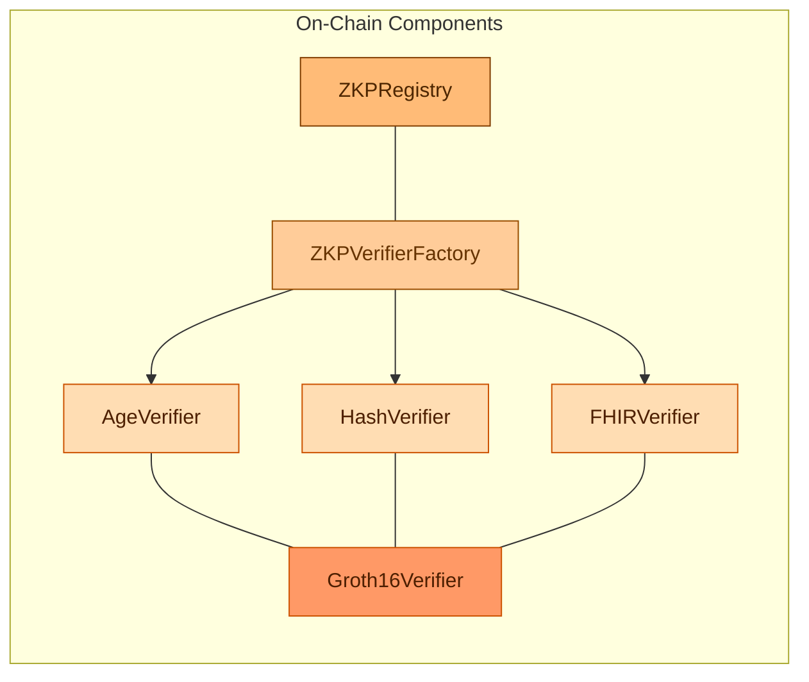
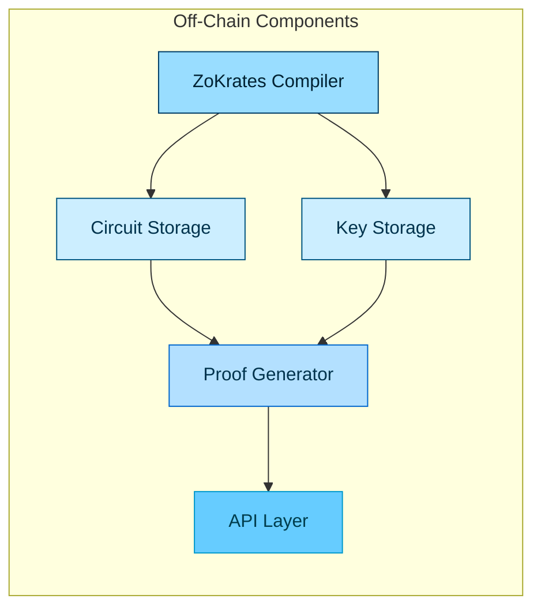
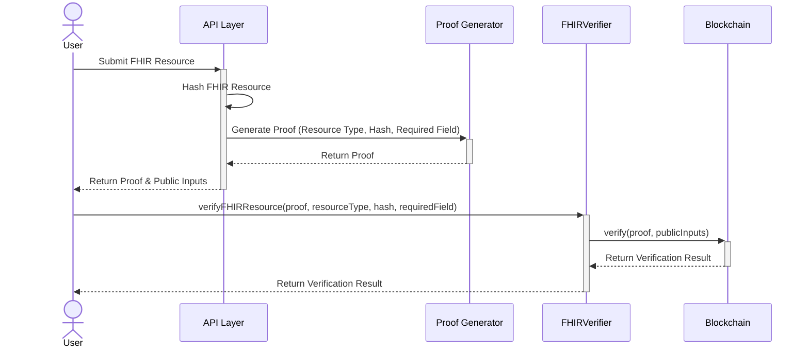
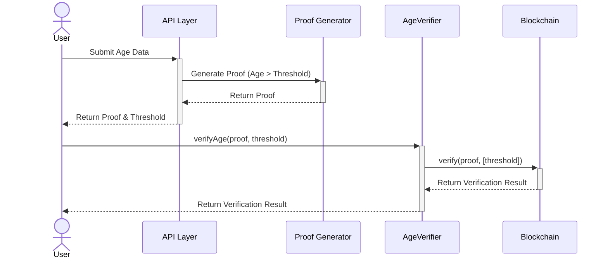
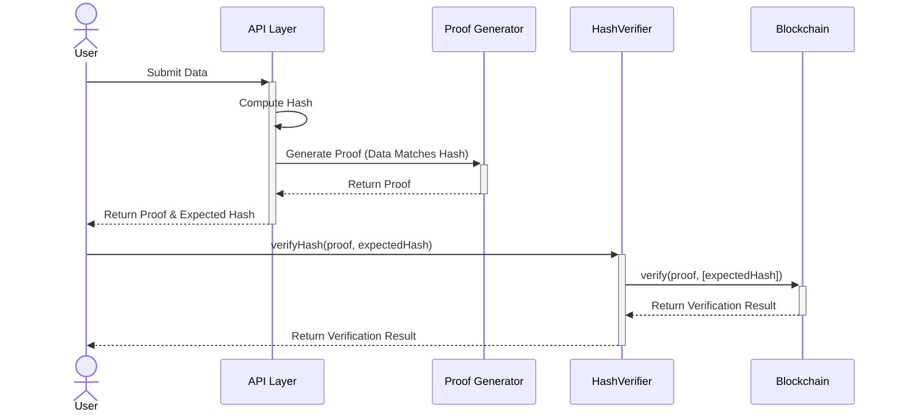
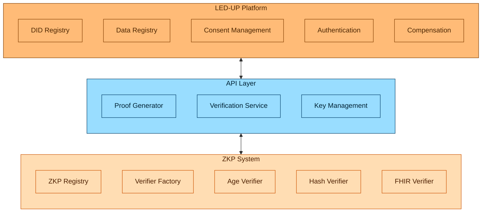

# LED-UP Zero-Knowledge Proof Architecture

## Table of Contents

- [Overview](#overview)
- [Architecture Principles](#architecture-principles)
- [System Components](#system-components)
  - [On-Chain Components](#on-chain-components)
  - [Off-Chain Components](#off-chain-components)
- [ZKP Implementation](#zkp-implementation)
  - [Proof Generation](#proof-generation)
  - [Proof Verification](#proof-verification)
  - [Key Management](#key-management)
- [Verification Workflows](#verification-workflows)
  - [FHIR Resource Verification](#fhir-resource-verification)
  - [Age Verification](#age-verification)
  - [Hash Verification](#hash-verification)
- [Security Considerations](#security-considerations)
- [Gas Optimization](#gas-optimization)
- [Deployment Strategy](#deployment-strategy)
- [Integration with LED-UP Platform](#integration-with-led-up-platform)
- [Conclusion](#conclusion)

## Overview

This document outlines the Zero-Knowledge Proof (ZKP) architecture for the LED-UP platform. The architecture is designed to provide privacy-preserving verification of health data while minimizing on-chain storage and computation costs. By leveraging ZKPs, the LED-UP platform can verify the validity and integrity of health data without exposing the actual data on the blockchain.

The architecture follows a minimal on-chain implementation approach, where most of the computation-intensive operations are performed off-chain, and only the verification of proofs is done on-chain. This approach significantly reduces gas costs and enhances privacy while maintaining the security and integrity guarantees provided by the blockchain.

## Architecture Principles

1. **Data Privacy**: Sensitive health data remains off-chain, with only cryptographic proofs stored on-chain.
2. **Minimal On-Chain Footprint**: Only essential verification logic and proof validation are implemented on-chain.
3. **Scalability**: Computation-intensive operations are performed off-chain to ensure system scalability.
4. **Modularity**: The architecture is modular, allowing for different types of verifiers to be added or updated.
5. **Security**: Cryptographic integrity is maintained throughout the system, with robust key management.
6. **Interoperability**: The system integrates with existing LED-UP components and standards.

## System Components

### On-Chain Components

1. **ZKPRegistry**: Central registry for managing ZKP verifier contracts.

   - Maintains a mapping of verifier types to their contract addresses
   - Provides access control for administrators
   - Enables discovery and management of verifiers

2. **ZKPVerifierFactory**: Factory contract for deploying specialized verifier contracts.

   - Creates and registers different types of verifiers
   - Manages the deployment of new verifier implementations
   - Provides a standardized interface for verifier creation

3. **Specialized Verifiers**: Domain-specific verifier contracts.

   - **AgeVerifier**: Verifies age-related proofs without revealing actual age
   - **HashVerifier**: Verifies data integrity through hash verification
   - **FHIRVerifier**: Verifies FHIR resource data without exposing the actual health data

4. **Groth16Verifier**: Core ZKP verification contract generated by ZoKrates.
   - Implements the cryptographic verification of Groth16 proofs
   - Contains the verification key and pairing check logic
   - Used by specialized verifiers to validate proofs

### Off-Chain Components

1. **ZoKrates Compiler**: Compiles ZKP circuits from high-level code.

   - Transforms domain-specific logic into arithmetic circuits
   - Generates proving and verification keys
   - Creates Solidity verifier contracts

2. **Proof Generator**: Generates ZKPs from input data.

   - Takes health data as input
   - Uses the proving key to generate proofs
   - Outputs proofs that can be verified on-chain

3. **Circuit Storage**: Stores ZKP circuits and related artifacts.

   - Maintains circuit definitions for different verification types
   - Stores compiled circuit artifacts
   - Provides version control for circuits

4. **Key Storage**: Securely stores cryptographic keys.

   - Manages proving keys (used off-chain)
   - Stores verification keys (used for on-chain verification)
   - Implements secure key management practices

5. **API Layer**: Interfaces between off-chain and on-chain components.
   - Exposes endpoints for proof generation and verification
   - Handles communication with blockchain
   - Manages user authentication and authorization

## ZKP Implementation

### Proof Generation

```mermaid
sequenceDiagram
    participant Client
    participant API as API Layer
    participant PG as Proof Generator
    participant BC as Blockchain

    rect rgb(56,23,35)
    Note over Client, BC: Proof Generation Flow
    Client->>+API: Submit Data for Verification
    API->>+PG: Generate Proof
    PG-->>-API: Return Proof
    API-->>-Client: Return Proof & Public Inputs
    end

    rect rgb(23, 56, 45)
    Note over Client, BC: Proof Verification Flow
    Client->>+BC: Submit Proof & Public Inputs
    Note over BC: Verify Proof On-Chain
    BC-->>-Client: Return Verification Result
    end
```

The proof generation process occurs entirely off-chain:

1. **Circuit Definition**: ZKP circuits are defined using ZoKrates' high-level language.

   - Circuits encode the verification logic (e.g., age verification, FHIR resource validation)
   - Different circuits are created for different verification types

2. **Compilation**: Circuits are compiled to arithmetic circuits.

   - The ZoKrates compiler transforms high-level code into constraints
   - This process generates the proving and verification keys

3. **Witness Generation**: A witness is generated from the private input data.

   - The witness represents the solution to the circuit constraints
   - It includes both private and public inputs

4. **Proof Generation**: A ZKP is generated from the witness.
   - The proof demonstrates knowledge of inputs that satisfy the circuit
   - The proof is compact and can be efficiently verified on-chain

### Proof Verification

The verification process spans both off-chain and on-chain components:

1. **Off-Chain Preparation**:

   - The client obtains a proof from the Proof Generator
   - The proof is packaged with public inputs for on-chain verification

2. **On-Chain Verification**:

   - The proof and public inputs are submitted to the appropriate verifier contract
   - The verifier contract uses the Groth16Verifier to validate the proof
   - The verification result (true/false) is returned

3. **Verification Types**:
   - **Age Verification**: Verifies that a person's age is above a threshold without revealing the actual age
   - **Hash Verification**: Verifies that data matches a specific hash without revealing the data
   - **FHIR Verification**: Verifies properties of FHIR resources without exposing the resource data

### Key Management

Proper key management is critical for the security of the ZKP system:

1. **Proving Key Management**:

   - **Storage Location**: Azure Key Vault or similar secure storage
   - **Access Control**: Limited to authorized proof generation services
   - **Rotation Policy**: Only when circuit logic changes
   - **Backup Strategy**: Regular backups with secure recovery procedures

2. **Verification Key Management**:

   - **On-Chain Storage**: Embedded in the Groth16Verifier contract
   - **Off-Chain Backup**: Stored in Azure Key Vault for recovery purposes
   - **Deployment Process**: New verifier contracts are deployed when verification keys change

3. **Security Measures**:
   - **Encryption**: Keys are encrypted at rest and in transit
   - **Access Logging**: All key access is logged and monitored
   - **Least Privilege**: Access is granted on a need-to-know basis

## Verification Workflows

### FHIR Resource Verification

The FHIR resource verification workflow allows for validating FHIR resources without exposing the actual data:

1. **Resource Preparation**:

   - The FHIR resource is hashed off-chain
   - The resource type and required fields are identified

2. **Proof Generation**:

   - A proof is generated that demonstrates:
     - The resource is of the specified type
     - The resource hash matches the expected hash
     - The required fields are present in the resource

3. **On-Chain Verification**:
   - The proof is submitted to the FHIRVerifier contract
   - The verifier validates that the resource meets the specified criteria
   - The verification result is recorded on-chain

### Age Verification

The age verification workflow enables age-based access control without revealing actual ages:

1. **Age Data Preparation**:

   - The user's age is processed off-chain
   - A threshold value is determined for verification

2. **Proof Generation**:

   - A proof is generated that demonstrates the user's age is above the threshold
   - The proof does not reveal the actual age

3. **On-Chain Verification**:
   - The proof is submitted to the AgeVerifier contract
   - The verifier validates that the age is above the threshold
   - The verification result is recorded on-chain

### Hash Verification

The hash verification workflow ensures data integrity without exposing the data:

1. **Data Preparation**:

   - The data is hashed off-chain
   - The expected hash is determined

2. **Proof Generation**:

   - A proof is generated that demonstrates the data matches the expected hash
   - The proof does not reveal the actual data

3. **On-Chain Verification**:
   - The proof is submitted to the HashVerifier contract
   - The verifier validates that the data matches the expected hash
   - The verification result is recorded on-chain

## Security Considerations

1. **Trusted Setup**:

   - The ZKP system relies on a trusted setup phase
   - Multiple participants should be involved in the setup to ensure security
   - The toxic waste (random values used in setup) must be securely destroyed

2. **Circuit Security**:

   - Circuits must be audited for correctness and security
   - Formal verification of circuits should be performed where possible
   - Circuit updates must be carefully managed to prevent vulnerabilities

3. **Key Security**:

   - Proving keys must be kept secure to prevent fraudulent proof generation
   - Verification keys must be correctly deployed to ensure proper verification
   - Key rotation procedures must be established for security incidents

4. **Smart Contract Security**:

   - Verifier contracts must be audited for vulnerabilities
   - Access control must be properly implemented
   - Upgrade mechanisms should be in place for security patches

5. **API Security**:

   - API endpoints must be secured with proper authentication and authorization
   - Rate limiting should be implemented to prevent DoS attacks
   - Input validation must be thorough to prevent injection attacks

6. **Data Privacy**:
   - No sensitive data should be stored on-chain
   - Public inputs should be carefully designed to prevent data leakage
   - Side-channel attacks must be considered and mitigated

## Gas Optimization

1. **Minimal On-Chain Verification**:

   - Only the essential verification logic is implemented on-chain
   - Proof generation, which is computation-intensive, is performed off-chain
   - Public inputs are minimized to reduce gas costs

2. **Efficient Verifier Implementation**:

   - The Groth16 verification algorithm is highly optimized
   - Precompiled contracts for pairing checks are utilized
   - Assembly code is used for critical operations

3. **Batched Verification**:

   - Where possible, multiple proofs are verified in a single transaction
   - This reduces the per-proof gas cost
   - Batch verification can be implemented for specific use cases

4. **Proxy Pattern**:

   - A proxy pattern can be used to upgrade verifier contracts
   - This allows for gas optimizations without redeploying all contracts
   - The ZKPRegistry facilitates this by providing a level of indirection

5. **Event-Based Storage**:
   - Verification results are stored as events rather than state variables
   - This reduces gas costs for storage
   - Events can be indexed for efficient off-chain querying

## Deployment Strategy

1. **Initial Deployment**:

   - Deploy the ZKPRegistry contract
   - Deploy the ZKPVerifierFactory contract
   - Generate and deploy the Groth16Verifier contracts
   - Deploy specialized verifier contracts (AgeVerifier, HashVerifier, FHIRVerifier)
   - Register all verifiers in the ZKPRegistry

2. **Circuit Updates**:

   - When circuit logic changes, generate new proving and verification keys
   - Deploy new Groth16Verifier contracts with updated verification keys
   - Deploy new specialized verifier contracts
   - Update the ZKPRegistry to point to the new verifiers

3. **Versioning**:

   - Implement versioning for circuits and verifiers
   - Maintain backward compatibility where possible
   - Provide migration paths for existing proofs

4. **Testing**:
   - Thoroughly test all components before deployment
   - Perform gas optimization analysis
   - Conduct security audits

## Integration with LED-UP Platform

The ZKP system integrates with the LED-UP platform in the following ways:

1. **DID Registry Integration**:

   - ZKPs can be used to verify DID document properties
   - DID controllers can prove ownership without revealing private keys

2. **Data Registry Integration**:

   - FHIR resources can be verified without exposing sensitive data
   - Data integrity can be proven through hash verification

3. **Consent Management Integration**:

   - Consent can be verified without revealing the full consent details
   - Age-based consent can be validated without revealing actual ages

4. **Authentication Integration**:

   - ZKPs can be used for privacy-preserving authentication
   - Credential verification without revealing credential details

5. **Compensation Integration**:
   - Payment eligibility can be verified without revealing sensitive data
   - Compensation calculations can be proven correct without revealing inputs

## Conclusion

The LED-UP ZKP architecture provides a robust framework for privacy-preserving verification of health data. By keeping most data and computation off-chain while leveraging the blockchain for verification, the architecture achieves a balance between privacy, security, and efficiency.

Key benefits of this architecture include:

1. **Enhanced Privacy**: Sensitive health data remains off-chain, with only cryptographic proofs stored on-chain.
2. **Reduced Gas Costs**: Computation-intensive operations are performed off-chain, minimizing on-chain gas costs.
3. **Scalability**: The system can handle a large number of verifications without blockchain congestion.
4. **Flexibility**: The modular design allows for different types of verifiers to be added or updated.
5. **Security**: Cryptographic integrity is maintained throughout the system.

This architecture enables the LED-UP platform to provide privacy-preserving verification of health data, which is essential for compliance with healthcare regulations and user privacy expectations.
