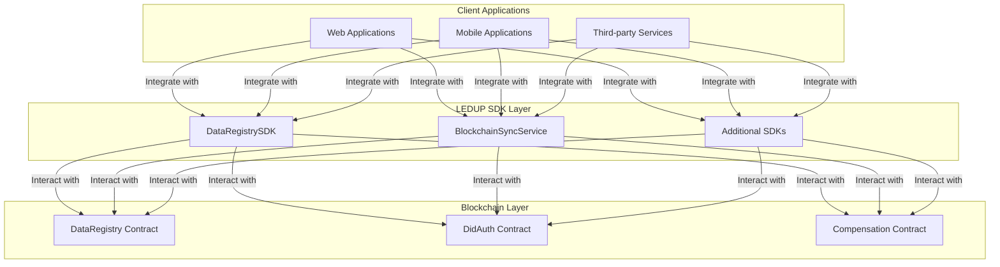

# LEDUP Smart Contract SDKs

**Version:** 1.0.0  
**Last Updated:** March 2025  
**Status:** Production

## Overview

This directory contains comprehensive SDK documentation for the LEDUP platform's smart contracts. These SDKs provide developers with the tools needed to interact with the LEDUP blockchain infrastructure for secure health data sharing and management.

## Available SDK Documentation

| SDK                                                      | Description                                                                                                                          | Usage                                                                            |
| -------------------------------------------------------- | ------------------------------------------------------------------------------------------------------------------------------------ | -------------------------------------------------------------------------------- |
| [DataRegistry](./DataRegistry.md)                        | Core smart contract documentation for the DataRegistry contract, which manages health data records, access control, and verification | For developers building directly on top of the smart contract                    |
| [DataRegistrySDK](./DataRegistrySDK.md)                  | TypeScript SDK for easy integration with the DataRegistry contract                                                                   | For frontend and backend developers implementing LEDUP functionality             |
| [BlockchainSyncService](../api/BlockchainSyncService.md) | Service for synchronizing blockchain events with application state                                                                   | For backend developers building services that need to react to blockchain events |

## Integration Pathways

The LEDUP SDK documentation provides several integration pathways depending on your specific needs:

1. **Direct Smart Contract Integration** - For dApps and services that need to interact directly with the smart contracts
2. **SDK-Based Integration** - For applications that want a higher-level abstraction with TypeScript/JavaScript support
3. **Event-Driven Integration** - For services that need to monitor and react to blockchain events

### Architecture Overview



## Getting Started

To get started with the LEDUP smart contract SDKs:

1. Review the specific SDK documentation based on your integration needs
2. Install the required packages:
   ```bash
   npm install @ledup/data-registry-sdk @ledup/blockchain-sync
   ```
3. Initialize the SDK with your configuration
4. Begin implementing the LEDUP functionality in your application

## SDK Usage Examples

### DataRegistrySDK Example

```typescript
import { DataRegistrySDK, ResourceType } from '@ledup/data-registry-sdk';
import { ethers } from 'ethers';

// Connect to blockchain
const provider = new ethers.providers.JsonRpcProvider('YOUR_RPC_URL');
const wallet = new ethers.Wallet('YOUR_PRIVATE_KEY', provider);

// Initialize SDK
const sdk = new DataRegistrySDK({
  provider,
  wallet,
  contractAddress: 'CONTRACT_ADDRESS',
});

// Register a health record
async function registerHealthRecord() {
  const recordData = {
    recordId: `patient-${Date.now()}`,
    cid: 'QmYwAPJzv5CZsnA625s3Xf2nemtYgPpHdWEz79ojWnPbdG',
    contentHash: ethers.utils.keccak256(ethers.utils.toUtf8Bytes('patient data')),
    resourceType: ResourceType.Patient,
    dataSize: 1024,
  };

  const tx = await sdk.records.register(recordData);
  await tx.wait();
  console.log('Record registered:', recordData.recordId);
}
```

### BlockchainSyncService Example

```typescript
import { BlockchainSyncService } from '@ledup/blockchain-sync';

// Initialize service
const syncService = new BlockchainSyncService({
  providers: ['YOUR_RPC_URL'],
  contracts: {
    dataRegistry: {
      address: 'CONTRACT_ADDRESS',
      startBlock: 123456,
    },
  },
});

// Connect and start monitoring
async function initialize() {
  await syncService.connect();

  // Register for events
  syncService.registerEventListener({
    contractName: 'dataRegistry',
    eventName: 'RecordRegistered',
    callback: (event) => {
      console.log('New record registered:', event.args.recordId);
      // Update application state
    },
  });

  // Start monitoring
  await syncService.startEventMonitoring();
}
```

---

**© 2025 LEDUP - All rights reserved.**
