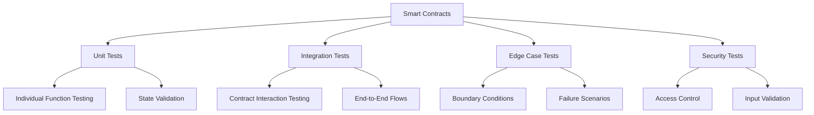

# LEDUP Smart Contract Testing Guide

**Version:** 1.0.0  
**Last Updated:** March 2025  
**Status:** Production

## Overview

This guide outlines the testing strategy and methodologies employed for validating the LEDUP smart contract ecosystem. Comprehensive testing ensures the reliability, security, and correctness of the platform's blockchain components, which form the foundation of our decentralized health data sharing infrastructure.

## Testing Architecture

The LEDUP testing framework incorporates multiple layers of testing to ensure comprehensive coverage:



## Test Environment Setup

### Development Environment

Each test suite begins with a standardized environment setup that deploys fresh contract instances for testing:

```typescript
// Basic environment setup pattern
describe('ContractName', function () {
  // Contract instances
  let contractInstance;
  let dependencyContract;

  // Test accounts
  let owner;
  let user1;
  let user2;

  // Constants
  const TEST_PARAMETER = 'test-value';

  beforeEach(async function () {
    // Get signers
    [owner, user1, user2] = await ethers.getSigners();

    // Deploy dependency contracts first
    const DependencyFactory = await ethers.getContractFactory('Dependency');
    dependencyContract = await DependencyFactory.deploy();
    await dependencyContract.waitForDeployment();

    // Deploy main contract with dependencies
    const ContractFactory = await ethers.getContractFactory('ContractName');
    contractInstance = await ContractFactory.deploy(await dependencyContract.getAddress());
    await contractInstance.waitForDeployment();

    // Optional setup steps (e.g., granting roles, initializing state)
    await contractInstance.initialize(TEST_PARAMETER);
  });

  // Test suites follow...
});
```

### Common Setup Patterns

#### DID Ecosystem Setup

For tests involving the DID ecosystem (DidRegistry, DidAuth, DidVerifier, DidIssuer):

```typescript
// DID ecosystem setup
let didRegistry, didVerifier, didIssuer, didAuth;
let owner, admin, producer, consumer;

// DIDs for testing
let producerDid, consumerDid;

beforeEach(async function () {
  [owner, admin, producer, consumer] = await ethers.getSigners();

  // Deploy DidRegistry
  const DidRegistry = await ethers.getContractFactory('DidRegistry');
  didRegistry = await DidRegistry.deploy();
  await didRegistry.waitForDeployment();

  // Deploy other DID contracts with dependencies
  const DidVerifier = await ethers.getContractFactory('DidVerifier');
  didVerifier = await DidVerifier.deploy(await didRegistry.getAddress());
  await didVerifier.waitForDeployment();

  const DidIssuer = await ethers.getContractFactory('DidIssuer');
  didIssuer = await DidIssuer.deploy(await didRegistry.getAddress());
  await didIssuer.waitForDeployment();

  const DidAuth = await ethers.getContractFactory('DidAuth1');
  didAuth = await DidAuth.deploy(
    await didRegistry.getAddress(),
    await didVerifier.getAddress(),
    await didIssuer.getAddress()
  );
  await didAuth.waitForDeployment();

  // Create test DIDs
  producerDid = `did:ledup:producer:${producer.address}`;
  consumerDid = `did:ledup:consumer:${consumer.address}`;

  // Register DIDs
  await didRegistry.connect(producer).registerDid(producerDid, '{}', '0x123456');
  await didRegistry.connect(consumer).registerDid(consumerDid, '{}', '0x123456');

  // Additional setup (roles, credentials, etc.)
});
```

#### Data Registry and Compensation Setup

For tests involving data sharing and compensation:

```typescript
// Data registry and payment setup
let dataRegistry, compensation, token;
let owner, producer, consumer, provider;

beforeEach(async function () {
  [owner, producer, consumer, provider] = await ethers.getSigners();

  // Deploy token for payments
  const Token = await ethers.getContractFactory('Token');
  token = await Token.deploy();
  await token.waitForDeployment();

  // Mint tokens for testing
  await token.mint(consumer.address, ethers.parseEther('1000'));

  // Deploy DID components (as shown above)
  // ...

  // Deploy Compensation contract
  const Compensation = await ethers.getContractFactory('Compensation1');
  compensation = await Compensation.deploy(
    provider.address,
    await token.getAddress(),
    5, // service fee percentage
    ethers.parseEther('1'), // unit price
    await didAuth.getAddress()
  );
  await compensation.waitForDeployment();

  // Deploy DataRegistry
  const DataRegistry = await ethers.getContractFactory('DataRegistry1');
  dataRegistry = await DataRegistry.deploy(await compensation.getAddress(), await didAuth.getAddress());
  await dataRegistry.waitForDeployment();

  // Additional setup for testing specific scenarios
});
```

## Test Types

### 1. Unit Tests

Unit tests focus on verifying individual contract functions in isolation:

```typescript
describe('Function: registerRecord', function () {
  it('should register a new record correctly', async function () {
    // Call the function with test parameters
    await dataRegistry.connect(producer).registerRecord(
      'record-id',
      'ipfs://metadata',
      ethers.keccak256(ethers.toUtf8Bytes('content')),
      0, // resource type
      1024 // size
    );

    // Verify state changes
    const record = await dataRegistry.getRecord('record-id');
    expect(record.producer).to.equal(producer.address);
    expect(record.metadataURI).to.equal('ipfs://metadata');
    expect(record.verified).to.be.false;
  });

  it('should emit the correct event', async function () {
    // Check event emission
    await expect(
      dataRegistry
        .connect(producer)
        .registerRecord('record-id', 'ipfs://metadata', ethers.keccak256(ethers.toUtf8Bytes('content')), 0, 1024)
    )
      .to.emit(dataRegistry, 'RecordRegistered')
      .withArgs('record-id', producer.address, 0, 1024);
  });

  it('should revert when called with invalid parameters', async function () {
    // Test input validation
    await expect(
      dataRegistry.connect(producer).registerRecord(
        '', // empty ID
        'ipfs://metadata',
        ethers.keccak256(ethers.toUtf8Bytes('content')),
        0,
        1024
      )
    ).to.be.revertedWithCustomError(dataRegistry, 'DataRegistry__InvalidInputParam');
  });
});
```

### 2. Integration Tests

Integration tests verify interactions between multiple contracts:

```typescript
describe('Payment and Access Integration', function () {
  it('should process payment and grant access', async function () {
    // Register a record
    await dataRegistry
      .connect(producer)
      .registerRecord('paid-record', 'ipfs://metadata', ethers.keccak256(ethers.toUtf8Bytes('content')), 0, 1024);

    // Approve tokens for payment
    await token.connect(consumer).approve(await compensation.getAddress(), ethers.parseEther('1000'));

    // Process payment
    await compensation.connect(consumer).processPayment(
      producer.address,
      'paid-record',
      10, // data units
      consumerDid
    );

    // Producer grants access
    await dataRegistry.connect(producer).shareData(
      'paid-record',
      consumer.address,
      Math.floor(Date.now() / 1000) + 86400 // 1 day access
    );

    // Verify consumer has access
    const [hasAccess] = await dataRegistry.checkAccess('paid-record', consumer.address);
    expect(hasAccess).to.be.true;

    // Verify producer balance
    const expectedPayment = ethers.parseEther('9.5'); // 10 units at 1 TOKEN each, minus 5% fee
    const producerBalance = await compensation.connect(producer).getProducerBalance();
    expect(producerBalance).to.equal(expectedPayment);
  });
});
```

### 3. Edge Case Tests

Edge case tests focus on boundary conditions and unusual scenarios:

```typescript
describe('Edge Cases', function () {
  it('should handle expired access grants', async function () {
    // Register a record
    await dataRegistry
      .connect(producer)
      .registerRecord('expire-record', 'ipfs://metadata', ethers.keccak256(ethers.toUtf8Bytes('content')), 0, 1024);

    // Set up payment and grant short-lived access
    await token.connect(consumer).approve(await compensation.getAddress(), ethers.parseEther('1000'));

    await compensation.connect(consumer).processPayment(producer.address, 'expire-record', 10, consumerDid);

    // Grant access that expires in 1 second
    const expirationTime = Math.floor(Date.now() / 1000) + 1;
    await dataRegistry.connect(producer).shareData('expire-record', consumer.address, expirationTime);

    // Initially should have access
    let [hasAccess] = await dataRegistry.checkAccess('expire-record', consumer.address);
    expect(hasAccess).to.be.true;

    // Wait for expiration (using time helpers)
    await ethers.provider.send('evm_increaseTime', [2]);
    await ethers.provider.send('evm_mine');

    // Should no longer have access
    [hasAccess] = await dataRegistry.checkAccess('expire-record', consumer.address);
    expect(hasAccess).to.be.false;
  });

  it('should handle multiple sequential operations', async function () {
    // Test complex sequences of operations
    // (e.g., register, update, deactivate, reactivate a DID)
  });
});
```

### 4. Access Control Tests

Access control tests verify that only authorized users can perform specific actions:

```typescript
describe('Access Control', function () {
  it('should prevent unauthorized producer registration', async function () {
    // Setup: Ensure producer is not authorized

    // Attempt unauthorized operation
    await expect(
      dataRegistry
        .connect(consumer)
        .registerRecord(
          'unauthorized-record',
          'ipfs://metadata',
          ethers.keccak256(ethers.toUtf8Bytes('content')),
          0,
          1024
        )
    ).to.be.revertedWithCustomError(dataRegistry, 'DataRegistry__UnauthorizedProducer');
  });

  it('should prevent unauthorized access to admin functions', async function () {
    await expect(compensation.connect(consumer).changeServiceFee(10)).to.be.reverted; // Access control error
  });
});
```

### 5. Security Tests

Security tests focus on potential vulnerabilities or attack vectors:

```typescript
describe('Security', function () {
  it('should prevent reentrancy attacks', async function () {
    // Deploy a malicious contract
    const AttackerFactory = await ethers.getContractFactory('MockAttacker');
    const attacker = await AttackerFactory.deploy(await compensation.getAddress());
    await attacker.waitForDeployment();

    // Fund the attacker
    await token.mint(await attacker.getAddress(), ethers.parseEther('10'));

    // Attempt attack
    await expect(attacker.attack()).to.be.revertedWith('ReentrancyGuard: reentrant call');
  });

  it('should validate input parameters', async function () {
    // Test with malformed or malicious inputs
    await expect(
      dataRegistry.connect(producer).registerRecord(
        ethers.ZeroHash, // Invalid record ID
        'ipfs://metadata',
        ethers.keccak256(ethers.toUtf8Bytes('content')),
        0,
        1024
      )
    ).to.be.reverted;
  });
});
```

## Test Utilities

### Common Test Helpers

To reduce duplication and improve maintainability, LEDUP tests utilize reusable helper functions:

```typescript
// TestCommon.ts
import { ethers } from 'hardhat';

// Enum definitions
export enum ConsentStatus {
  NotSet = 0,
  Allowed = 1,
  Denied = 2,
}

export enum RecordStatus {
  Inactive = 0,
  Active = 1,
  Suspended = 2,
}

export enum AccessLevel {
  None = 0,
  Read = 1,
  ReadWrite = 2,
}

// Shared constants
export const testDataId = 'test-record-123';
export const accessDuration = Math.floor(Date.now() / 1000) + 86400; // 1 day access

// Context interface for sharing test state
export interface TestContext {
  dataRegistry: any;
  didAuth: any;
  compensation: any;
  token: any;
  owner: any;
  producer: any;
  consumer: any;
  verifier: any;
  provider: any;
}

// Setup function
export async function setupTest(): Promise<TestContext> {
  // Standard setup code for all tests
  // ...
  return context;
}

// Helper for processing payments
export async function processPaymentForRecord(
  ctx: TestContext,
  consumer: any,
  recordId: string,
  units: number = 10
): Promise<void> {
  // Approve tokens
  await ctx.token.connect(consumer).approve(await ctx.compensation.getAddress(), ethers.parseEther('1000'));

  // Get consumer DID
  const consumerDid = await ctx.didAuth.getDidFromAddress(consumer.address);

  // Process payment
  await ctx.compensation.connect(consumer).processPayment(ctx.producer.address, recordId, units, consumerDid);
}
```

## Testing Best Practices

### 1. Isolation

Each test should be independent and not rely on the state changes from other tests:

```typescript
// BAD - Tests depend on each other
it('should register a producer', async function () {
  await dataRegistry.connect(producer).registerProducer(RecordStatus.Active, ConsentStatus.Allowed);
  // Test assertions...
});

it('should register a record', async function () {
  // This depends on the producer being registered in the previous test
  await dataRegistry.connect(producer).registerRecord(/*...*/);
  // Test assertions...
});

// GOOD - Tests are isolated
beforeEach(async function () {
  // Set up the required state for all tests
  await dataRegistry.connect(producer).registerProducer(RecordStatus.Active, ConsentStatus.Allowed);
});

it('should register a record', async function () {
  // This test now has the required state already set up
  await dataRegistry.connect(producer).registerRecord(/*...*/);
  // Test assertions...
});
```

### 2. Coverage

Aim for comprehensive test coverage across:

- All contract functions
- Success and failure paths
- Edge cases and boundary conditions
- Different user roles and permissions

```typescript
// Testing all aspects of a function
describe('Function: processPayment', function () {
  // Test success path
  it('should process payment correctly when all conditions are met', async function () {
    // Success case test
  });

  // Test failure paths
  it('should fail when token approval is insufficient', async function () {
    // Failure case test
  });

  it('should fail when producer is invalid', async function () {
    // Another failure case test
  });

  // Test boundary conditions
  it('should handle minimum payment amount', async function () {
    // Edge case test
  });

  it('should handle maximum payment amount', async function () {
    // Another edge case test
  });

  // Test event emissions
  it('should emit the correct event with proper arguments', async function () {
    // Event test
  });
});
```

### 3. Event Testing

Always verify event emissions with the correct parameters:

```typescript
it('should emit PaymentProcessed event with correct data', async function () {
  const expectedAmount = BigInt(dataSize) * unitPrice;
  const expectedFee = (expectedAmount * BigInt(serviceFee)) / 100n;
  const expectedProducerAmount = expectedAmount - expectedFee;

  await expect(compensation.connect(consumer).processPayment(producer.address, recordId, dataSize, consumerDid))
    .to.emit(compensation, 'PaymentProcessed')
    .withArgs(producer.address, consumer.address, expectedProducerAmount, expectedFee);
});
```

### 4. Error Testing

Verify that functions revert with the expected errors:

```typescript
it('should fail when processing payment with invalid producer', async function () {
  const invalidProducer = ethers.ZeroAddress;
  const consumerDid = await didAuth.getDidFromAddress(consumer.address);

  await expect(
    compensation.connect(consumer).processPayment(invalidProducer, recordId, dataSize, consumerDid)
  ).to.be.revertedWithCustomError(compensation, 'Compensation__InvalidAddress');
});
```

### 5. State Validation

Verify contract state changes after operations:

```typescript
it('should update balances correctly after payment', async function () {
  const initialProducerBalance = await compensation.getProducerBalance(producer.address);
  const initialServiceFeeBalance = await compensation.serviceFeeBalance();

  // Process payment
  await compensation.connect(consumer).processPayment(producer.address, recordId, dataSize, consumerDid);

  // Calculate expected values
  const expectedPayment = BigInt(dataSize) * unitPrice;
  const expectedFee = (expectedPayment * BigInt(serviceFee)) / 100n;
  const expectedProducerAmount = expectedPayment - expectedFee;

  // Verify updated balances
  const finalProducerBalance = await compensation.getProducerBalance(producer.address);
  const finalServiceFeeBalance = await compensation.serviceFeeBalance();

  expect(finalProducerBalance).to.equal(initialProducerBalance + expectedProducerAmount);
  expect(finalServiceFeeBalance).to.equal(initialServiceFeeBalance + expectedFee);
});
```

## Test Organization

### Structuring Test Files

Tests are organized by contract and feature:

1. **Contract-specific test files**: Each contract has at least one dedicated test file
2. **Feature-specific test files**: Complex features may have dedicated test files
3. **Edge case test files**: Separate files for edge cases and boundary testing

```
/test
  /unit
    DidRegistry.test.ts
    DidVerifier.test.ts
    DidIssuer.test.ts
    DidAuth.test.ts
    DataRegistry.test.ts
    Compensation.test.ts
  /integration
    DataSharing.test.ts
    Payment.test.ts
  /edge
    DidRegistry.edge.test.ts
    DataRegistry.edge.test.ts
    Compensation.edge.test.ts
  /security
    SecurityTests.test.ts
  /helpers
    TestCommon.ts
```

### Test Naming Conventions

Follow consistent naming patterns:

1. **Describe blocks**: Contract names or feature areas
2. **Nested describes**: Function names or scenarios
3. **Test cases**: Clear description of what is being tested

```typescript
// Contract-level describe
describe('DidRegistry', function () {
  // Function-level describe
  describe('registerDid', function () {
    // Test cases for this function
    it('should register a new DID', async function () {
      /* ... */
    });
    it('should revert when registering an existing DID', async function () {
      /* ... */
    });
  });

  // Feature-level describe
  describe('DID Resolution', function () {
    it('should resolve a DID to its document', async function () {
      /* ... */
    });
    it('should map an address to its DID', async function () {
      /* ... */
    });
  });
});
```

## Continuous Integration

The LEDUP test suite is integrated with CI/CD pipelines to ensure code quality:

1. **Automated testing**: All tests run on every PR and commit
2. **Coverage reports**: Track test coverage metrics
3. **Gas reports**: Monitor gas usage changes
4. **Linting**: Enforce code style and best practices

## Running Tests

Execute tests using the following commands:

```bash
# Run all tests
npx hardhat test

# Run specific test file
npx hardhat test test/unit/DidRegistry.test.ts

# Run tests with gas reporting
REPORT_GAS=true npx hardhat test

# Run tests with coverage
npx hardhat coverage
```

## Conclusion

Comprehensive testing is critical to ensuring the security, reliability, and correctness of the LEDUP smart contract ecosystem. By following these testing strategies and patterns, we maintain high-quality code and minimize the risk of vulnerabilities or bugs in production.

The testing approach outlined in this guide helps ensure that all aspects of the LEDUP platform are thoroughly validated, from individual function behavior to complex multi-contract interactions and edge cases.

---

**© 2025 LEDUP - All rights reserved.**
