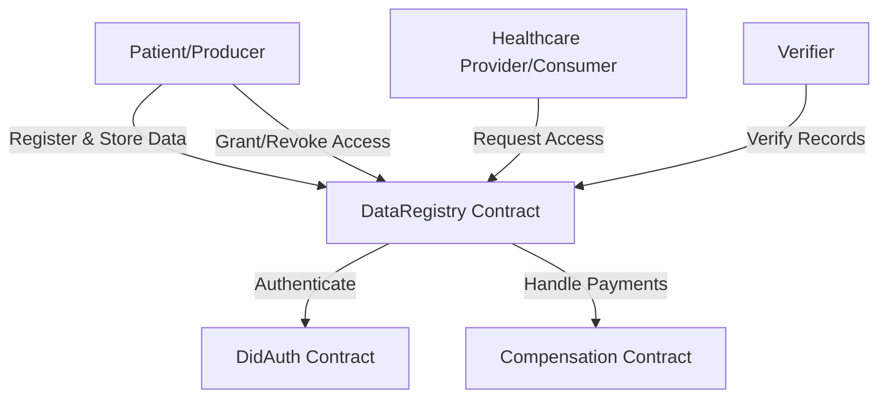
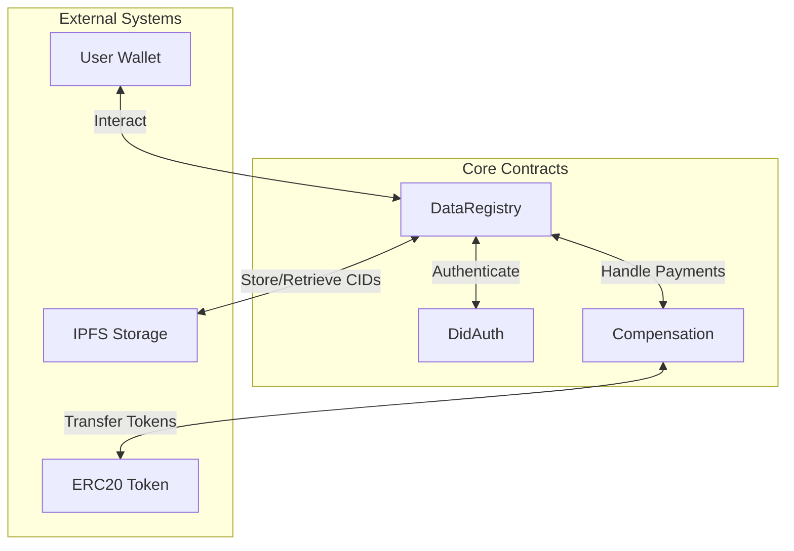
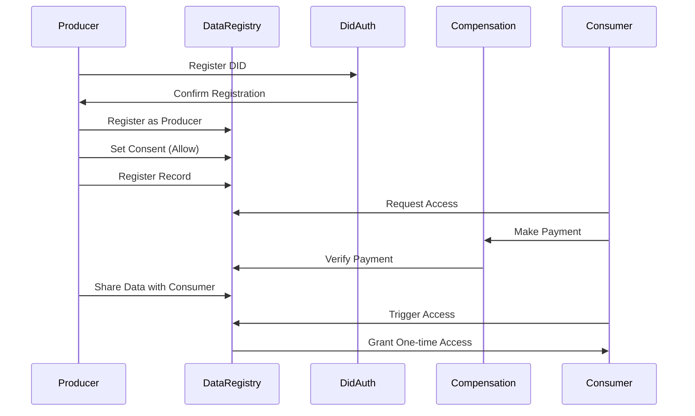
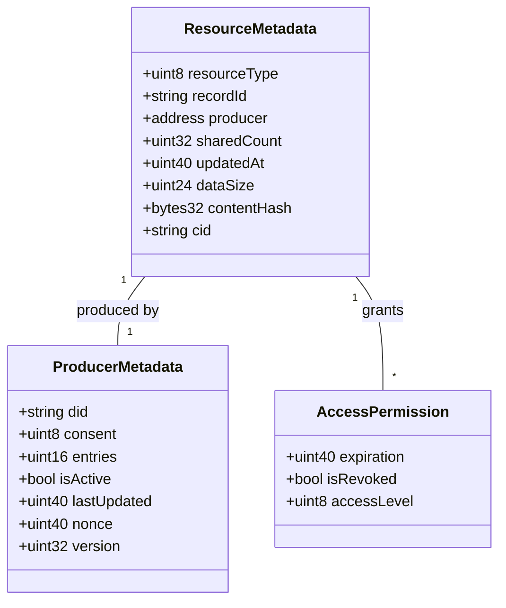
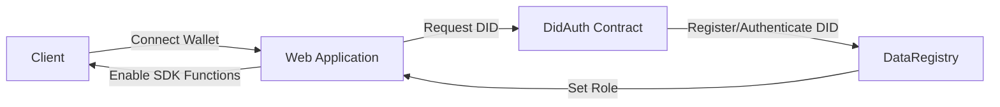
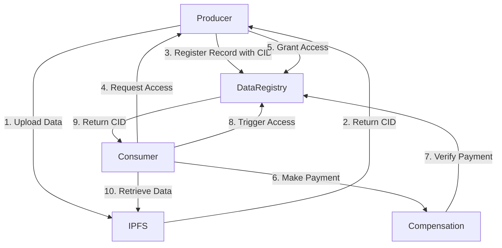
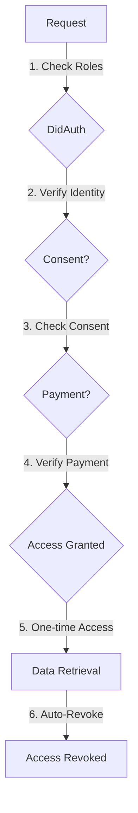
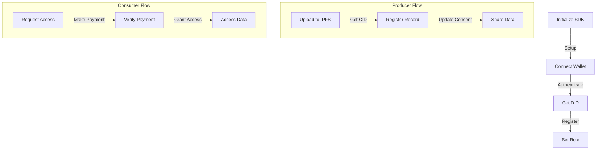
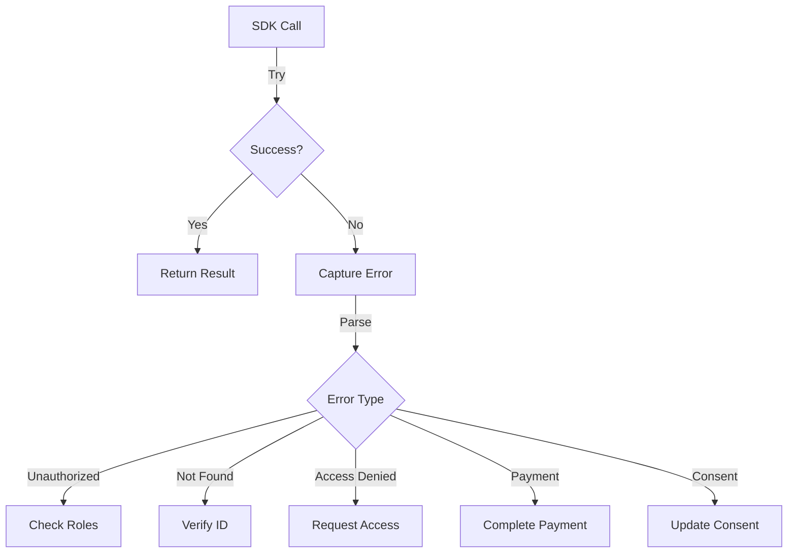

# LEDUP - DataRegistry SDK Documentation

**Version:** 1.0.0  
**Last Updated:** March 2025  
**Status:** Production

## Table of Contents

1. [Overview](#overview)
2. [Architecture](#architecture)
3. [Core Components](#core-components)
4. [Data Structures](#data-structures)
5. [API Reference](#api-reference)
   - [Producer Operations](#producer-operations)
   - [Record Management](#record-management)
   - [Access Control](#access-control)
   - [Verification](#verification)
   - [Administration](#administration)
6. [Integration Guide](#integration-guide)
7. [Security](#security)
8. [Best Practices](#best-practices)
9. [Troubleshooting](#troubleshooting)

## Overview

DataRegistry is a secure blockchain-based registry for health data management, designed to facilitate secure sharing of medical records with consent management and compensation. It implements DID-based authentication with string-based record and CID storage, optimized for sensitive healthcare data.

The registry enables patients (producers) to securely store references to their health data and selectively share it with healthcare providers and researchers (consumers) in a controlled, transparent, and compensated manner.



## Architecture

The DataRegistry contract is designed with a modular architecture, integrating with external services for authentication and compensation while maintaining core registry functionality.



### Key Components

- **DataRegistry Contract**: The main contract that handles record management, access control, and sharing logic.
- **DidAuth**: Handles decentralized identity authentication and role management.
- **Compensation**: Manages payment verification and token transfers for data access.
- **IPFS**: External storage system where actual data is stored, with only references kept on-chain.

## Core Components

### System Flow

The following sequence diagram illustrates the typical flow for data registration and sharing:



## Data Structures

### Enumerations

```solidity
enum ResourceType {
    Patient,
    Observation,
    Condition,
    Procedure,
    Encounter,
    Medication,
    MedicationStatement,
    MedicationRequest,
    DiagnosticReport,
    Immunization,
    AllergyIntolerance,
    CarePlan,
    CareTeam,
    Basic,
    Other
}

enum RecordStatus {
    Inactive,
    Active,
    Suspended,
    Deleted
}

enum ConsentStatus {
    NotSet,
    Allowed,
    Denied
}

enum AccessLevel {
    None,
    Read,
    Write
}
```

### Key Structures



## API Reference

### Producer Operations

#### registerProducer

Registers a new producer (patient) in the system with their DID.

```solidity
function registerProducer(RecordStatus _status, ConsentStatus _consent) external whenNotPaused
```

**Parameters:**

- `_status`: Initial status for the producer (Active, Inactive, etc.)
- `_consent`: Initial consent status (Allowed, Denied, NotSet)

**Events Emitted:**

- None directly, but updates producer metadata

**SDK Example:**

```typescript
// Register as a producer with active status and allowed consent
const tx = await dataRegistry.registerProducer(RecordStatus.Active, ConsentStatus.Allowed);
await tx.wait();
```

#### updateProducerConsent

Updates the consent status for a producer.

```solidity
function updateProducerConsent(address producer, ConsentStatus consentStatus) external withRole(didAuth.PRODUCER_ROLE()) whenNotPaused
```

**Parameters:**

- `producer`: Address of the producer to update
- `consentStatus`: New consent status to set

**Events Emitted:**

- `ConsentStatusChanged(address indexed provider, ConsentStatus status, address indexed updater)`

**SDK Example:**

```typescript
// Update producer consent to allowed
const tx = await dataRegistry.updateProducerConsent(producerAddress, ConsentStatus.Allowed);
await tx.wait();
```

### Record Management

#### registerRecord

Registers a new health record in the system.

```solidity
function registerRecord(
    string calldata recordId,
    string calldata cid,
    bytes32 contentHash,
    ResourceType resourceType,
    uint24 dataSize
) external whenNotPaused onlyRegisteredProducer nonReentrant
```

**Parameters:**

- `recordId`: Unique identifier for the record
- `cid`: IPFS Content ID where the actual data is stored
- `contentHash`: Hash of the content for integrity verification
- `resourceType`: Type of health resource (Patient, Observation, etc.)
- `dataSize`: Size of the data (used for payment calculations)

**Events Emitted:**

- `RecordRegistered(string indexed recordId, string did, string cid, bytes32 contentHash, address indexed provider)`

**SDK Example:**

```typescript
// Register a new patient record
const tx = await dataRegistry.registerRecord(
  'patient-record-123',
  'QmYwAPJzv5CZsnA625s3Xf2nemtYgPpHdWEz79ojWnPbdG',
  ethers.utils.keccak256(ethers.utils.toUtf8Bytes('patient data')),
  ResourceType.Patient,
  1024 // size in bytes
);
await tx.wait();
```

#### updateRecord

Updates an existing record with new content.

```solidity
function updateRecord(string calldata recordId, string calldata cid, bytes32 contentHash) external whenNotPaused nonReentrant
```

**Parameters:**

- `recordId`: ID of the record to update
- `cid`: New IPFS Content ID
- `contentHash`: New content hash

**Events Emitted:**

- `RecordUpdated(string indexed recordId, string cid, bytes32 contentHash, address indexed provider)`

**SDK Example:**

```typescript
// Update an existing record
const tx = await dataRegistry.updateRecord(
  'patient-record-123',
  'QmNewContentHash',
  ethers.utils.keccak256(ethers.utils.toUtf8Bytes('updated patient data'))
);
await tx.wait();
```

### Access Control

#### shareData

Grants access to a consumer for a specific record.

```solidity
function shareData(string calldata recordId, address consumerAddress, uint40 accessDuration) external whenNotPaused nonReentrant withRole(didAuth.PRODUCER_ROLE()) consentAllowed(recordId)
```

**Parameters:**

- `recordId`: ID of the record to share
- `consumerAddress`: Address of the consumer to grant access to
- `accessDuration`: Duration of access in seconds

**Events Emitted:**

- `ConsumerAuthorized(string indexed recordId, address indexed consumer, AccessLevel accessLevel, uint40 expiration)`

**SDK Example:**

```typescript
// Share data with a consumer for 30 days
const thirtyDaysInSeconds = 30 * 24 * 60 * 60;
const tx = await dataRegistry.shareData('patient-record-123', consumerAddress, thirtyDaysInSeconds);
await tx.wait();
```

#### shareToProvider

Grants access to a healthcare provider for a specific record.

```solidity
function shareToProvider(string calldata recordId, address provider, uint40 accessDuration, AccessLevel accessLevel) external withRole(didAuth.PRODUCER_ROLE()) consentAllowed(recordId)
```

**Parameters:**

- `recordId`: ID of the record to share
- `provider`: Address of the healthcare provider
- `accessDuration`: Duration of access in seconds
- `accessLevel`: Level of access to grant (Read, Write)

**Events Emitted:**

- `ProviderAuthorized(string indexed recordId, address indexed provider, AccessLevel accessLevel, uint40 timestamp)`

**SDK Example:**

```typescript
// Share data with a provider for 7 days with read access
const sevenDaysInSeconds = 7 * 24 * 60 * 60;
const tx = await dataRegistry.shareToProvider(
  'patient-record-123',
  providerAddress,
  sevenDaysInSeconds,
  AccessLevel.Read
);
await tx.wait();
```

#### triggerAccess

Used by a consumer to access shared data after payment verification.

```solidity
function triggerAccess(string calldata recordId) external withRole(didAuth.CONSUMER_ROLE()) paymentVerified(recordId)
```

**Parameters:**

- `recordId`: ID of the record to access

**Events Emitted:**

- `AccessTriggered(string indexed recordId, address indexed consumer, string consumerDid, AccessLevel accessLevel)`

**SDK Example:**

```typescript
// Consumer accessing data they've been granted access to
const tx = await dataRegistry.triggerAccess('patient-record-123');
await tx.wait();
```

#### revokeAccess

Revokes previously granted access to a record.

```solidity
function revokeAccess(string calldata recordId, address consumerAddress) external whenNotPaused nonReentrant
```

**Parameters:**

- `recordId`: ID of the record
- `consumerAddress`: Address of the consumer to revoke access from

**Events Emitted:**

- `AccessRevoked(string indexed recordId, address indexed consumer, string consumerDid, address indexed revoker)`

**SDK Example:**

```typescript
// Revoke consumer access to record
const tx = await dataRegistry.revokeAccess('patient-record-123', consumerAddress);
await tx.wait();
```

### Verification

#### verifyRecord

Verifies a record by a trusted verifier (e.g., healthcare authority).

```solidity
function verifyRecord(string calldata recordId) external whenNotPaused nonReentrant withRole(didAuth.VERIFIER_ROLE())
```

**Parameters:**

- `recordId`: ID of the record to verify

**Events Emitted:**

- `RecordVerified(string indexed recordId, address indexed verifier)`

**SDK Example:**

```typescript
// Verify a record (called by verifier)
const tx = await dataRegistry.verifyRecord('patient-record-123');
await tx.wait();
```

### View Functions

#### checkAccess

Checks if a consumer has access to a record.

```solidity
function checkAccess(string calldata recordId, address consumerAddress) external view returns (bool hasAccess, uint40 expiration, uint8 accessLevel, bool isRevoked)
```

**Parameters:**

- `recordId`: ID of the record
- `consumerAddress`: Address of the consumer

**Returns:**

- `hasAccess`: Whether the consumer has access
- `expiration`: When the access expires
- `accessLevel`: Level of access (Read, Write)
- `isRevoked`: Whether access has been revoked

**SDK Example:**

```typescript
// Check if consumer has access to record
const [hasAccess, expiration, accessLevel, isRevoked] = await dataRegistry.checkAccess(
  'patient-record-123',
  consumerAddress
);
```

#### getRecordInfo

Gets information about a record.

```solidity
function getRecordInfo(string calldata recordId) external view returns (bool isVerified, ResourceMetadata memory metadata)
```

**Parameters:**

- `recordId`: ID of the record

**Returns:**

- `isVerified`: Whether the record is verified
- `metadata`: Record metadata

**SDK Example:**

```typescript
// Get record information
const [isVerified, metadata] = await dataRegistry.getRecordInfo('patient-record-123');
```

## Integration Guide

### Setup and Initialization

To integrate with the DataRegistry contract, you'll need to:

1. Connect to the Ethereum network where the contract is deployed
2. Initialize the contract with its ABI and address
3. Set up required roles through the DidAuth contract

```typescript
import { ethers } from 'ethers';
import { DataRegistry__factory } from './typechain-types';

// Connect to provider
const provider = new ethers.providers.JsonRpcProvider(RPC_URL);
const signer = new ethers.Wallet(PRIVATE_KEY, provider);

// Initialize contract
const dataRegistryAddress = '0x...'; // Contract address
const dataRegistry = DataRegistry__factory.connect(dataRegistryAddress, signer);
```

### Authentication Flow



### Data Flow



## Security

The DataRegistry contract implements multiple security measures:

1. **Role-based Access Control**: Using OpenZeppelin's AccessControl
2. **Reentrancy Protection**: Using OpenZeppelin's ReentrancyGuard
3. **Circuit Breaker**: Using OpenZeppelin's Pausable
4. **Consent Management**: Explicit consent required for data sharing
5. **Payment Verification**: Required before data access
6. **Record Verification**: By trusted verifiers
7. **One-time Access**: Access is revoked after use

### Security Flow



## Best Practices

1. **Always verify the owner** before performing sensitive operations
2. **Check access permissions** before attempting to access records
3. **Verify payment** before granting access to consumers
4. **Use explicit consent** before sharing any data
5. **Keep record metadata minimal** and store actual data off-chain
6. **Implement proper error handling** for failed transactions
7. **Monitor events** to track important state changes

### Implementation Pattern



## Troubleshooting

### Common Errors

| Error Code                          | Description                                       | Solution                                        |
| ----------------------------------- | ------------------------------------------------- | ----------------------------------------------- |
| `DataRegistry__Unauthorized`        | User doesn't have required role or permissions    | Ensure user has the appropriate role in DidAuth |
| `DataRegistry__RecordNotFound`      | Record ID doesn't exist                           | Verify the record ID is correct                 |
| `DataRegistry__RecordAlreadyExists` | Attempting to create a record with an existing ID | Use a different record ID                       |
| `DataRegistry__InvalidDID`          | DID format or validation failed                   | Ensure DID follows proper format                |
| `DataRegistry__AccessDenied`        | User doesn't have access to the record            | Request access from record owner                |
| `DataRegistry__ExpiredAccess`       | Access has expired                                | Request new access                              |
| `DataRegistry__PaymentNotVerified`  | Payment not completed or verified                 | Complete payment through Compensation contract  |
| `DataRegistry__ConsentNotAllowed`   | Producer has not granted consent                  | Producer must update consent status             |

### Error Handling Flow



---

## SDK Reference Implementation

For a complete reference implementation of this SDK in TypeScript, see the `led-up-fe/src/sdk` directory in the repository.

---

**© 2025 LEDUP - All rights reserved.**
