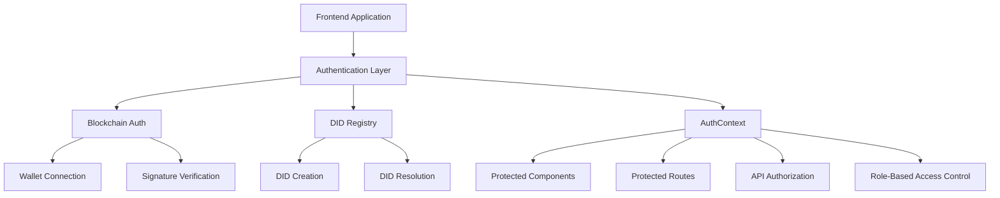
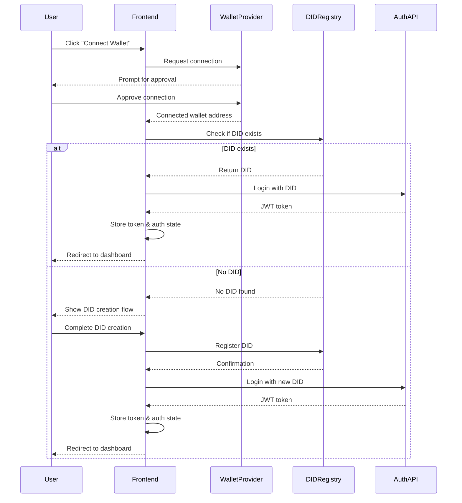
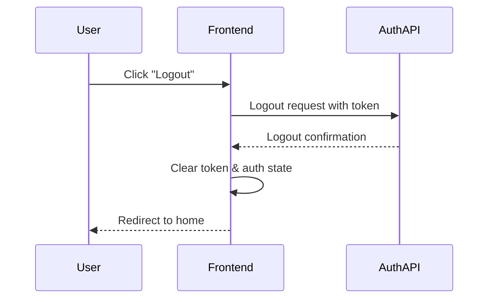

# Authentication & Authorization Documentation

## Overview

This document describes the authentication and authorization system used in the LEDUP frontend application. It covers the DID-based authentication flow, user roles and permissions, protected routes, and integration with blockchain wallet identity.

## Authentication Architecture

The LEDUP application implements a DID-based authentication system that leverages blockchain wallet connections for identity verification:



## Authentication Context

The application uses React Context to manage authentication state globally:

```tsx
// Based on the actual AuthProvider implementation
import { createContext, useContext, ReactNode } from 'react';
import { Address } from 'viem';
import { User } from '@/features/auth/types';

// Actual role types from the codebase
export type UserRole = 'ADMIN' | 'CONSUMER' | 'PRODUCER' | 'PROVIDER' | 'OPERATOR' | 'ISSUER' | 'VERIFIER';

// Actual auth context shape
interface AuthContextType {
  isAuthenticated: boolean;
  isLoading: boolean;
  did: string;
  publicKey: string;
  address: Address | null;
  user: User | null;
  error: string | null;
  userRoles: UserRole[];
  hasRole: (role: UserRole) => boolean;
  hasAnyRole: (roles: UserRole[]) => boolean;
  hasAllRoles: (roles: UserRole[]) => boolean;
  login: (redirectAfterLogin?: boolean, defaultRedirect?: string) => Promise<boolean>;
  logout: () => Promise<void>;
  refreshTokenSilently: () => Promise<boolean>;
  register: (formData: FormData) => Promise<void>;
}

const AuthContext = createContext<AuthContextType>({
  isAuthenticated: false,
  isLoading: false,
  did: '',
  address: null,
  user: null,
  publicKey: '',
  error: null,
  userRoles: [],
  hasRole: () => false,
  hasAnyRole: () => false,
  hasAllRoles: () => false,
  login: async () => false,
  logout: async () => {},
  refreshTokenSilently: async () => false,
  register: async () => {},
});

export function AuthProvider({ children }: { children: ReactNode }) {
  // Implementation details...

  return <AuthContext.Provider value={authContextValue}>{children}</AuthContext.Provider>;
}

export function useAuth() {
  return useContext(AuthContext);
}
```

## Authentication Hooks

The application provides custom hooks for authentication-related functionality:

```tsx
// Server-side authentication hook
export function useServerAuth() {
  // Implements server-side authentication logic including:
  // - JWT token management
  // - Session handling
  // - Login/logout functions
  // - Token refresh
}

// DID authentication hook
export function useDidAuth() {
  // Implements DID-related authentication functions:
  // - Role verification
  // - DID resolution
  // - DID verification
}

// Protected route hook
export function useProtectedRoute() {
  const { isAuthenticated, isLoading } = useAuth();
  const router = useRouter();

  useEffect(() => {
    if (!isLoading && !isAuthenticated) {
      router.push('/login');
    }
  }, [isAuthenticated, isLoading, router]);

  return { isLoading, isAuthenticated };
}
```

## DID-Based Authentication

### Wallet Connection Flow

The application implements a DID (Decentralized Identifier) based authentication flow:

```tsx
// Based on SigninPageContent in the actual codebase
function SigninFlow() {
  // State and hooks initialization
  const { address, isConnected } = useAccount();
  const { isAuthenticated, login, logout } = useAuth();
  const { data: existingDid } = useAddressToDID(address);
  const registerDid = useRegisterDid();

  // Handle wallet connection and DID flow
  const handleDidFlow = async () => {
    if (!isConnected || !address) return;

    try {
      // Check if user already has a DID
      if (existingDid) {
        // Login with existing DID
        await login(true, '/dashboard');
      } else {
        // Generate key pair for DID creation
        const { privateKey, publicKey } = generateKeyPair();

        // Create DID document
        const didDocument = {
          // DID document structure
        };

        // Show DID creation form
        // ...
      }
    } catch (error) {
      // Error handling
    }
  };

  // Register DID on blockchain
  const handleRegisterDid = async () => {
    try {
      await registerDid.mutateAsync({
        did: didIdentifier,
        document: didDocument,
        publicKey: publicKey,
      });

      // Complete authentication after DID registration
    } catch (error) {
      // Error handling
    }
  };

  // Component rendering
}
```

### DID Registration and Resolution

The application uses dedicated hooks for DID registry operations:

```tsx
// DID registry hooks examples
export function useAddressToDID(address: Address | undefined) {
  // Fetches DID associated with an address
}

export function useRegisterDid() {
  // Registers a new DID on the blockchain
}
```

## Authorization System

### Role-Based Authorization

The application implements a role-based access control system:

```tsx
// Role definition from the actual codebase
export type UserRole = 'ADMIN' | 'CONSUMER' | 'PRODUCER' | 'PROVIDER' | 'OPERATOR' | 'ISSUER' | 'VERIFIER';

// Role checking functions
function hasRole(role: UserRole) {
  // Check if user has a specific role
}

function hasAnyRole(roles: UserRole[]) {
  // Check if user has any of the specified roles
}

function hasAllRoles(roles: UserRole[]) {
  // Check if user has all specified roles
}
```

### Role-Based Component Access

The application implements role-based component rendering:

```tsx
// RoleGuard component example
interface RoleGuardProps {
  allowedRoles: UserRole[];
  children: React.ReactNode;
  fallback?: React.ReactNode;
}

export function RoleGuard({ allowedRoles, children, fallback = null }: RoleGuardProps) {
  const { userRoles } = useAuth();

  const hasPermission = allowedRoles.some((role) => userRoles.includes(role));

  if (!hasPermission) {
    return fallback;
  }

  return <>{children}</>;
}
```

## Protected Routes

### Middleware-Based Route Protection

The application implements route protection using Next.js middleware:

```tsx
// middleware.ts
import { NextResponse } from 'next/server';
import type { NextRequest } from 'next/server';

export function middleware(request: NextRequest) {
  const authToken = request.cookies.get('auth_token')?.value;

  // Check if the route requires authentication
  const isProtectedRoute =
    request.nextUrl.pathname.startsWith('/dashboard') || request.nextUrl.pathname.startsWith('/profile');

  // Redirect to login if accessing protected route without auth
  if (isProtectedRoute && !authToken) {
    return NextResponse.redirect(new URL('/auth/signin', request.url));
  }

  return NextResponse.next();
}
```

### Client-Side Route Protection

In addition to middleware, the application implements client-side route protection:

```tsx
// Protected page example
'use client';

import { useProtectedRoute } from '@/hooks/use-protected-route';
import { LoadingSpinner } from '@/components/ui/loading-spinner';

export default function DashboardPage() {
  const { isLoading } = useProtectedRoute();

  if (isLoading) {
    return <LoadingSpinner />;
  }

  return (
    <div>
      <h1>Dashboard</h1>
      {/* Dashboard content */}
    </div>
  );
}
```

## API Authorization

### JWT Token Management

The application uses JWT tokens for API request authorization:

```tsx
// Token management utility functions
function getAuthToken(): string | null {
  return localStorage.getItem('auth_token');
}

function setAuthToken(token: string): void {
  localStorage.setItem('auth_token', token);
}

function removeAuthToken(): void {
  localStorage.removeItem('auth_token');
}
```

### Request Authorization

The application adds authorization headers to API requests:

```tsx
// Example of adding auth token to requests
async function makeAuthenticatedRequest(url: string, options: RequestInit = {}) {
  const token = getAuthToken();

  const headers = {
    ...options.headers,
    Authorization: token ? `Bearer ${token}` : '',
  };

  return fetch(url, {
    ...options,
    headers,
  });
}
```

## Authentication Flows

### Signin Flow



### Logout Flow



## Security Considerations

### Token Security

- JWT tokens are stored in localStorage
- Tokens have expiration times
- Automatic token refresh mechanisms
- CSRF protection

### Wallet Security

- Non-custodial wallet integration
- Sign-message based authentication
- No private key exposure to application

### Session Timeout

- Configurable session timeouts
- Automatic session renewal with activity
- Forced logout after extended inactivity

## Testing Authentication

### Authentication Mocking

```tsx
// Example of mocking authentication for tests
export const mockAuthContext = {
  isAuthenticated: true,
  isLoading: false,
  did: 'did:ethr:0x123...',
  publicKey: '0x456...',
  address: '0x789...' as Address,
  user: {
    id: '1',
    name: 'Test User',
  },
  error: null,
  userRoles: ['CONSUMER', 'PRODUCER'],
  hasRole: (role) => ['CONSUMER', 'PRODUCER'].includes(role),
  hasAnyRole: (roles) => roles.some((role) => ['CONSUMER', 'PRODUCER'].includes(role)),
  hasAllRoles: (roles) => roles.every((role) => ['CONSUMER', 'PRODUCER'].includes(role)),
  login: jest.fn(),
  logout: jest.fn(),
  refreshTokenSilently: jest.fn(),
  register: jest.fn(),
};

export function renderWithAuth(ui: React.ReactElement) {
  return render(<AuthContext.Provider value={mockAuthContext}>{ui}</AuthContext.Provider>);
}
```

## Known Limitations and Future Improvements

- Implement multi-factor authentication
- Enhance DID verification process
- Support for additional wallet providers
- Biometric authentication options
- Enhanced privacy features

---

**Last Updated:** [Date]  
**Contact:** [Contact Information]
