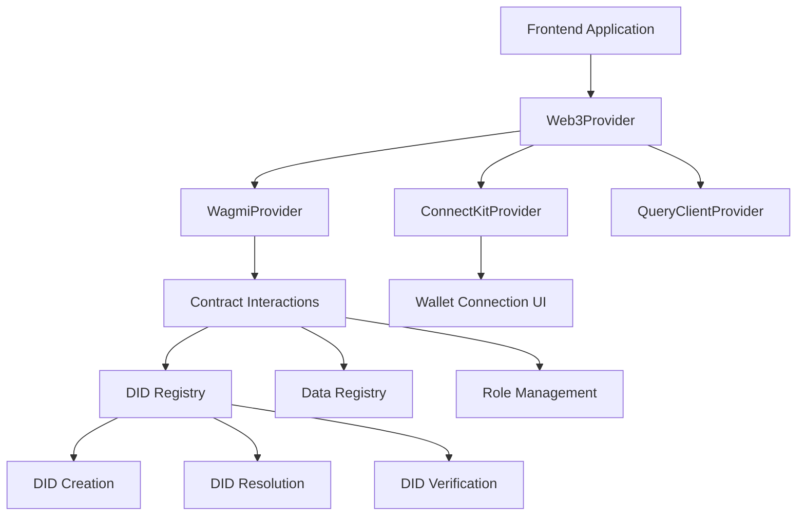

# Blockchain Integration Documentation

## Overview

This document describes how the LEDUP frontend application integrates with blockchain technologies. It covers wallet connection, DID (Decentralized Identifier) management, smart contract interactions, and related functionality.

## Blockchain Architecture

The LEDUP application uses a modular blockchain integration architecture that leverages Wagmi, ConnectKit, and Viem for interaction with Ethereum-compatible networks:



## Web3 Provider Setup

The application uses a centralized Web3 provider setup powered by Wagmi v2 and ConnectKit:

```tsx
// Based on actual web3-provider.tsx
import { WagmiProvider, createConfig, http } from 'wagmi';
import { sepolia, hardhat } from 'wagmi/chains';
import { QueryClient, QueryClientProvider } from '@tanstack/react-query';
import { ConnectKitProvider, getDefaultConfig } from 'connectkit';

// Create a new query client
const queryClient = new QueryClient({
  defaultOptions: {
    queries: {
      refetchOnWindowFocus: false,
      refetchOnMount: false,
      refetchOnReconnect: false,
      retry: false,
      staleTime: 60 * 60 * 1000, // Consider data fresh for 1 hour
      gcTime: 120 * 60 * 1000, // Cache for 2 hours
    },
  },
});

// Wagmi config using ConnectKit's getDefaultConfig
const config = createConfig(
  getDefaultConfig({
    // Supported chains
    chains: [hardhat, sepolia],
    // Transport configuration for each chain
    transports: {
      [hardhat.id]: http(process.env.NEXT_PUBLIC_RPC_URL || 'http://localhost:8545'),
      [sepolia.id]: http(`https://eth-sepolia.g.alchemy.com/v2/${process.env.NEXT_PUBLIC_ALCHEMY_ID}`),
    },
    // WalletConnect configuration
    walletConnectProjectId: process.env.NEXT_PUBLIC_WALLET_CONNECT_PROJECT_ID!,
    // App metadata
    appName: 'LED-UP Healthcare',
    appDescription: 'LED-UP Healthcare platform that provides secure file sharing.',
    appUrl: 'https://led-up-docs.vercel.app',
    appIcon: '/logo.png',
  })
);

export const Web3Provider = ({ children }: { children: React.ReactNode }) => {
  // Client-side only rendering (preventing hydration issues)
  const [isMounted, setIsMounted] = useState(false);

  useEffect(() => {
    setIsMounted(true);
  }, []);

  if (!isMounted) {
    return null;
  }

  return (
    <WagmiProvider config={config}>
      <QueryClientProvider client={queryClient}>
        <ConnectKitProvider>{children}</ConnectKitProvider>
      </QueryClientProvider>
    </WagmiProvider>
  );
};
```

## Wallet Connection

### ConnectKit Integration

The application uses ConnectKit to provide a user-friendly wallet connection interface:

```tsx
// Based on actual wallet-connect.tsx
import { ConnectKitButton } from 'connectkit';
import { useTheme } from 'next-themes';
import { cn } from '@/lib/utils';
import { WalletIcon } from 'lucide-react';

type Mode = 'light' | 'dark' | 'auto';

export function ConnectButton({ className }: { className?: string }) {
  const { theme } = useTheme();

  const getMode = (theme: string): Mode => {
    switch (theme) {
      case 'light':
        return 'light';
      case 'dark':
        return 'dark';
      default:
        return 'auto';
    }
  };

  return (
    <div
      className={cn(
        'relative group flex items-center gap-2',
        'rounded-lg',
        'bg-gradient-to-br from-primary/80 via-primary to-primary/90',
        'p-[1px]',
        className
      )}
    >
      <div className="relative bg-background/95 backdrop-blur-sm rounded-[7px] flex items-center px-3">
        <WalletIcon className="w-6 h-6" />
        <ConnectKitButton
          label="CONNECT TO LED-UP"
          mode={getMode(theme as string)}
          customTheme={{
            '--ck-connectbutton-background': 'transparent',
            '--ck-connectbutton-hover-background': 'transparent',
            '--ck-connectbutton-active-background': 'transparent',
            '--ck-connectbutton-border-radius': '0px',
          }}
        />
      </div>
    </div>
  );
}
```

### Wagmi Hooks Usage

The application leverages Wagmi hooks for blockchain interactions:

```tsx
// Examples of using Wagmi hooks
import { useAccount, useConnect, useDisconnect } from 'wagmi';

function WalletStatus() {
  const { address, isConnected } = useAccount();
  const { disconnect } = useDisconnect();

  if (isConnected) {
    return (
      <div>
        <p>Connected to {address}</p>
        <button onClick={() => disconnect()}>Disconnect</button>
      </div>
    );
  }

  return <p>Not connected</p>;
}
```

## DID Registry Integration

### DID Registry Contract Interaction

The application provides custom hooks for DID registry interactions:

```tsx
// Based on the actual use-did-registry.ts implementation
import { useContractRead, useContractWrite } from 'wagmi';
import { didRegistryAbi } from '@/abi/DidRegistryAbi';

// DID Registry contract address
const didRegistryAddress = process.env.NEXT_PUBLIC_DID_REGISTRY_ADDRESS as `0x${string}`;

/**
 * Hook to fetch a DID associated with an Ethereum address
 */
export function useAddressToDID(address: Address | undefined) {
  return useContractRead({
    address: didRegistryAddress,
    abi: didRegistryAbi,
    functionName: 'addressToDID',
    args: [address],
    enabled: !!address,
  });
}

/**
 * Hook to register a new DID in the registry
 */
export function useRegisterDid() {
  return useContractWrite({
    address: didRegistryAddress,
    abi: didRegistryAbi,
    functionName: 'registerDID',
  });
}

/**
 * Hook to fetch a DID document by DID
 */
export function useGetDIDDocument(did: string | undefined) {
  return useContractRead({
    address: didRegistryAddress,
    abi: didRegistryAbi,
    functionName: 'getDIDDocument',
    args: [did],
    enabled: !!did,
  });
}
```

### DID Creation Flow

The DID creation flow integrates with the authentication process:

```tsx
// Example of DID creation flow (simplified from actual implementation)
function DIDCreationFlow() {
  const { address, isConnected } = useAccount();
  const { data: existingDid } = useAddressToDID(address);
  const registerDid = useRegisterDid();

  // Generate key pair
  const generateKeys = () => {
    // Cryptography implementation
    return { privateKey, publicKey };
  };

  // Handle DID registration
  const handleRegisterDid = async () => {
    const { privateKey, publicKey } = generateKeys();
    const didIdentifier = `did:ethr:${address}`;

    // Create DID document
    const didDocument = {
      '@context': 'https://www.w3.org/ns/did/v1',
      id: didIdentifier,
      verificationMethod: [
        {
          id: `${didIdentifier}#keys-1`,
          type: 'EcdsaSecp256k1VerificationKey2019',
          controller: didIdentifier,
          publicKeyHex: publicKey,
        },
      ],
      authentication: [`${didIdentifier}#keys-1`],
    };

    // Register on blockchain
    await registerDid.mutateAsync({
      args: [didIdentifier, JSON.stringify(didDocument), publicKey],
    });

    // Store private key securely
    // Complete authentication
  };

  // Component rendering
}
```

## Data Registry Integration

The application integrates with a data registry contract for health data management:

```tsx
// Example of data registry hooks (simplified)
export function useRegisterProducer() {
  return useContractWrite({
    address: dataRegistryAddress,
    abi: dataRegistryAbi,
    functionName: 'registerProducer',
  });
}

export function useRegisterPatientData() {
  return useContractWrite({
    address: dataRegistryAddress,
    abi: dataRegistryAbi,
    functionName: 'registerPatientData',
  });
}

export function useGetPatientData(patientDid: string | undefined) {
  return useContractRead({
    address: dataRegistryAddress,
    abi: dataRegistryAbi,
    functionName: 'getPatientData',
    args: [patientDid],
    enabled: !!patientDid,
  });
}
```

## Role Management

The application manages user roles through smart contract interactions:

```tsx
// Role management hooks (simplified)
export function useUserRoles(did: string | undefined) {
  return useContractRead({
    address: roleManagerAddress,
    abi: roleManagerAbi,
    functionName: 'getUserRoles',
    args: [did],
    enabled: !!did,
  });
}

export function useAssignRole() {
  return useContractWrite({
    address: roleManagerAddress,
    abi: roleManagerAbi,
    functionName: 'assignRole',
  });
}

export function useHasRole(did: string | undefined, role: string | undefined) {
  return useContractRead({
    address: roleManagerAddress,
    abi: roleManagerAbi,
    functionName: 'hasRole',
    args: [did, role],
    enabled: !!did && !!role,
  });
}
```

## Transaction Management

### Transaction Submission

The application handles blockchain transactions with proper UI feedback:

```tsx
// Example of transaction handling
function SubmitTransaction() {
  const [isSubmitting, setIsSubmitting] = useState(false);
  const [txHash, setTxHash] = useState<string | null>(null);
  const { write } = useContractWrite({
    /*...*/
  });

  const handleSubmit = async () => {
    setIsSubmitting(true);
    try {
      const { hash } = await write();
      setTxHash(hash);
      // Show success toast
    } catch (error) {
      // Show error toast
      console.error('Transaction failed:', error);
    } finally {
      setIsSubmitting(false);
    }
  };

  // Component rendering
}
```

### Transaction Status Monitoring

The application monitors transaction status for better UX:

```tsx
// Transaction status monitoring
function TransactionStatus({ hash }: { hash: string }) {
  const { data, isLoading, isSuccess, isError } = useWaitForTransaction({
    hash,
  });

  useEffect(() => {
    if (isSuccess) {
      // Show success notification
    }
    if (isError) {
      // Show error notification
    }
  }, [isSuccess, isError]);

  // Component rendering showing appropriate status
}
```

## IPFS Integration

The application integrates with IPFS through backend services for decentralized storage:

```tsx
// IPFS integration (simplified)
async function uploadToIPFS(file: File) {
  const formData = new FormData();
  formData.append('file', file);

  const response = await fetch('/api/ipfs/pin', {
    method: 'POST',
    body: formData,
  });

  const data = await response.json();
  return data.cid; // Content Identifier
}

async function getFromIPFS(cid: string) {
  const response = await fetch(`/api/ipfs/getData?cid=${cid}`);
  return response.json();
}
```

## Security Considerations

### Private Key Management

The application securely manages private keys:

- Private keys are never sent to the server
- Keys are encrypted before local storage
- Session-based key availability

### Transaction Security

The application ensures transaction security:

- Confirmation dialogs for all transactions
- Clear transaction intent and details shown
- User-friendly error handling and recovery

## Cross-Chain Support

The application is designed for multi-chain operation:

- Supports Sepolia testnet and Hardhat local network
- Configurable for mainnet deployment
- Consistent UX across different networks

## Error Handling

The application implements robust error handling for blockchain interactions:

```tsx
// Error handling in blockchain interactions
function BlockchainOperation() {
  const [error, setError] = useState<Error | null>(null);

  const handleOperation = async () => {
    try {
      // Blockchain operation
    } catch (err) {
      if (err.code === 4001) {
        // User rejected transaction
        setError(new Error('Transaction was rejected. Please try again.'));
      } else if (err.code === -32603) {
        // Internal JSON-RPC error (often gas related)
        setError(new Error('Transaction failed. Please check your balance and try again.'));
      } else {
        // Other errors
        setError(err);
      }
    }
  };

  // Component rendering with error handling
}
```

## Testing Strategy

### Mock Providers

For testing, the application uses mock providers:

```tsx
// Mock provider for testing
import { createTestClient, http, walletActions } from 'viem/test';

const testClient = createTestClient({
  chain: hardhat,
  mode: 'anvil',
  transport: http(),
}).extend(walletActions);

// Use in tests
```

### Environment Configuration

Testing environments are configured specifically for blockchain tests:

- Local Hardhat node for contract testing
- Mock responses for non-contract dependent tests
- Realistic delays and error conditions

---

**Last Updated:** [Date]  
**Contact:** [Contact Information]
